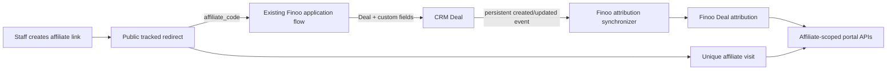

# Finoo Affiliate Portal and Attribution

## TLDR

**Key Points:**
- Add a private Finoo application module, `finoo_affiliates`, for affiliate links, first-party unique-click tracking, Deal attribution, commission management, and affiliate-scoped portal reporting.
- Count at most one visit per affiliate link and anonymous browser identifier in a rolling 24-hour window. Redirect bots, link previews, and prefetches without recording a visit.
- Attribute the existing application flow through the `affiliate_code` query parameter and the Deal custom field keyed `affiliate_code` (`Affiliate Code`). Count a transaction once, at the first recorded transition of an attributed Deal into a stage whose label is `Completed`.
- Disable both the public signup route and signup API for Finoo while preserving staff-created and invited portal accounts.

**Scope:**
- Affiliate dashboard with adjustable range, default last 30 days, and weekly series for leads, unique link visits, and transactions.
- Affiliate Leads page listing only Deals attributed to the signed-in affiliate, with company name, landing page, initial referrer, commission status, and commission amount.
- Staff affiliate-link management and a CRM Deal tab for affiliate user, commission status, and commission amount.
- Tenant-safe APIs, persistence, migration, integration tests, and headed QA on `https://finoo.om.they.dev`.

**Boundaries:**
- Existing customer roles `affiliate` and `intermediary` are reused; role creation is not part of this change.
- The intermediary portal is out of scope.
- Existing public application form behavior remains owned by the deployed Finoo application. This module consumes its `affiliate_code` → Deal `Affiliate Code` contract.
- The implementation is private to Finoo. No upstream contribution or public PR is allowed for THOM-88.

**Concerns:**
- Public redirect handling, portal authorization, tenant isolation, visitor de-duplication, CRM money fields, and schema changes make the delivery `risk-high`.
- The redirect destination must be validated against a Finoo-owned allowlist so affiliate links cannot become an open redirect.

## Overview

THOM-88 adds Finoo-specific affiliate acquisition and commission visibility on top of Open Mercato's CRM, dictionaries, persistent events, and customer portal. Staff manage affiliate links and the commission fields associated with an attributed Deal. An authenticated affiliate sees only their own links' aggregate performance and their own attributed Deals.

The implementation is a private app-level module at `apps/mercato/src/modules/finoo_affiliates`. Core changes are limited to a generic, default-on portal self-registration display seam used by the shell, landing page, and login page. The Finoo app configuration disables the public signup API, while module-owned frontend middleware redirects the signup page to login; together these provide server-side enforcement.

## Proposed Solution

Build one Finoo-owned module with four additive entities: affiliate links, unique visits, an immutable first-Completed registry, and Deal attribution extensions. A database trigger on the CRM stage-transition projection captures the first Completed timestamp atomically in the same transaction; persistent customer Deal events hydrate the affiliate read model after the CRM command commits. Data coupling uses UUID-only references, intentional snapshots, and an app-owned `data/extensions.ts` declaration; UI coupling uses existing portal dashboard and Deal-detail widget spots. Staff mutations are command-backed and undoable. Portal reads derive the affiliate solely from customer auth. A generic `NEXT_PUBLIC_OM_PORTAL_ALLOW_SELF_REGISTRATION` switch defaults to `true` in core UI, while Finoo sets it to `false`, disables the signup API through an app override, and redirects the signup page through module frontend middleware.

## Problem Statement

Open Mercato currently has no affiliate-link event store or tracked redirect, no Finoo attribution read model, and no affiliate-scoped dashboard. The existing portal also exposes self-registration by default. Finoo requires invitation/staff-created accounts only and needs a complete acquisition chain:

1. staff creates a link for an affiliate;
2. a real visitor follows the link;
3. the link forwards to the Finoo application with `affiliate_code`;
4. the application creates a Deal with the existing attribution custom fields;
5. the affiliate sees the lead and eventual first `Completed` transition;
6. staff controls commission status and amount from the Deal context.

Without a Finoo-owned read model, portal endpoints would have to expose staff CRM APIs or join unrelated module entities directly from the browser. Without first-party visit storage, the click graph has no authoritative source.

## Goals and Non-Goals

### Goals

- Record privacy-minimized, unique, human affiliate-link visits in Open Mercato.
- Preserve one deterministic affiliate attribution per Deal from the existing `affiliate_code` handoff.
- Expose tenant-, organization-, and affiliate-scoped portal reads.
- Make dashboard ranges adjustable, validated, and defaulted to the last 30 days.
- Store commission status using a system dictionary with the exact values `approved`, `waiting`, and `rejected`.
- Preserve optimistic locking on staff-editable link and Deal-attribution records.
- Keep the module private and compatible with the current `fork/finoo` baseline.

### Non-Goals

- Building an intermediary portal.
- Replacing the Finoo application form or redesigning the broader CRM pipeline.
- Cross-device visitor identity, user fingerprinting, multi-touch attribution, attribution windows, or commission payout automation.
- Generic product analytics, session replay, external analytics-provider integration, or historical data import.
- Public upstream contribution.

## Market Reference

[Plausible Analytics Community Edition](https://github.com/plausible/analytics) is the closest open-source market reference for a privacy-minimized first-party event model. Its documented posture avoids cookies and persistent personal identifiers and includes known-bot filtering. THOM-88 adopts the same product principles—minimal event data, explicit bot/prefetch rejection, and simple date-filtered aggregates—but does not copy its generic analytics/session architecture. Finoo needs an authenticated affiliate business read model, a 24-hour per-link uniqueness rule, and CRM attribution, all of which are narrower than a general analytics platform.

## Confirmed Business Rules

- Self-registration: disabled.
- Click definition: a unique human visit, not every HTTP request.
- Unique window: one counted visit per affiliate link and anonymous browser identifier per rolling 24 hours.
- Bots/previews: redirect to the destination but do not count.
- Attribution parameter: `affiliate_code`.
- Deal attribution source: existing Deal custom field key `affiliate_code`; landing page and initial referrer come from the existing Deal custom fields `landing_page` and `initial_referrer`.
- Lead time: Deal creation time for a successfully attributed Deal.
- Transaction time: the earliest persisted transition to a pipeline stage with the normalized label `completed`.
- Spec unit: links, attribution, CRM fields, and portal reporting remain one integrated THOM-88 specification.

## Architecture

### Module Boundary

`finoo_affiliates` requires `customers`, `customer_accounts`, `portal`, `dictionaries`, and `events`. It owns all affiliate entities, APIs, pages, widgets, event subscribers, ACL declarations, setup defaults, and translations.

The module stores UUID references to CRM Deals and customer portal users without MikroORM relationships. It may read the required peer entities through their package entity exports inside server-only services, always with explicit tenant and organization predicates. It never imports peer commands or business services and never exposes peer entities from its API.

`data/extensions.ts` declares the `finoo_deal_attribution.deal_id` link to `customers.deal` using the supported extension DSL. The extension remains owned and stored by Finoo; the declaration does not create an ORM relationship or make the customers module depend on Finoo. The peers are hard requirements for this private module, not optional integrations.

### Data Flow

### Eventual Consistency

An `AFTER INSERT OR UPDATE` database trigger on `customer_deal_stage_transitions` inserts the first normalized Completed timestamp with `ON CONFLICT DO NOTHING` inside the CRM write transaction. A persistence failure therefore rolls back the stage transition instead of being swallowed by an after-command hook. Persistent `customers.deal.created` and `customers.deal.updated` subscribers then synchronize attribution after the CRM command commits. Each delivery is idempotent:

- no matching active affiliate code: leave no attribution or preserve the existing immutable attribution;
- matching code and no attribution: create the attribution using Deal creation time;
- existing attribution: refresh presentation snapshots and detect the first `Completed` transition;
- retry: upsert by the scoped unique Deal key and never overwrite an earlier `transactionAt`.

Affiliate ownership becomes immutable once established automatically. Staff may deliberately correct it through the Deal affiliate tab; subsequent CRM event synchronization must not silently replace that staff selection.

Staff/undo deletion and Deal lifecycle deletion are distinguished. Ordinary Deal synchronization never resurrects an attribution explicitly removed by staff or undo; restoring a previously deleted Deal may restore only the attribution marked as Deal-deleted.

## Data Model

All module tables contain `id`, `organization_id`, `tenant_id`, `created_at`, and `updated_at`. User-editable entities also contain `deleted_at` and participate in optimistic locking.

### `finoo_affiliate_links`

| Field | Type | Rules |
|---|---|---|
| `affiliate_user_id` | UUID | required portal user reference; no ORM relation |
| `code` | text | high-entropy, globally unique, immutable after creation |
| `label` | text | staff-facing label |
| `destination_url` | text | absolute HTTPS URL with allowlisted host |
| `is_active` | boolean | inactive links return 404 and never redirect |
| `deleted_at` | timestamptz | soft delete |

Indexes: scoped affiliate lookup, globally unique code, scoped active list.

### `finoo_affiliate_visits`

| Field | Type | Rules |
|---|---|---|
| `affiliate_link_id` | UUID | module-local link reference |
| `affiliate_user_id` | UUID | immutable snapshot from the link |
| `visitor_hash` | text nullable | SHA-256 of a random first-party browser token; cleared after the 24-hour dedupe window |
| `visited_at` | timestamptz | counted visit time |

Index `(affiliate_link_id, visitor_hash, visited_at)` supports the 24-hour uniqueness check. A transaction-scoped advisory lock derived from link ID and visitor hash serializes concurrent first visits. During visit recording, expired non-null hashes for that link are irreversibly cleared. An hourly tenant- and organization-scoped scheduler job also anonymizes expired hashes in bounded batches, including dormant or deactivated links, while timestamps and affiliate identifiers remain available for aggregate reporting. The internal entity does not need optimistic locking.

### `finoo_deal_completions`

| Field | Type | Rules |
|---|---|---|
| `deal_id` | UUID | scoped unique CRM Deal reference; no ORM relation |
| `completed_at` | timestamptz | immutable first normalized `Completed` transition |

The scoped unique key plus `INSERT ... ON CONFLICT DO NOTHING` preserves the first timestamp even when Deal events are delayed or the Deal later re-enters `Completed`.

### `finoo_deal_attributions`

| Field | Type | Rules |
|---|---|---|
| `deal_id` | UUID | scoped unique CRM Deal reference; no ORM relation |
| `affiliate_user_id` | UUID | portal user reference; editable by staff |
| `affiliate_code` | text | attribution snapshot |
| `company_name` | text nullable | first linked company display-name snapshot |
| `landing_page` | text nullable | Deal custom-field snapshot |
| `initial_referrer` | text nullable | Deal custom-field snapshot |
| `commission_status_entry_id` | UUID | entry from `finoo_commission_status` dictionary |
| `commission_status` | text | normalized value snapshot: approved/waiting/rejected |
| `commission_amount` | integer | non-negative integer, default 0 |
| `lead_at` | timestamptz | attributed Deal creation time |
| `transaction_at` | timestamptz nullable | earliest Completed transition; set once |
| `attribution_source` | text | `automatic` or `staff` |
| `deletion_reason` | text nullable | `deal` or `staff`; controls whether synchronization may restore the row |
| `deleted_at` | timestamptz | soft delete |

Indexes: scoped unique Deal, scoped affiliate + lead time, scoped affiliate + transaction time. `updated_at` is returned as `updatedAt` by staff APIs and is required for update/delete optimistic-lock headers.

### Encryption and Privacy

`encryption.ts` exports `defaultEncryptionMaps` for `finoo_deal_attribution.company_name`, `landing_page`, and `initial_referrer`. All reads of the attribution entity use `findWithDecryption` or `findOneWithDecryption` with both tenant and organization scope. These display snapshots do not participate in equality filters, so hash sibling columns are not required.

Affiliate codes, destination URLs, dictionary values, integer commission amounts, timestamps, UUID references, and visitor hashes remain plaintext because they are routing/filtering/aggregation fields rather than free-text personal snapshots. The random visitor cookie token is never persisted; only its one-way SHA-256 digest is stored. No custom encryption implementation is introduced.

### Dictionary

`seedDefaults` idempotently creates an active system dictionary:

- key: `finoo_commission_status`
- entries: `approved`, `waiting`, `rejected`
- default entry: `waiting`
- manager visibility: hidden

The staff editor lists only these three entries and validates that the selected entry belongs to the scoped dictionary. Both entry ID and normalized value snapshot are stored so portal reads remain deterministic while preserving the requested dictionary semantics.

## Visit Tracking and Security

### Redirect Contract

`GET /api/finoo_affiliates/r/:code`:

1. validate the code format;
2. resolve one active link and its tenant/organization;
3. revalidate the stored destination URL against `OM_FINOO_AFFILIATE_REDIRECT_HOSTS`;
4. append or replace `affiliate_code` with the link code;
5. classify the request;
6. before container creation or link lookup, require a client identity derived from a deployment-validated proxy depth and apply a shared endpoint/client rate limiter; for a human request, apply a second per-link/client limit before visit persistence, then read or set the 24-hour `finoo_affiliate_visitor` cookie and record a visit only when no visit exists within the previous 24 hours;
7. return a 302 redirect with `Cache-Control: no-store`.

`HEAD` requests redirect without counting. Invalid/inactive codes and disallowed destinations return 404; the response does not reveal which validation failed.

### Bot and Preview Rejection

A request is non-counting when any of the following holds:

- method is not GET;
- `Purpose`, `Sec-Purpose`, or `X-Purpose` indicates prefetch/preview;
- `User-Agent` is absent;
- normalized `User-Agent` matches maintained bot/crawler/preview tokens, including search crawlers and social preview agents.
- present Fetch Metadata does not describe a top-level document navigation (`navigate`, `document`, and, when present, `?1`).

This is deterministic filtering, not a claim of perfect bot detection. The shared limiter bounds cookie churn and write amplification; its client key is one-way hashed and transient. No IP address, full referrer, full user-agent, or browser fingerprint is persisted by the Finoo module.

### Destination Allowlist

`OM_FINOO_AFFILIATE_REDIRECT_HOSTS` is a comma-separated list of exact lowercase hosts. Only credential-free `https:` destinations on that list, without a non-default explicit port, are accepted. Local development additionally allows `http://localhost` and `http://127.0.0.1`. Staff create/update APIs apply the same validator as the redirect endpoint.

Production must configure `RATE_LIMIT_TRUST_PROXY_DEPTH` to the verified FINOO edge chain and use shared Redis rate-limit storage when more than one application instance serves redirects. If client identity or the limiter is unavailable, the public endpoint fails closed before database work. A known globally disabled limiter never records analytics; the integration-test runtime is the only bounded exception used to exercise the full redirect flow.

## CRM Attribution Synchronization

The event subscriber loads the Deal, its normalized custom fields, linked companies, and persisted stage transitions under the event's tenant and organization scope.

Custom-field keys are configurable for deployment drift but have fixed defaults:

| Meaning | Environment override | Default key |
|---|---|---|
| Affiliate code | `OM_FINOO_AFFILIATE_CODE_FIELD` | `affiliate_code` |
| Landing page | `OM_FINOO_LANDING_PAGE_FIELD` | `landing_page` |
| Initial referrer | `OM_FINOO_INITIAL_REFERRER_FIELD` | `initial_referrer` |

The synchronizer accepts normalized keys with or without the `cf_` transport prefix but never performs fuzzy label matching. Values are trimmed and length-bounded before persistence.

If the custom-field affiliate code has no active scoped link, no attribution is created. If it matches, `affiliate_user_id` is copied from the link and `commission_status` starts as `waiting`. A Deal is a transaction if the immutable Finoo completion registry contains its first `Completed` transition. The existing CRM stage-transition projection is used only as a historical fallback when staff first attaches a pre-existing Deal; merely having a current text status or being manually marked closed is insufficient.

## APIs

### Staff APIs

All staff APIs require normal staff authentication plus `finoo_affiliates.manage` and enforce request tenant/organization scope.

- `GET/POST/PUT/DELETE /api/finoo_affiliates/links`
  - paginated link management;
  - POST generates a random code server-side;
  - PUT/DELETE enforce optimistic locking.
- `GET /api/finoo_affiliates/affiliate-users`
  - returns active portal users assigned to the `affiliate` customer role in the current scope.
- `GET/PUT /api/finoo_affiliates/deal-attributions?dealId=:id`
  - GET returns one Deal extension record plus dictionary choices;
  - PUT creates or updates the staff-owned fields, validates the portal user role and dictionary entry, and enforces optimistic locking on update.

Every route exports per-method `metadata` and `openApi`. Link CRUD uses `makeCrudRoute` and command IDs. The custom attribution write delegates to its command through the standard command bus and runs registered mutation guards before execution. Public schemas never accept tenant or organization IDs.

### Portal APIs

Portal APIs require customer authentication and `portal.finoo_affiliates.view`. They derive `affiliate_user_id` exclusively from the authenticated customer user; they never accept it from query/body input.

- `GET /api/finoo_affiliates/portal/dashboard?from=YYYY-MM-DD&to=YYYY-MM-DD`
  - inclusive calendar dates, default last 30 days, maximum 366 days;
  - returns zero-filled ISO-week buckets for leads, visits, and transactions.
- `GET /api/finoo_affiliates/portal/leads?page=&pageSize=&sort=`
  - page size at most 100;
  - returns only non-deleted attributions assigned to the authenticated affiliate.

Dates are interpreted in `OM_FINOO_ANALYTICS_TIMEZONE`, default `Europe/Warsaw`, and returned as ISO dates. The implementation groups through explicit timezone-aware SQL or an equivalent deterministic server-side bucketing function.

### Disabled Signup

The Finoo app entry disables:

- `POST /api/customer_accounts/signup`;
- the discovered page route `/[orgSlug]/portal/signup`, redirected to the corresponding login page by Finoo frontend middleware.

Core portal UI reads `NEXT_PUBLIC_OM_PORTAL_ALLOW_SELF_REGISTRATION` through one shared helper that defaults to `true`. `PortalShell`, the portal landing page, and the login page hide all signup calls to action when it is false. Finoo sets it to false at build/deployment time. This display switch is additive and default-preserving; the disabled signup API plus Finoo frontend middleware remain the hard server-side guarantee even if the UI variable is misconfigured.

## Commands, Events, and Undo

Staff mutations use these commands:

- `finoo_affiliates.links.create`
- `finoo_affiliates.links.update`
- `finoo_affiliates.links.delete`
- `finoo_affiliates.deal_attributions.upsert`

Create undo soft-deletes the created link/attribution. Attribution create undo marks the deletion as staff-owned and emits the declared deleted event, so later Deal updates cannot resurrect it. Update undo restores the complete before snapshot. Delete undo restores the soft-deleted link. Commands capture before/after snapshots through the existing undo helpers, enforce optimistic locking for update/delete, mutate within the standard atomic-flush boundary, and emit side effects only after the transaction succeeds.

The module declares singular, past-tense events with `createModuleEvents(... as const)`:

- `finoo_affiliates.affiliate_link.created`
- `finoo_affiliates.affiliate_link.updated`
- `finoo_affiliates.affiliate_link.deleted`
- `finoo_affiliates.deal_attribution.created`
- `finoo_affiliates.deal_attribution.updated`

Undo emits the corresponding lifecycle result. Visit recording is an internal append-only public-endpoint side effect and is intentionally not undoable; a successful redirect cannot be recalled. It does not emit a per-click persistent event because that would duplicate the durable visit store and add queue load with no current consumer.

Two one-event subscriber files consume `customers.deal.created` and `customers.deal.updated` and delegate to the same idempotent synchronizer. They export persistent metadata, fail closed without trusted tenant/organization scope, and do not emit another customer command.

## Authorization and Tenant Isolation

### ACL Features

- `finoo_affiliates.view` — staff read access.
- `finoo_affiliates.manage` — staff link and commission management.
- `portal.finoo_affiliates.view` — affiliate portal dashboard and leads.

Default staff grants: admin gets view/manage; employee gets view. `defaultCustomerRoleFeatures` grants portal view to the existing `affiliate` role. Portal admin wildcard behavior remains governed by the existing customer RBAC service.

Every ORM query includes both `tenantId` and `organizationId` unless it is the initial globally unique redirect-code lookup. The redirect immediately binds the resulting link scope and all subsequent queries use it. Portal APIs additionally filter by the authenticated customer user ID. IDs from one organization must behave as not found in another.

## Frontend

### Staff Link Management

`/backend/finoo-affiliates/links` uses the standard `DataTable` and `CrudForm` patterns. Staff can create a label, choose an affiliate user, set an allowlisted destination, activate/deactivate, copy the generated tracked URL, edit, and soft-delete. User-facing text is translated.

### Deal Extension Tab

An injected `detail:customers.deal:tabs` tab titled “Affiliate & Commission” shows:

- affiliate portal user;
- commission status dictionary select;
- commission amount integer input;
- read-only affiliate code, landing page, and initial referrer snapshots.

It uses guarded mutation and the attribution's `updatedAt` optimistic-lock header. A missing automatic attribution can be created manually by selecting an affiliate.

### Affiliate Dashboard

Three feature-gated widgets at `portal:dashboard:sections` show leads, unique clicks, and transactions. Each chart initially omits dates so the API returns the authoritative configured-timezone range of today minus 29 days through today; the returned values initialize its independent controls. Empty weeks remain visible with zero values.

### Leads Page

`/:orgSlug/portal/affiliate/leads` is feature-gated and uses portal-safe `DataTable` props. Columns:

1. company name;
2. landing page;
3. initial referrer;
4. commission status;
5. commission amount.

The page never receives unrelated Deal fields or other affiliates' identifiers.

### Frontend Boundary Ledger

| Component | Boundary | Rationale |
|---|---|---|
| Portal dashboard widget | client | date interaction and chart rendering |
| Portal leads table | client | pagination/sorting and portal API call |
| Deal attribution tab | client | editable form and guarded mutation |
| Staff links page | client | DataTable/CrudForm interactions |
| Route/page metadata | server/module metadata | auth and feature guards before render |
| Redirect and all APIs | server | trust boundary and scoped persistence |

Client components do not import ORM entities, secrets, or raw environment configuration. Providers are not added; existing portal/backend providers own auth, translations, and widget registries.

### UI Budgets

- No new production dependency.
- Three dashboard widgets, one per chart; chart shells remove their border/background inside the host `PortalCard`.
- Page size ≤100.
- No hard-coded colors or arbitrary Tailwind values.
- Loading, error, empty, keyboard-submit, and narrow-viewport states are covered.

## Configuration

| Variable | Required | Default | Purpose |
|---|---|---|---|
| `OM_FINOO_AFFILIATE_REDIRECT_HOSTS` | production yes | none | exact HTTPS redirect hosts |
| `OM_FINOO_ANALYTICS_TIMEZONE` | no | `Europe/Warsaw` | date interpretation and weekly buckets |
| `OM_FINOO_AFFILIATE_CODE_FIELD` | no | `affiliate_code` | Deal custom-field key |
| `OM_FINOO_LANDING_PAGE_FIELD` | no | `landing_page` | Deal custom-field key |
| `OM_FINOO_INITIAL_REFERRER_FIELD` | no | `initial_referrer` | Deal custom-field key |
| `NEXT_PUBLIC_OM_PORTAL_ALLOW_SELF_REGISTRATION` | no | `true` | hides public portal signup CTAs when false |

The module fails closed when production redirect hosts are not configured. Secrets are not introduced.

## Performance and Cache

The MVP intentionally uses no application cache. Dashboard results are user-, tenant-, organization-, and date-range-specific; omitting cache avoids stale cross-tenant entries and invalidation complexity. Each request performs three bounded indexed aggregate queries—visits, attributed leads, and transactions—over at most 366 days, then merges the small weekly result sets in memory. Portal lead and staff link lists use one paginated query plus bounded enrichment queries; there is no per-row database loop.

Finoo is expected to have substantially fewer than 10,000 active links and attributed Deals per organization. Offset pagination is retained because it is the canonical `DataTable` contract and page size is capped at 100. Keyset pagination or cached aggregates are deferred until observed query plans or volume justify them. All critical point/range lookups have the indexes listed in the Data Model section. No worker is needed because no foreground operation touches more than 1,000 rows.

## Migration and Backward Compatibility

- Additive migration creates only `finoo_*` tables, indexes, and constraints.
- Existing customers, Deals, roles, API routes, event IDs, and custom-field definitions are not modified.
- The generic public self-registration display helper defaults to the current `true` behavior.
- No existing Deal is backfilled automatically. Staff may attach an affiliate manually; newly emitted Deal events create future attributions.
- Rollback disables the module and its route/widget registrations. The additive tables can remain dormant; dropping them is a separate destructive operation.

## Implementation Plan

### Phase 1 — Foundation

- Define module metadata, ACL, setup, entities, validators, encryption map, data extension, commands/events, DI service, migrations, and translations.
- Enable the private module in `apps/mercato/src/modules.ts`, disable the signup API, and redirect the signup page through Finoo frontend middleware.
- Implement the default-on signup-display configuration seam across shell, landing, and login with regression tests.

### Phase 2 — Attribution and Tracking

- Implement destination validation, request classification, cookie hashing, advisory-lock de-duplication, and redirect API.
- Implement persistent Deal event subscribers and idempotent attribution synchronization.
- Unit-test uniqueness, bot/preview handling, URL mutation, tenant scope, attribution immutability, and first Completed transition.

### Phase 3 — Staff Surfaces

- Implement staff link CRUD and affiliate-user endpoint.
- Implement Deal attribution API and injected tab.
- Verify optimistic locking, dictionary validation, and staff ACLs.

### Phase 4 — Portal Surfaces

- Implement affiliate-scoped dashboard and leads APIs.
- Implement dashboard widget and Leads page with portal feature guards.
- Verify default and custom ranges, zero-filled weeks, pagination, and narrow layouts.

### Phase 5 — Integration and Delivery

- Run generation, migration review, targeted unit/integration tests, typecheck, lint, and build checks.
- Perform one fresh primary code review and one orthogonal security review because auth/RBAC/public redirect/money are in scope.
- Deploy only to `finoo.om.they.dev`, then run headed desktop and narrow-viewport QA.
- Add durable evidence to THOM-88 and close only after the implementation, deployment, and QA acceptance criteria pass.

## Test Strategy

### Unit and Route Tests

- redirect appends exactly one `affiliate_code` while preserving existing query parameters and fragments;
- disallowed/non-HTTPS destinations fail closed;
- missing UA, bot UA, preview/prefetch headers, and HEAD do not insert visits;
- same link + visitor in 24 hours inserts once; another link or post-window visit inserts;
- concurrent duplicates serialize to one insert;
- visitor persistence contains no IP address, user-agent, or raw cookie token;
- expired visitor hashes are anonymized by the scheduled bounded cleanup even when their link is no longer used;
- subscriber ignores unknown/inactive/wrong-scope codes;
- subscriber creates one attribution and retries idempotently;
- automatic sync cannot replace staff-corrected affiliate ownership;
- transaction time comes from the immutable first-Completed registry, survives delayed event delivery and never moves later after reopen/re-complete;
- staff APIs enforce feature, tenant, organization, role, dictionary, input, and optimistic-lock rules;
- command undo restores link and attribution snapshots and emits the correct lifecycle side effects;
- portal APIs ignore attempted affiliate-ID injection and use authenticated identity only;
- disabled signup route/API are inaccessible and the signup CTA is hidden only for Finoo.

### Integration Coverage

- `TC-FINOO-AFF-001`: staff creates a link; a human redirect sets the visitor cookie, appends the code, and counts one visit across duplicate requests.
- `TC-FINOO-AFF-002`: bots, current Meta crawlers, previews, subresource loads, and non-navigation fetches redirect without increasing counts; transient limiting bounds cookie churn.
- `TC-FINOO-AFF-003`: a Deal carrying the code and attribution custom fields becomes the affiliate's lead with the required columns.
- `TC-FINOO-AFF-004`: another affiliate and another organization cannot read that lead or its metrics.
- `TC-FINOO-AFF-005`: first Completed transition increments transactions once; reopen/re-complete and delayed delivery do not move or double count it; attaching an already-Completed Deal initializes both historical dates.
- `TC-FINOO-AFF-006`: staff edits dictionary commission status and integer amount from the Deal tab with conflict handling.
- `TC-FINOO-AFF-007`: dashboard defaults to 30 days, accepts a custom valid range, rejects >366 days, and zero-fills weeks.
- `TC-FINOO-AFF-008`: public signup page/API are unavailable while invited/staff-created affiliate login remains functional.

Integration tests create all links, users, Deals, role assignments, dictionary data, and transitions they require and clean up in `finally`. They do not depend on seeded demo data.

### Headed QA

- Staff: create/copy/deactivate link; edit Deal affiliate/commission; observe validation and conflict states.
- Affiliate desktop: login, dashboard default/custom range, Leads pagination and values.
- Affiliate narrow viewport: dashboard charts/range and Leads table remain usable without clipped controls.
- Public: signup CTA absent; signup URL unavailable; tracked link redirects correctly; bot proof uses route-level evidence rather than a visual-only claim.

## Risks and Mitigations

| Risk | Mitigation |
|---|---|
| Cross-tenant portal disclosure | derive affiliate from authenticated portal context and scope every query by tenant/org/user |
| Open redirect | exact HTTPS host allowlist at write and redirect time |
| Bot inflation | deterministic UA/purpose filtering; redirect without count |
| Concurrent duplicate visits | transaction advisory lock plus indexed 24-hour lookup |
| Lost commission updates | `updated_at` optimistic locking and unified conflict surface |
| Incorrect transaction count | persisted transition history and earliest `Completed` timestamp only |
| Application field drift | explicit configurable custom-field keys; no fuzzy matching |
| Generic-core pollution | private app module; only additive portal-shell seam in shared UI |
| Deployment drift | bind deployment to exact branch SHA and verify runtime provenance before QA |

## Final Compliance Report

### Scope and Simplicity

- One private module owns the complete end-to-end feature because link tracking, Deal attribution, and affiliate reporting share one acceptance chain.
- No generic analytics subsystem, provider, queue, fingerprinting library, or production dependency is added.
- Core changes are limited to an additive default-preserving portal self-registration display helper used by existing public portal surfaces.

### Architecture

- No cross-module ORM relationships.
- All foreign module references are UUIDs and presentation snapshots.
- Persistent customer events provide the write-side coupling; portal/staff widgets provide UI coupling.
- The app-owned data extension declaration records the Deal link without moving ownership into CRM.
- Required peer modules are explicit; the private module is not expected to run without them.

### Security and Data Protection

- Staff and portal ACLs are feature-based.
- Tenant, organization, and affiliate scoping are server-enforced.
- Redirects are allowlisted and non-cacheable.
- Visit storage excludes IP, UA, raw cookie, and full referrer.
- Free-text attribution snapshots use the platform encryption-map mechanism and decryption-aware reads.
- No secrets or credentials are introduced.

### Backward Compatibility

- Existing APIs, events, schemas, and default portal signup behavior remain unchanged outside the Finoo app configuration.
- All schema changes are additive and app-owned.
- Existing data needs no destructive migration.

### Verification Gate

- Completion requires fresh tests, diff inspection, one primary review, security review, exact-SHA deployment evidence, headed desktop/narrow QA, and Jira read-back.
- This document has been self-audited for scope cohesion. Independent spec review is deferred to the mandatory post-implementation review because the active runtime instruction prohibits spawning subagents unless the user explicitly requests delegation.

## Changelog

### 2026-08-12
- Replaced the skeleton after confirmation of all four business decisions.
- Finalized the private app-module boundary, `affiliate_code` handoff, first-Completed transaction rule, unified specification, data model, APIs, security controls, UI boundaries, migration, implementation phases, and test matrix.
- Added Plausible CE as the privacy-minimized market reference and documented the intentionally narrower Finoo model.
- Remediated the pre-implementation audit: added encryption maps, command/undo and module-event contracts, data-extension declaration, route metadata/OpenAPI requirements, no-cache/query budgets, and a complete signup display seam covering shell, landing, and login.

### Review — 2026-08-12
- **Reviewer**: Codex self-audit under no-subagent runtime constraint
- **Security**: Passed after adding encryption, exact-host redirects, scoped reads, and complete signup enforcement
- **Performance**: Passed with a 366-day cap, indexed bounded queries, and explicit cardinality assumptions
- **Cache**: Passed; no cache is the deliberate MVP strategy
- **Commands**: Passed after defining command, optimistic-lock, event, snapshot, and undo contracts
- **Risks**: Passed; residual bot-classification and future-volume risks are documented and bounded
- **Verdict**: Approved for implementation
