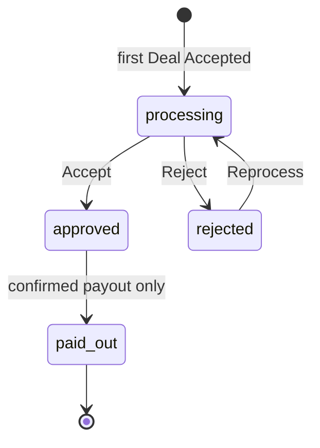
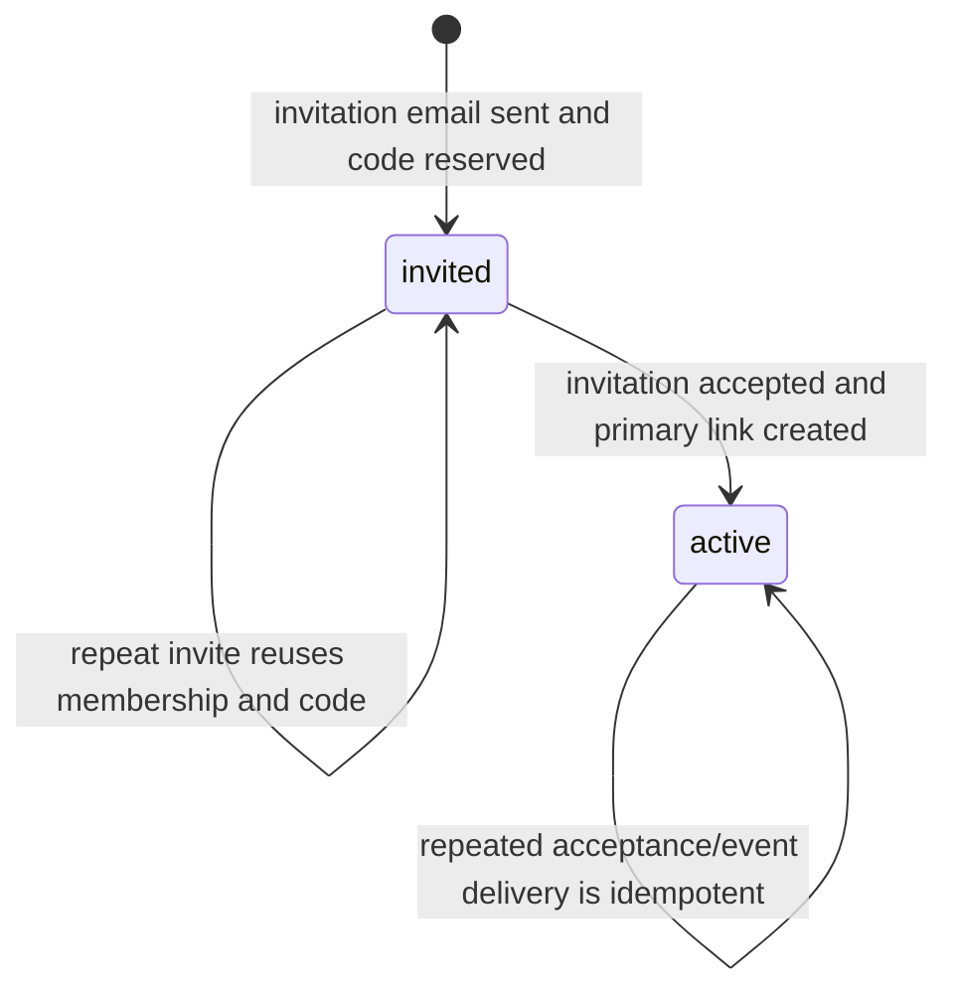

# Finoo Affiliate Program, Transactions, and Payouts

## TLDR

**Key Points:**
- Extend the private `finoo_affiliates` module into the complete Finoo affiliate-program operating surface: invitation-backed affiliate membership, one generated primary link per affiliate, first-party unique-click tracking, Deal attribution, an idempotent transaction ledger created on the first `Accepted` stage transition, manual review, and manual payout recording.
- Keep public self-registration disabled. Staff invite an email through the existing customer-portal invitation API with the existing `affiliate` role; Finoo immediately reserves a unique code and activates its primary tracked link only after invitation acceptance creates the portal user.
- Treat a payout as evidence that an external bank transfer was already made. Confirmation creates one payout, connects every selected approved transaction, and atomically moves those transactions to `paid_out`; it never initiates money movement.
- Preserve the deployed THOM-88 contracts additively: legacy link CRUD, Completed-transition records, old event IDs, and the `waiting` status remain readable/accepted for compatibility, while new UI and records use `processing`, `approved`, `rejected`, and `paid_out`.

**Scope:**
- Affiliate portal dashboard, Leads, Payouts, and Profile pages.
- Staff Affiliates, Affiliate transactions, and Affiliate payouts pages.
- Invitation orchestration, primary-link generation, encrypted bank profile, transaction state machine, payout preview/confirmation, migrations, tests, deployment, and headed QA.
- FINOO outbound invitation delivery through the existing Amazon SES Communications Hub adapter using one organization-scoped dedicated credential pair stored by the encrypted integration-credentials service.
- Reuse the existing `affiliate` and `intermediary` customer roles; only `affiliate` receives this module's portal grants.

**Boundaries:**
- The finoo.pl Deal-ingress endpoint remains out of scope. This module consumes the existing Deal custom fields `affiliate_code`, `landing_page`, and `initial_referrer`.
- Commission calculation rules are out of scope. Staff continue to enter a non-negative integer commission amount on the Deal before acceptance; the first Accepted transition snapshots that value into the transaction.
- Payout confirmation records an external payment; it does not call a bank, payment provider, or accounting service.
- The intermediary portal remains out of scope.
- This is private FINOO instance work. No upstream contribution, public branch, public issue, or public PR is allowed.
- The shared EC2 role, IMDS settings, trust policies, CTO credentials, and existing real FINOO user credentials are not modified.

**Concerns:**
- Money state, encrypted bank details, invitations, portal authorization, tenant isolation, idempotent stage processing, and multi-record payout updates make the delivery `risk-high`.
- The deployed integer commission contract is preserved as whole PLN units. Fractional commissions and multi-currency payouts require a separately approved migration.

## Overview

THOM-89 completes the operational affiliate loop started by THOM-88. The deployed module already provides human-unique click tracking, affiliate-code attribution, a portal dashboard, a Leads table, staff link CRUD, and a Deal commission widget. It does not yet have a durable affiliate membership record, invitation-driven primary-link lifecycle, Accepted-based commission transactions, bank profiles, or payout records.

The extension remains one private application module at `apps/mercato/src/modules/finoo_affiliates`. It uses existing customer-account invitation APIs and events, customer Deal events and stage-transition history, module-local commands, the platform encryption map, progress jobs for payout confirmation, and existing backend/portal UI primitives. Core modules are not modified.

The existing `@open-mercato/channel-ses` provider is extended additively with optional `authMode`, `accessKeyId`, and `secretAccessKey` credential fields. Both key fields are secret-typed and encrypted by the existing integration credential store. Adapter and health-check clients inject the pair only in explicit access-key mode; absent fields preserve the AWS SDK default chain. FINOO provisioning remains ambient-compatible, while the private upgrade gate requires a healthy explicit pair only for the exact FINOO tenant and organization. The pair enters the runtime through a stdin-only CLI command, is never accepted as a CLI option or environment variable, and is not printed.

> **Market references:** Plausible Community Edition remains the reference for privacy-minimized first-party click storage. Refersion and Affilae document the common pending/approved/rejected conversion review model, while Rekomi and Affonso model payouts as batches connected to immutable conversion IDs and distinguish payable from paid. Finoo adopts idempotent conversion identity, explicit review states, a terminal paid state, and payout-to-transaction linkage. It deliberately rejects automatic transfers, clawbacks, multi-currency settlement, commission-rule engines, fraud scoring, and post-payment adjustments because none are in the approved scope.

## Problem Statement

The current implementation has six material gaps:

1. Staff manage links, not affiliates. There is no durable one-row-per-affiliate record that can exist between invitation and account acceptance or hold the primary code and bank profile.
2. The current transaction graph uses the first `Completed` transition on Deal attribution. The approved business rule is instead: create one commission transaction on the first `Accepted` transition and never create it again after reopen/re-entry.
3. Commission status is stored directly on Deal attribution with the old `waiting / approved / rejected` vocabulary. There is no authoritative transaction state machine and no terminal `paid_out` state.
4. There is no payout aggregate connecting a payment reference and total to the exact transactions covered by the external bank transfer.
5. Affiliates cannot maintain account-holder/account-number data or see payout history and balance summaries.
6. Staff cannot invite an affiliate from the program surface or operate affiliate, transaction, and payout tables as one workflow.

## Goals and Non-Goals

### Goals

- One tenant- and organization-scoped `FinooAffiliate` membership per invitation/email before acceptance and per affiliate portal user after acceptance.
- One high-entropy primary affiliate code and generated tracked URL per membership.
- Immediate code reservation after the staff invitation succeeds; link activation only after the invitation is accepted.
- Exactly one commission transaction per attributed Deal, created from the first normalized `Accepted` stage transition.
- Explicit transaction transitions: `processing -> approved`, `processing -> rejected`, `rejected -> processing`, and `approved -> paid_out` only through payout confirmation.
- Atomic and idempotent payout creation across one affiliate's selected approved transactions. Mixed-affiliate batching is superseded by `.ai/specs/enterprise/2026-08-18-finoo-batch-payouts-and-visible-errors.md`.
- Encrypted profile and payout bank details.
- Affiliate-scoped portal reads and feature-gated staff actions.
- Additive migration and preserved THOM-88 public/private contract surfaces.

### Non-Goals

- finoo.pl Deal ingestion or changes to its application form.
- Automatic commission calculation, percentage/rate plans, approval delays, refund/clawback handling, negative balances, tax documents, invoices, or payment-provider integration.
- Multi-currency payouts. THOM-89 is fixed to PLN and preserves existing integer values as whole PLN units.
- Changing customer-account invitation acceptance fields or creating CRM People records for invitees.
- Self-registration or affiliate applications.
- Editing or undoing a recorded payout after confirmation.
- Deleting legacy affiliate-link or first-Completed data.

## Confirmed Business Rules

- Customer portal roles: existing `intermediary` and `affiliate` roles; only `affiliate` receives affiliate-program access.
- Public self-registration: disabled at page, CTA, and API levels.
- Click: one human top-level navigation per link/browser token in a rolling 24-hour window; bots, previews, prefetches, and subresource requests redirect without counting.
- Lead attribution: Deal custom-field `affiliate_code` resolves an active link and immutable affiliate owner.
- Conversion trigger: earliest persisted Deal stage transition whose trimmed, case-normalized label is `accepted`.
- Reopen/re-entry: leaving Accepted and entering Accepted again does not create or change the existing transaction.
- Initial transaction status: `processing`.
- Commission amount: non-negative integer entered by staff before Accepted and snapshotted into the transaction on first Accepted.
- Status wording: the business text's “Accepted” transaction status means the technical `approved` commission status; Deal stage `Accepted` remains a separate workflow concept.
- Payout eligibility: only `approved` transactions.
- Payout selection: the original contract supports one or more transactions belonging to exactly one affiliate and one tenant/organization; `.ai/specs/enterprise/2026-08-18-finoo-batch-payouts-and-visible-errors.md` additively groups a mixed selection into one payout per affiliate.
- Payout effect: one payout row plus links to all selected transactions and their transition to `paid_out`, in one database transaction.
- Payout warning: localized through `finooAffiliates.payouts.confirmWarning`; Polish displays “Potwierdź wyłącznie wtedy, gdy płatność została faktycznie wykonana.”
- Bank payment: external/manual; confirmation records it only.
- Currency: PLN; stored integer values remain whole PLN units for compatibility.
- SES provider authentication: the AWS SDK default credential chain remains the provider default. The FINOO organization alone opts into a dedicated access-key pair; incomplete or implicit key pairs fail validation.
- SES IAM scope: `ses:SendRawEmail` on `arn:aws:ses:eu-west-2:062648047691:identity/they.dev` only when `ses:FromAddress` equals `no-reply@they.dev`, plus `ses:GetAccount` on `*` for the existing health probe. Both statements require `aws:RequestedRegion = eu-west-2`; ordinary `SendEmail` and SES management actions are not granted.

## Proposed Solution

Add five module-owned entities—affiliate membership, first Accepted registry, transaction, payout-preview reservation, and payout—and extend the existing link and attribution rows with optional membership IDs. Existing invitation, link, visit, and Deal attribution entities stay in place.

The staff invitation form submits once but performs a two-step server workflow through existing APIs:

1. `customer_accounts` sends the invitation with the `affiliate` role and returns the invitation ID only after email delivery succeeds.
2. Finoo's idempotent ensure endpoint validates that scoped invitation and role, creates/reuses the affiliate membership, reserves its unique code, and returns it immediately.

Best-effort inline Finoo subscribers to `customer_accounts.user.invited` and `customer_accounts.invitation.accepted` accelerate synchronization but are not treated as durable or trusted-scope delivery, because the existing source events are fire-and-forget. Each subscriber reloads the invitation/user and tenant-owned affiliate role from storage and verifies tenant/organization membership before acting. The explicit ensure endpoint is authoritative after invite, and every authenticated Finoo portal entry lazily runs the same idempotent activation reconciliation before resolving membership. The named setup/CLI reconciliation is the durable operator repair path. Together these paths bind the accepted portal user and create/activate the primary legacy-compatible `FinooAffiliateLink` using the reserved code and configured default destination without modifying core modules. A code is visible after invitation but cannot redirect or attribute Deals until the membership has an accepted active portal user.

An additive database trigger captures the first `Accepted` stage transition into a scoped unique registry with `ON CONFLICT DO NOTHING`. Existing Deal subscribers then synchronize attribution and create the transaction when both an attribution and first-Accepted record exist. A scoped unique constraint on transaction Deal identity is the second idempotency boundary.

Staff review transactions through explicit transition commands. Payout preview validates a same-affiliate selection, reads the current encrypted bank profile, and persists a module-owned reference reservation with an exact binding hash. Confirm enqueues a progress job carrying that reference. Concurrent exact confirms may create more than one progress/queue job because the shared services have no caller-defined uniqueness seam; every job converges on the single database-unique reference and payout. The worker executes one compound command that locks and revalidates all selected versions, creates or reuses the payout, links every transaction, and changes them to `paid_out` atomically.

## User Stories / Use Cases

- **Staff program manager** wants to invite an email and receive a unique code so that the affiliate can join without public registration.
- **Affiliate** wants to copy one generated link and see leads, unique clicks, accepted transactions, payable balance, paid total, and payout history.
- **Affiliate** wants to maintain account holder and account number so staff can prepare a manual transfer.
- **CRM operator** wants first Accepted to create one commission transaction so reopen/re-entry cannot double accrue commission.
- **Finance operator** wants to approve/reject transactions and record one payout for selected approved transactions so the ledger matches a completed bank transfer.
- **Auditor** wants a payment reference and immutable transaction linkage so each paid commission is traceable exactly once.

## Architecture

### Module Boundary and Cross-Module Coupling

`finoo_affiliates` remains the glue-owning private consumer. It retains its existing `scheduler` requirement and also requires the application modules `customers`, `customer_accounts`, `portal`, `dictionaries`, `events`, and `progress`. Payout workers use the `@open-mercato/queue` infrastructure package without declaring a nonexistent `queue` module dependency.

- Customer invitation mutation: browser calls the existing authenticated `customer_accounts` API; Finoo does not import or invoke its command/service.
- Invitation and acceptance side effects: Finoo best-effort inline subscribers consume declared `customer_accounts` events, then reload and verify invitation/user/role scope; explicit ensure, lazy portal reconciliation, and the repair CLI provide recovery.
- Deal conversion side effect: Finoo persistent subscribers consume declared `customers.deal.created` / `updated` / `deleted` events and read scoped Deal, custom-field, company, and transition data. Every module-owned update of an existing attribution first runs the idempotent transaction command against the persisted pre-edit values and fails closed if that snapshot attempt fails; a second attempt after persistence covers the reverse ordering where Accepted preceded attribution. Deal deletion likewise runs the command before soft-deleting the attribution and permits the trusted system command to read the just-soft-deleted Deal, preserving any first-Accepted liability. A scoped scheduled reconciliation scans only eligible post-deploy `finoo_deal_acceptances` rows without a transaction, including legacy attributions whose nullable `affiliate_id` can be resolved from the active scoped `affiliate_user_id`, so a failure between the committed Deal write and persistent-event enqueue cannot strand a valid post-deploy commission or allow a later attribution edit to replace its pre-edit money/affiliate snapshot.
- Cross-module data: scalar UUIDs and encrypted snapshots only; no cross-module ORM relations.
- UI: module pages and existing dashboard/Deal widget injection spots.
- Module-absent behavior: customer invitations and CRM Deals keep working; no Finoo membership, transaction, or payout side effect occurs.

### Data Flow

```mermaid
flowchart LR
  Staff["Staff enters affiliate email"] --> Invite["Customer portal invitation email"]
  Invite --> Reserve["Finoo membership and reserved code"]
  Reserve --> AcceptInvite["Invitee accepts and creates portal user"]
  AcceptInvite --> PrimaryLink["Primary tracked link activated"]
  PrimaryLink --> Click["Human unique visit"]
  Click --> Form["Existing finoo.pl application flow"]
  Form --> Deal["Deal with affiliate_code"]
  Deal --> Attribution["Finoo Deal attribution"]
  Deal --> Accepted["First Accepted transition registry"]
  Attribution --> Transaction["One processing transaction"]
  Accepted --> Transaction
  Transaction --> Review["Approve, reject, or reprocess"]
  Review --> Preview["Same-affiliate payout preview"]
  Preview --> Confirm["Confirmed external payment record"]
  Confirm --> Payout["Payout plus paid_out transactions"]
```

### Server / Client Boundary Map

| Route / surface | Server root | Client islands | Data owner | Notes |
|---|---|---|---|---|
| `/backend/finoo-affiliates/affiliates` | generated backend page wrapper | `AffiliatesTableClient`, `InviteAffiliateDialog` | staff APIs | DataTable plus invite dialog |
| `/backend/finoo-affiliates/transactions` | generated backend page wrapper | `TransactionsTableClient`, `PayoutPreviewDialog` | staff APIs | selected-row action and guarded writes |
| `/backend/finoo-affiliates/payouts` | generated backend page wrapper | `PayoutsTableClient` | staff APIs | read-only DataTable |
| `/:orgSlug/portal/affiliate/leads` | generated portal page wrapper | `AffiliateLeadsClient` | portal API | existing route, expanded statuses |
| `/:orgSlug/portal/affiliate/payouts` | generated portal page wrapper | `AffiliatePayoutsClient` | portal API | read-only DataTable |
| `/:orgSlug/portal/affiliate/profile` | generated portal page wrapper | `AffiliateProfileFormClient` | portal profile API | own encrypted bank fields |
| portal dashboard | existing portal server shell | three charts plus summary/link client island | portal dashboard API | no new provider |

### `"use client"` Ledger and Budgets

| File group | Exact browser capability | Heavy deps | Guardrail |
|---|---|---|---|
| staff Affiliates client | DataTable, dialog state, email submit, copy link | DataTable only | split invite dialog from table; each file target <300 LOC |
| staff Transactions client | DataTable selection, actions, preview dialog | DataTable only | split preview dialog and status actions; each file target <300 LOC |
| staff Payouts client | DataTable pagination/sorting | DataTable only | target <250 LOC |
| portal Profile client | form state and guarded PUT | none | target <220 LOC |
| portal Payouts client | DataTable pagination | DataTable only | target <220 LOC |
| dashboard summary/link client | date controls and copy action | existing chart deps only | no new chart/provider dependency |

Budgets: zero new production dependencies, zero new global providers, zero page-root client components outside generated conventions, page size at most 100, payout selection at most 100, changed interactive routes each receive a hydration/interaction Playwright path, and `yarn check:client-boundaries` must pass. Because that checker does not scan app-module client islands, a focused source test additionally enforces server page roots, `*.client.tsx` separation, and these LOC budgets.

## Data Models

All new module entities contain UUID `id`, `tenant_id`, `organization_id`, `created_at`, and `updated_at`. Queries always include tenant and organization. User-editable rows include `updated_at` for optimistic locking. Scalar IDs reference peer-module rows without ORM relations.

### `FinooAffiliate` — `finoo_affiliates`

| Field | Type | Rules |
|---|---|---|
| `invitation_id` | UUID nullable | scoped invitation reference; unique while present |
| `customer_user_id` | UUID nullable | set after acceptance; scoped unique while present |
| `email` | text | encrypted invitation/user snapshot |
| `email_hash` | text | deterministic equality lookup; scoped unique active membership |
| `code` | text | 24-character high-entropy uppercase code; globally unique and immutable |
| `primary_link_id` | UUID nullable | module-local link ID created on acceptance |
| `account_holder_name` | text nullable | encrypted; portal user editable |
| `account_number` | text nullable | encrypted; trimmed/normalized for storage, never logged |
| `is_active` | boolean | false until accepted; inactive members cannot create new attribution |
| `deleted_at` | timestamptz nullable | soft delete; financial history remains |

Indexes: unique global code, scoped unique non-deleted email hash, scoped unique non-null customer user, scoped invitation, active list.

Staff first/last-name columns do not add another name store. The list batch-loads the linked scoped CRM Person when available and uses its first/last name. Otherwise it derives a display fallback by splitting the required customer-user `displayName` at the final whitespace; a one-token name has an empty last-name cell. This is display-only and never used for identity or authorization.

### Existing `FinooAffiliateLink` Extension

Add nullable `affiliate_id` and retain `affiliate_user_id`, `code`, `label`, destination, lifecycle, routes, commands, and events. The new primary link has the membership's reserved code. Existing manually created links remain valid and can continue to redirect and attribute. The old staff link CRUD page is removed from navigation but its API contract remains.

### Existing `FinooDealAttribution` Extension

Add nullable `affiliate_id`. Preserve all deployed columns, the legacy `approved | waiting | rejected` commission-status contract, and legacy first-Completed `transaction_at`. The existing Deal-attribution API and command remain writable before and after Accepted exactly as deployed; later edits affect only the mutable CRM attribution and never rewrite an already-created transaction snapshot. Add read-only transaction identity/current-program-status fields to the response so the CRM widget can distinguish the mutable attribution from the immutable ledger. New portal and staff program views use the transaction projection described below rather than reinterpreting the legacy status field.

### `FinooDealAcceptance` — `finoo_deal_acceptances`

| Field | Type | Rules |
|---|---|---|
| `deal_id` | UUID | scoped unique CRM Deal ID |
| `accepted_at` | timestamptz | first Accepted transition observed after deployment; immutable |

The trigger inserts with `ON CONFLICT DO NOTHING`. The existing `finoo_deal_completions` table and trigger remain unchanged for compatibility.

### `FinooAffiliateTransaction` — `finoo_affiliate_transactions`

| Field | Type | Rules |
|---|---|---|
| `affiliate_id` | UUID | module membership ID |
| `affiliate_user_id` | UUID | accepted portal-user snapshot |
| `deal_id` | UUID | scoped unique Deal identity; no ORM relation |
| `deal_name` | text nullable | encrypted snapshot |
| `deal_company` | text nullable | encrypted snapshot |
| `commission_amount` | integer | non-negative whole PLN units, snapshot at first Accepted |
| `currency` | text | fixed `PLN` snapshot |
| `commission_status_entry_id` | UUID | dictionary entry snapshot |
| `commission_status` | text | `processing`, `approved`, `rejected`, or `paid_out` |
| `accepted_at` | timestamptz | immutable first Accepted time |
| `payout_id` | UUID nullable | module-local payout link; set exactly once |
| `created_event_published_at` | timestamptz nullable | durable publication marker; null rows are retried by Accepted reconciliation |
| `created_at` / `updated_at` | timestamptz | optimistic-lock version is `updated_at` |

Indexes: scoped unique Deal, scoped affiliate/status/accepted time, scoped payout, dashboard time range.

### `FinooAffiliatePayout` — `finoo_affiliate_payouts`

| Field | Type | Rules |
|---|---|---|
| `affiliate_id` | UUID | module membership ID |
| `affiliate_user_id` | UUID | portal-user snapshot |
| `payment_reference` | text | server-generated globally unique idempotency key |
| `amount` | bigint | exact sum of linked transactions in whole PLN units |
| `currency` | text | fixed `PLN` |
| `account_holder_name` | text | encrypted confirmation-time snapshot |
| `account_number` | text | encrypted confirmation-time snapshot |
| `paid_at` | timestamptz | server confirmation time |
| `created_event_published_at` | timestamptz nullable | durable publication marker; payout-job retry repairs a failed enqueue |
| `created_at` / `updated_at` | timestamptz | immutable business record after creation |

Each transaction has at most one `payout_id`; one payout has one or more transaction rows. No unbounded ID array or JSON ledger is stored.

### `FinooPayoutPreview` — `finoo_payout_previews`

| Field | Type | Rules |
|---|---|---|
| `payment_reference` | text | server-generated globally unique opaque reference |
| `batch_id` | UUID nullable | server-issued aggregate identity; nullable only for previews created before the batch-binding migration |
| `batch_binding_hash` | text nullable | scope-bound hash of the canonical payment-reference/group-binding set |
| `affiliate_id` | UUID | module membership ID |
| `binding_hash` | text | versioned, scope-bound HMAC of canonical transaction IDs/versions, affiliate version, total, currency, and bank-profile HMAC; creation fails closed without a server-side pepper |
| `selection` | JSON | bounded 1..100 transaction IDs and versions; no bank data |
| `amount` | bigint | exact preview total in whole PLN units |
| `currency` | text | fixed `PLN` |
| `expires_at` | timestamptz | short-lived confirmation window |
| `payout_id` | UUID nullable | set after successful convergence |
| `created_at` / `updated_at` | timestamptz | lifecycle and optimistic concurrency |

The unique reference is the financial idempotency seam. Expired unused previews are pruned by the existing scheduler pattern. New aggregate-money APIs serialize `amount`, `totalPaidOut`, and `pendingPayout` as base-10 integer strings so `bigint` values never lose precision in JSON; legacy per-Deal `commissionAmount` remains a number.

### Encryption and Privacy

`encryption.ts` is extended with platform `defaultEncryptionMaps` for:

- `finoo_affiliates.email` with `email_hash` as the lookup sibling;
- `finoo_affiliates.account_holder_name` and `account_number`;
- `finoo_affiliate_transactions.deal_name` and `deal_company`;
- `finoo_affiliate_payouts.account_holder_name` and `account_number`.

All reads use `findWithDecryption` / `findOneWithDecryption` and trusted tenant/organization scope. Bank values never enter logs, events, progress metadata, audit summaries, or affiliate/staff list responses except the explicitly authorized payout preview and own-profile response. Staff list rows expose only email/name/code/count. Portal payout history exposes date/reference/amount, not stored bank snapshots.

### Commission Dictionaries

The existing system dictionary `finoo_commission_status` remains unchanged for the legacy Deal-attribution contract:

- `approved`;
- `rejected`;
- `waiting`.

The new system dictionary `finoo_affiliate_transaction_status` contains `processing`, `approved`, `rejected`, and `paid_out`. Only transaction APIs expose this closed four-value enum. Existing attribution rows, dictionary entry IDs, OpenAPI enums, and generated/exhaustive clients therefore retain their current behavior. In new program views an assigned Deal with no transaction is projected as `processing`; after Accepted, the transaction row is authoritative.

## State Machines

### Transaction

All other transitions return `409 INVALID_COMMISSION_TRANSITION`. `paid_out` is terminal. A paid transaction cannot be edited, rejected, reprocessed, removed from its payout, or paid again.

### Invitation / Affiliate Activation

An expired/cancelled invitation does not delete the reserved membership automatically; re-inviting the same normalized email reuses it. Staff can deactivate the membership separately in future scope; THOM-89 does not add a delete action to the new Affiliates table.

## Commands, Events, Workers, and Undo

### Commands

- `finoo_affiliates.affiliate.ensure_invitation` — idempotently creates/refreshes membership after a successful scoped affiliate-role invitation; undo soft-deletes only a newly created, still-unaccepted membership.
- `finoo_affiliates.affiliate.activate` — system command binds the accepted user and creates/reuses the primary link; idempotent, not user-undoable.
- `finoo_affiliates.affiliate.update_profile` — portal-own bank profile update with DI-aware optimistic locking; intentionally non-undoable and executed with `skipLog: true` because the command bus always persists original redo input, which would expose bank values through decrypted audit surfaces. This release creates no ActionLog for the profile mutation; scoped API authorization and the entity `updated_at` provide the operational trace without storing another sensitive copy.
- `finoo_affiliates.transaction.create` — system command from Deal synchronization; unique Deal and first-Accepted registry make retries idempotent; not user-undoable.
- `finoo_affiliates.transaction.transition` — staff command for processing/approved/rejected transitions; undo restores the prior non-paid status only if the row has not since become `paid_out`.
- `finoo_affiliates.payout.create` — worker-invoked compound command; non-undoable because it records an already-made external transfer.

Existing link and attribution commands/events remain.

### Events

Add singular, past-tense module events:

- `finoo_affiliates.affiliate.created`
- `finoo_affiliates.affiliate.activated`
- `finoo_affiliates.affiliate.profile_updated`
- `finoo_affiliates.affiliate_transaction.created`
- `finoo_affiliates.affiliate_transaction.updated`
- `finoo_affiliates.affiliate_payout.created`

Events include IDs, status/amount where operationally needed, and trusted scope, but never email or bank data. Existing event IDs are not renamed or removed.

Created financial events use at-least-once publication. The transaction and payout rows retain a nullable publication timestamp that is written only after the persistent event enqueue succeeds. A failed enqueue leaves the marker null: Accepted reconciliation reselects unpublished transaction rows, while the durable payout job retries or remains recoverable from its dead-letter record. A crash after enqueue but before marking may publish a duplicate, so consumers must remain idempotent by the stable financial row ID.

### Subscribers

- `customer_accounts.user.invited` -> best-effort ensure when a storage-verified invitation includes the tenant-owned `affiliate` role.
- `customer_accounts.invitation.accepted` -> best-effort bind/activate after reloading and verifying invitation, user, role, tenant, and organization.
- Existing `customers.deal.created` / `updated` subscribers -> synchronize attribution and create transaction when first Accepted exists.
- Scheduled post-deploy acceptance reconciliation -> retry transaction creation or missing created-event publication for registry rows that still have no ledger row or whose transaction publication marker is null and currently have a live Deal, active attribution, and matching active affiliate membership. Membership matches `affiliate_user_id` and, when the legacy nullable `affiliate_id` is present, must also match that ID. It never scans historical customer stage transitions, cannot create pre-deploy liabilities, and does not immediately requeue a batch containing a no-op row; the stable schedule handles later eligibility without a tight loop.
- Existing Deal deletion subscriber -> first creates/reuses any post-deploy first-Accepted transaction from the still-live attribution and the just-soft-deleted Deal snapshot, failing closed before soft-deleting the attribution; transaction/payout history remains intact.

Each subscriber has one event, treats the event context as untrusted, derives scope from verified persisted rows, performs idempotent writes, and does not circularly re-emit into the source module. Delivery durability comes from explicit ensure, lazy portal activation reconciliation, and the repair CLI rather than from these source events.

### Payout Worker and Progress

Payout confirmation is a user-visible selected-row operation and therefore uses the shared progress framework:

1. preview binds its payment reference to the canonical sorted transaction IDs, their versions, affiliate ID and version, total, currency, and bank-profile snapshot hash;
2. confirmation validates that exact binding for up to 100 `{ id, updatedAt }` rows and the supplied `affiliateUpdatedAt` under the same-affiliate scope;
3. creates a `ProgressJob` whose non-sensitive metadata includes the payment reference; concurrent duplicate jobs are permitted and converge on one payout;
4. enqueues `finoo-affiliates-payout-create` with trusted scope, user ID, reference, affiliate version, and transaction versions;
5. worker starts the job, executes one atomic payout command, marks processed count to total only after commit, then completes;
6. failures mark the job failed and queue retry reuses the payment reference, so a committed payout is returned rather than duplicated.

The compound command uses the DI-aware command optimistic-lock guard, locks all scoped transaction and preview rows, and compares every explicit version while locked. It is all-or-nothing. Partial payout rows or partially paid transaction sets are impossible.

## API Contracts

Every route exports per-method `metadata` and `openApi`, validates with Zod, excludes caller-supplied tenant/organization scope, and uses feature-based authorization. Custom writes run registered mutation guards plus command-level optimistic locking.

### Staff Affiliates

#### `GET /api/finoo_affiliates/affiliates`

Requires `finoo_affiliates.view`. Query: page, pageSize <=100, sort/search. Response rows: `id`, email, firstName, lastName, code, trackedUrl, relatedDeals, invite/active state, updatedAt. Batch enrichment has a bounded query count and no N+1 loop.

#### `GET /api/finoo_affiliates/invite-options`

Requires `finoo_affiliates.manage`. Returns the scoped active `affiliate` customer-role ID and whether the default destination configuration is ready. Does not expose other role ACLs.

#### `POST /api/finoo_affiliates/affiliates/ensure-invitation`

Requires `finoo_affiliates.manage` and an invitation ID returned by the existing `POST /api/customer_accounts/admin/users-invite`. Validates the invitation belongs to the same scope and includes the `affiliate` role. Returns `201` for created or `200` for existing: membership ID, code, active state, and future tracked URL. Repeated requests are idempotent.

The UI also requires the caller to hold `customer_accounts.invite` for the first existing-API call. The page explains a core invitation failure separately from a Finoo synchronization failure; event repair makes the second step recoverable.

### Staff Transactions

#### `GET /api/finoo_affiliates/transactions`

Requires `finoo_affiliates.view`. Paginated/filterable response columns: affiliateFirstName, affiliateLastName, dealName, dealCompany, commissionAmount, currency, commissionStatus, acceptedAt, updatedAt.

#### `POST /api/finoo_affiliates/transactions/:id/transition`

Requires `finoo_affiliates.manage`. Body: `action` (`accept`, `reject`, `reprocess`) and `updatedAt`. Maps only to the documented state machine. `pay_out` is not accepted here. Returns updated row; stale writes return structured `409`.

### Staff Payouts

#### `POST /api/finoo_affiliates/payouts/preview`

Requires `finoo_affiliates.payouts.manage`. Body: 1..100 transaction IDs. Read-only response: server-issued `batchId`, affiliate identity, `affiliateUpdatedAt`, account holder, account number, total amount as a base-10 integer string, currency, selected count, canonical transaction rows with `id` and `updatedAt`, and a server-generated payment reference. Each reference binds its group; `batchId` plus the aggregate binding prevents groups from being omitted or recombined. The original flat single-affiliate response remains a compatibility surface; the 2026-08-18 batch specification adds grouped mixed-affiliate responses and replaces `MIXED_AFFILIATES` with all-group preflight.

#### `POST /api/finoo_affiliates/payouts/confirm`

Requires `finoo_affiliates.payouts.manage`. The grouped body contains `batchId` and the exact groups returned by preview, with at most 100 transactions across the complete batch. Confirm atomically revalidates the aggregate group set, every reference binding, affiliate/profile version, transaction version/status, amount, and scope before enqueueing or committing any financial change. The legacy flat single-group body remains accepted only when the server-issued batch contains exactly one group. Any omitted/recombined group or changed selection, profile, amount, status, version, scope, or retry payload returns structured `409 PAYOUT_PREVIEW_STALE`; the client must request a new preview. A valid request returns `202`; an exact concurrent retry converges on the same payout set. A retry after commit returns `200`. No path creates a second payout.

#### `GET /api/finoo_affiliates/payouts`

Requires `finoo_affiliates.view`. Paginated response: affiliateFirstName, affiliateLastName, paymentReference, amount as a base-10 integer string, currency, paidAt, transactionCount.

### Portal

All portal APIs require customer auth plus the applicable portal feature and derive affiliate membership from the authenticated user ID.

#### `GET /api/finoo_affiliates/portal/dashboard?from=&to=`

Preserves default last 30 days and maximum 366 days. The existing `transactions` series retains its first-Completed meaning. The response additively returns `affiliateTransactions`, a zero-filled ISO-week series based on new ledger `acceptedAt`, plus base-10 integer strings `totalPaidOut` (sum of `paid_out` transactions) and `pendingPayout` (sum of `approved` transactions), currency, and the generated active tracked URL/code. The existing portal-transactions widget keeps consuming `transactions`; the new affiliate-program graph consumes `affiliateTransactions` under a new widget/component identity.

#### `GET /api/finoo_affiliates/portal/leads`

Preserves current columns, pagination, and legacy `commissionStatus: approved | waiting | rejected`. Additive fields include `affiliateProgramStatus: processing | approved | rejected | paid_out`, `affiliateTransactionId`, and transaction snapshot metadata. The new Leads table displays `affiliateProgramStatus`: assigned Deals without a transaction project as `processing`; Deals with a transaction use its exact status. Existing clients and tests may continue consuming only `commissionStatus`.

#### `GET /api/finoo_affiliates/portal/payouts`

Requires `portal.finoo_affiliates.view`. Paginated own-affiliate response: date (`paidAt`), paymentReference, amount as a base-10 integer string, currency.

#### `GET/PUT /api/finoo_affiliates/portal/profile`

GET requires `portal.finoo_affiliates.view`; PUT additionally requires `portal.finoo_affiliates.profile.manage`. Response/request contain only own accountHolderName, accountNumber, and updatedAt. PUT uses optimistic locking and platform encryption. Empty values are allowed for editing but payout preview remains blocked until both are non-empty.

### Existing Contracts

- Existing link CRUD and redirect endpoints remain.
- Existing Deal-attribution endpoint and `finoo_affiliates.deal_attributions.upsert` command remain behavior-compatible and add only read-only membership/transaction projection fields. After transaction creation, legacy edits update the CRM attribution only; they never change the transaction's affiliate, amount, status, or payout linkage. Transaction changes use only the new transition/payout commands.
- Existing dashboard/leads paths remain stable.
- Existing signup disablement remains unchanged.

## Authorization and ACL

### Staff Features

- `finoo_affiliates.view` — list affiliates, transactions, payouts and view Deal attribution.
- `finoo_affiliates.manage` — invite/ensure affiliates, manage pre-transaction Deal affiliate/amount, and transition non-paid transactions.
- `finoo_affiliates.payouts.manage` — view full payout preview bank details and confirm payout records.

Default staff grants: superadmin/admin receive all three; employee receives view only. Existing tenants receive additive grants via setup plus `auth sync-role-acls` during deployment.

### Portal Features

- `portal.finoo_affiliates.view` — dashboard, link, Leads, and payout history.
- `portal.finoo_affiliates.profile.manage` — update own bank profile.

The existing tenant-owned `affiliate` customer role receives both. `intermediary` receives neither. Role lookup is by tenant slug and does not assume a separate role row per organization; invitation membership is still verified for the selected organization. Existing tenants receive additive customer-role grants through setup synchronization. APIs still validate that the authenticated user has an active module membership, so granting a feature alone does not expose another affiliate's data.

## UI/UX

### Staff Navigation

Under the existing **Finoo affiliates** group:

1. **Affiliates** — replaces the visible “Affiliate links” item and route in navigation; columns email, first name, last name, code, related deals; toolbar Invite button.
2. **Affiliate transactions** — DataTable with required columns, `StatusBadge`, row Accept/Reject/Reprocess actions, canonical bulk selection, and Pay out toolbar action. The current DataTable has no row-selectability predicate, so all visible rows remain selectable; preview is the authoritative validation and rejects any non-approved or mixed-affiliate set without mutation.
3. **Affiliate payouts** — read-only DataTable with affiliate names, payment reference, amount, date, and transaction count.

The old links page/API remains reachable only by its existing URL for compatibility but is no longer a navigation item.

All three staff page metadata files require `finoo_affiliates.view`. Inside those pages, Invite is visible only with both `finoo_affiliates.manage` and `customer_accounts.invite`; transaction row actions require `finoo_affiliates.manage`; Pay out and its preview/confirm controls require `finoo_affiliates.payouts.manage`. APIs repeat every authorization check.

### Invite Dialog

Uses `Dialog`, `FormField`, `EmailInput`, and same-size `Button`s. Only email is requested. Submit first sends the existing portal invitation with the affiliate role, then ensures Finoo membership and displays/copies the reserved code. `Cmd/Ctrl+Enter` submits, `Escape` cancels, server errors remain distinguishable, and duplicate pending invitations reuse the membership/code.

### Payout Preview and Confirmation

The Pay out action sends the selected rows to preview. A valid approved same-affiliate selection opens a focused `Dialog` showing total PLN amount, affiliate, account holder, account number, generated reference, and selected count; invalid selections receive the scoped preview error and remain selected. An `Alert status="warning"` resolves `finooAffiliates.payouts.confirmWarning`; Polish displays “Potwierdź wyłącznie wtedy, gdy płatność została faktycznie wykonana.” Confirm is the primary action and is disabled while submitting. `Cmd/Ctrl+Enter` confirms and `Escape` cancels. After the confirm endpoint returns `202`, the host bulk action resolves successfully so canonical DataTable selection clears, while the shared global progress UI hydrates and follows the returned job. No custom table or polling loop is added.

### Portal Dashboard

- Existing three weekly charts retain independent adjustable date ranges and default last 30 days.
- Summary values show total paid out and pending payout in PLN.
- Generated individual link/code has an accessible Copy action and an inactive/setup message if membership activation is incomplete.
- Unrelated example showcase widgets require `portal.orders.view`, so an affiliate-only role sees only the FINOO affiliate dashboard content and no English demo placeholders.

### Portal Pages

- Leads: current columns, four current `StatusBadge` states, PLN amount.
- Affiliate payouts: date, reference, amount.
- Profile: `FormField` + `Input` for account holder and account number; save through guarded mutation; clear payout-blocking explanation.

All user-facing copy uses `useT`/translation files. Pages use `DataTable`, `LoadingMessage`, `ErrorMessage`, and standardized empty states. No raw form controls, fetch, hard-coded colors, arbitrary sizes, inline SVG, or custom dialog implementation. Narrow viewport keeps dialogs usable as the shared mobile bottom sheet and tables horizontally usable through DataTable behavior.

## Configuration

| Variable | Required | Default | Purpose |
|---|---|---|---|
| `OM_FINOO_AFFILIATE_REDIRECT_HOSTS` | production yes | none | existing exact redirect allowlist |
| `OM_FINOO_DEFAULT_AFFILIATE_DESTINATION_URL` | production yes | none | primary link destination created after invitation acceptance |
| `OM_FINOO_ANALYTICS_TIMEZONE` | no | `Europe/Warsaw` | existing dashboard bucketing |
| `OM_FINOO_AFFILIATE_CODE_FIELD` | no | `affiliate_code` | existing Deal custom-field key |
| `OM_FINOO_LANDING_PAGE_FIELD` | no | `landing_page` | existing Deal custom-field key |
| `OM_FINOO_INITIAL_REFERRER_FIELD` | no | `initial_referrer` | existing Deal custom-field key |
| `NEXT_PUBLIC_OM_PORTAL_ALLOW_SELF_REGISTRATION` | no | `true` platform, `false` FINOO | existing signup display switch |

Primary-link activation fails closed if the default destination is missing/invalid; the membership/code remains reserved and the repair command can be rerun after configuration is corrected.

## Performance and Cache

No new application cache is introduced. Reads are identity/scope/date-specific and writes are low volume; avoiding cache removes invalidation and cross-tenant leakage risk.

- Affiliate list: one membership page query, one bounded batch user/person enrichment, one grouped attribution count.
- Transaction/payout lists: one paginated query plus bounded batch name enrichment; no per-row reads.
- Dashboard: indexed range aggregates with maximum 366 days; transactions use `(tenant, organization, affiliate_user_id, accepted_at)` and status indexes.
- Payout confirmation: maximum 100 transaction rows, loaded/locked in one scoped query and committed in one transaction.
- Invite/code point lookups use scoped email hash/invitation/customer-user indexes and global code uniqueness.
- Progress work is one aggregate command; there is no per-transaction queue fan-out or event storm.

Offset pagination remains because it is the existing DataTable contract and all pages cap at 100. Keyset pagination and aggregate caches are deferred until measured volume requires them.

## Migration and Backward Compatibility

### Additive Schema

- Create `finoo_affiliates`, `finoo_deal_acceptances`, `finoo_affiliate_transactions`, `finoo_payout_previews`, and `finoo_affiliate_payouts`.
- Add nullable `affiliate_id` to existing link and attribution tables.
- Add Accepted capture function/trigger without altering the Completed trigger.
- Add nullable financial created-event publication markers for at-least-once recovery.
- Extend encryption maps and snapshots.
- Add the separate `finoo_affiliate_transaction_status` dictionary with `processing`, `approved`, `rejected`, and `paid_out`; leave the existing `finoo_commission_status` dictionary unchanged.

### Data Repair / Backfill

- Existing active affiliate-role customer users receive membership rows and primary codes through the mandatory scoped deployment repair command; an existing active link is adopted as primary when unambiguous, otherwise a primary link is created from the configured default destination.
- Existing attributions are linked to memberships by affiliate user where possible.
- Historical first Accepted transitions and transactions are not created automatically. This avoids turning current mutable Deal amounts into unapproved historical liabilities and preserves the rule that commission is snapshotted at the first observed Accepted transition.
- Only Accepted transitions observed after this release create new acceptance-registry and transaction rows. A future operator-approved historical cohort requires a separate preflight showing exact Deal IDs, amounts, totals, cutoff, and initial statuses before any mutation.

Membership/linkage repair runs in bounded tenant/organization batches through `yarn mercato finoo_affiliates repair-memberships --tenant <id> --organization <id> --dry-run`; the mutually exclusive `--apply` flag performs the reported changes. The command is idempotent, can run while traffic continues, and does not create historical acceptance or transaction rows. It is intentionally not executed from module setup because setup must not silently create customer memberships or external-facing links. Deployment is blocked until the operator runs `--dry-run` for exact counts, then `--apply`, followed by a second `--dry-run` that reports zero pending membership/linkage changes.

### Preserved Contracts

- No existing table, column, enum value, route, event ID, ACL ID, widget spot, DI key, or command ID is removed or renamed.
- Legacy links continue to redirect and count.
- Legacy `waiting` remains accepted, readable, and writable in the legacy Deal-attribution contract; it is not deprecated by this release.
- Existing `transactionAt` and dashboard `transactions` keep their first-Completed meaning. New Accepted transactions use their own `acceptedAt` and the additive `affiliateTransactions` dashboard series.
- Default platform signup behavior remains true outside FINOO.
- Rollback disables new routes/workers/subscribers while additive data remains; dropping financial data is a separate destructive action.

## Implementation Plan

### Phase 1 — Model and Compatibility

1. Extend entities, validators, encryption, new transaction-dictionary setup, ACLs, events, DI, migration, snapshot, and Accepted trigger while retaining `scheduler` and every legacy contract.
2. Add membership/linkage repair and preserve old links/status/API behavior without creating historical financial liabilities.
3. Add unit tests for schemas, encryption declarations, status transitions, code uniqueness, and migration invariants.

### Phase 2 — Invitation and Affiliate Membership

1. Add ensure/activate commands and invitation/acceptance subscribers.
2. Add Affiliates/invite-options/ensure APIs and staff Affiliates page/dialog.
3. Verify invitation email success, duplicate invite reuse, pre-accept inactive code, post-accept link activation, tenant/role isolation, and name fallbacks.

### Phase 3 — Accepted Transactions

1. Capture first Accepted and create one transaction through idempotent Deal synchronization, with a fail-closed pre-edit snapshot attempt on every existing-attribution mutation and Deal deletion, plus eligible registry-only scheduled reconciliation for a lost post-commit event enqueue and nullable legacy `affiliate_id` recovery.
2. Add transition command/API, additive Deal-widget transaction projection, affiliate-transaction dashboard aggregation, and staff Transactions page.
3. Verify reopen/re-entry, concurrent delivery, immutable amount/affiliate snapshots, transitions, optimistic locking, and portal Leads/dashboard changes.

### Phase 4 — Profiles and Payouts

1. Add portal Profile and Payouts APIs/pages with encrypted reads/writes.
2. Add payout preview, reference/idempotency, progress job/worker, atomic payout command, and staff Payouts page.
3. Add dashboard paid/pending summaries and generated link.
4. Verify missing-profile block, mixed-affiliate rejection, duplicate/retry safety, all-or-nothing updates, terminal paid rows, and no bank-data leakage.

### Phase 5 — Integration, Review, and Delivery

1. Run `yarn generate`, focused tests, migration generation/no-op review, package build/typecheck/lint, client-boundary check, and fully managed ephemeral integration tests.
2. Perform one fresh primary deep review plus an orthogonal security review for auth, tenant isolation, encryption, money state, and queue idempotency; remediate and rerun targeted checks.
3. Create a signed commit, deploy only to `finoo.om.they.dev` with exact SHA/digest/OCI/runtime provenance, run migrations/role sync/repair, and keep the CTO password unchanged.
4. Run headed staff/affiliate desktop and narrow-viewport QA, persist evidence to THOM-89, obtain release-evidence review, and close only if all acceptance criteria pass.

## Testing Strategy

### Unit / Route / Service Coverage

- invitation ID/email/role/scope validation, duplicate invite reuse, code collision retry, accepted-user binding, missing-destination repair;
- CRM Person name enrichment and deterministic display-name fallback;
- only normalized `accepted` transitions observed after deployment are captured; first insert wins; duplicate/reopen/re-entry creates one transaction;
- registry-only reconciliation creates a missing transaction after simulated event loss, resolves an active membership when a legacy attribution has no `affiliate_id`, remains idempotent, and never reads historical stage-transition rows;
- Deal deletion after a simulated lost creation event creates/reuses the first-Accepted transaction before the attribution is soft-deleted;
- unknown/inactive/wrong-scope code never attributes;
- transaction starts processing with snapshotted amount/PLN and immutable affiliate/deal/accepted time;
- exact allowed/forbidden transaction transitions while the legacy attribution status remains independently writable;
- profile encryption, decryption scope, optimistic locking, validation, `skipLog: true`, and no sensitive event/log/redo fields;
- payout preview same-affiliate/approved/profile rules and exact reference binding;
- payout command version checks, row locks, exact sum, reference idempotency, atomic linkage, retry-after-commit, and terminal paid state;
- worker progress completed/failed lifecycle, duplicate-job convergence, and trusted scope;
- staff/portal ACL and cross-tenant/cross-affiliate denial;
- old link routes, waiting enum, Completed registry, signup disablement, and current click hardening regressions.

### Integration Coverage

- `TC-FINOO-AFF-009`: staff invites an email; email success yields one reserved code, repeat invite reuses it, acceptance plus authenticated portal reconciliation creates/activates one primary link, and the repair CLI restores the same state after a simulated missed inline event. The ephemeral mail-capture path supplies the raw token; cleanup removes module fixtures and scoped invitation/user rows directly in test teardown because no invitation-delete API exists.
- `TC-FINOO-AFF-010`: Affiliates table shows email, first/last fallback, code, and scoped Deal count; other organization is isolated.
- `TC-FINOO-AFF-011`: attributed Deal first enters Accepted and creates exactly one processing transaction; leave/re-enter and event retry do not duplicate or move acceptedAt.
- `TC-FINOO-AFF-012`: staff accepts/rejects/reprocesses only allowed transaction statuses; stale and illegal transitions fail; Deal/portal additive projection updates while the legacy attribution contract remains unchanged.
- `TC-FINOO-AFF-013`: affiliate Profile saves/reloads encrypted bank data and cannot read/update another affiliate's profile.
- `TC-FINOO-AFF-014`: payout preview rejects missing profile, mixed affiliates, non-approved rows, and wrong scope; valid preview returns exact total/reference/account data.
- `TC-FINOO-AFF-015`: preview rejects invalid DataTable selections; confirm starts progress, duplicate jobs converge to one payout, all selected transactions link and become paid_out, retry after commit returns the payout, and any changed selection/version/profile binding returns `409` without duplication.
- `TC-FINOO-AFF-016`: dashboard default/custom ranges show the additive Accepted transaction series, paid/pending decimal-string sums, and generated link while the legacy Completed series remains unchanged; portal payout list is own-affiliate only.
- Existing `TC-FINOO-AFF-001..008` remain and are updated only where new additive/current status expectations require it.
- SES provider unit/contract coverage proves ambient backward compatibility, complete-pair validation, secret field metadata, identical adapter/health credential selection, health-before-save behavior, preset preservation, stdin-only configuration, and exact-scope deployment gates. A live invite and mailbox read-back prove delivery without exposing the credential pair.

All integration tests create and clean their own invitations/users/memberships/links/Deals/transitions/transactions/payouts and never rely on seeded/demo business data. Because invitation emails are external side effects, metadata-gated live email coverage is separated from deterministic local command/event coverage; production headed QA proves the configured mail path.

### Headed QA

- Staff: invite affiliate; observe code; accept invitation through real email link; see active generated link and Deal count.
- Staff: advance attributed Deal to Accepted; verify one processing transaction; move away and back; verify no duplicate.
- Staff: reject/reprocess/approve; select approved rows; preview reference/total/account; verify warning; confirm only after a test payment declaration; verify payout and paid_out linkage.
- Affiliate desktop: login, copy link, default/custom dashboard, paid/pending totals, Leads statuses/amounts, Profile save/reload, Payouts history.
- Affiliate narrow viewport: same key dashboard, profile, payout, dialog/table interactions without clipped controls.
- Public/security: signup unavailable; tracked redirect/click filters remain; cross-affiliate and cross-organization probes return no data.

## Risks & Impact Review

### Duplicate Transaction on Re-entry

- **Scenario**: Deal events retry or the Deal leaves and re-enters Accepted, causing double commission accrual.
- **Severity**: High
- **Affected area**: transaction ledger, dashboard, payout eligibility
- **Mitigation**: immutable first-Accepted timestamp registry plus scoped unique transaction Deal constraint, idempotent command, fail-closed pre-edit snapshot attempts on all module-owned attribution writes and Deal deletion, nullable legacy-membership recovery, and eligible registry-only scheduled reconciliation for lost post-commit event enqueue.
- **Residual risk**: incorrect historic stage labels require manual repair, but cannot create more than one transaction per Deal.

### Partial or Duplicate Payout

- **Scenario**: worker/network failure commits some rows, retries, or creates a second payout for the same selected transactions.
- **Severity**: Critical
- **Affected area**: financial ledger and affiliate trust
- **Mitigation**: one database transaction, row/version revalidation, unique reference idempotency, non-null payout exclusion, and retry returning the committed winner.
- **Residual risk**: an operator may record a transfer that was not actually made; the required warning and finance-only ACL are the approved operational control.

### Bank Data Disclosure

- **Scenario**: account data appears in list APIs, logs, events, progress metadata, another tenant, or another affiliate's portal session.
- **Severity**: Critical
- **Affected area**: privacy/security
- **Mitigation**: encryption maps, decryption-aware scoped reads, minimal response shapes, no sensitive event/audit/progress payloads, portal identity derivation, and payout-preview ACL.
- **Residual risk**: authorized finance staff can view full data because manual payment requires it; access remains auditable.

### Invitation Without Membership or Link

- **Scenario**: email succeeds but the second ensure request or activation subscriber fails.
- **Severity**: Medium
- **Affected area**: onboarding and link availability
- **Mitigation**: idempotent ensure endpoint, storage-verified best-effort inline hooks, lazy authenticated portal reconciliation, reserved-code membership, mandatory deployment repair command, and visible invited/inactive state.
- **Residual risk**: after a missed inline hook, activation may wait until the user's next authenticated portal request or operator reconciliation; no attribution or money is lost before activation.

### Legacy Contract Regression

- **Scenario**: replacing link UI/status semantics breaks existing links, integrations, tests, or stored rows.
- **Severity**: High
- **Affected area**: THOM-88 runtime
- **Mitigation**: additive tables/columns/new transaction enum, retained routes/events/Completed registry/waiting semantics, migration tests, and old integration-suite rerun.
- **Residual risk**: hidden legacy page receives less routine QA but stays executable and API-covered.

### Stale or Illegal Status Updates

- **Scenario**: two staff users approve/reject/pay the same transaction or edit the Deal after acceptance.
- **Severity**: High
- **Affected area**: commission correctness
- **Mitigation**: explicit state machine, updatedAt optimistic locking, payout row locks, Deal-widget transaction lock, and server-only paid transition.
- **Residual risk**: business corrections after paid-out require a future adjustment-ledger process; direct mutation is intentionally unavailable.

### Queue / Progress Unavailability

- **Scenario**: confirmation occurs after an external payment but the payout worker is delayed or unavailable.
- **Severity**: High
- **Affected area**: ledger timeliness
- **Mitigation**: durable queue, progress failure visibility, idempotent reference retries, no partial write, and deployment worker-health gate.
- **Residual risk**: ledger update may be delayed until worker recovery; duplicate recording remains prevented.

### Integer / Currency Misinterpretation

- **Scenario**: an operator assumes minor units or a non-PLN currency, producing an incorrect transfer.
- **Severity**: High
- **Affected area**: payout amount
- **Mitigation**: preserve existing whole-integer semantics, fixed stored/displayed `PLN`, explicit preview labels, and no currency selector.
- **Residual risk**: fractional commissions are unsupported and must be rounded/entered according to Finoo's current process.

### Public Tracking Abuse

- **Scenario**: bots or forged navigations inflate click metrics or amplify writes.
- **Severity**: Medium
- **Affected area**: analytics/storage
- **Mitigation**: retain THOM-88 fetch-metadata, crawler, cookie-dedupe, shared rate-limit, proxy-depth, and retention controls unchanged; regression tests remain.
- **Residual risk**: deterministic filters cannot identify every sophisticated human-like bot, but click counts do not directly create payable transactions.

### Dedicated SES Credential Disclosure or Overreach

- **Scenario**: a long-lived key leaks, is written to process/environment logs, is applied to the wrong tenant, or can send from an unapproved identity.
- **Severity**: High
- **Affected area**: invitations, password email, AWS account, recipient trust
- **Mitigation**: exact tenant/organization CLI scope, stdin-only input, both credential fields secret-typed and encrypted by the platform service, no dotenv/build/SSM/Jira values, health-before-save, exact deployment assertions, an IAM resource restricted to the verified `they.dev` identity, exact `ses:FromAddress`, and only `SendRawEmail` plus `GetAccount`; ordinary `SendEmail` remains ungranted.
- **Residual risk**: the FINOO application can send arbitrary transactional content and recipients from `no-reply@they.dev`; immediate key deactivation/deletion and restoring ambient credentials are the rollback controls.

## Migration & Backward Compatibility — SES Authentication

- No database migration is required; integration credentials remain an encrypted JSON object in the existing table.
- Existing SES rows containing only region, sender, and optional configuration set keep using the AWS SDK default credential chain unchanged.
- `authMode`, `accessKeyId`, and `secretAccessKey` are additive optional provider fields. Explicit credentials are used only when `authMode` is `access_keys` and both values are present.
- Reapplying an already-matching environment preset does not rewrite a valid explicit pair. A public-preset mismatch or partial/invalid pair fails closed instead of performing a secret-bearing read-modify-write.
- The first-rollout deployment flag records that credentials were newly staged. Every non-final deployment path restores and verifies the exact prior ambient object through a one-off container before candidate cleanup. The outer operator harness first deactivates the newly created key, verifies ambient restoration, then deletes the key, inline policy, and user; any uncertain cleanup remains an explicit security blocker.

## Final Compliance Report — 2026-08-13

### AGENTS.md Files Reviewed

- root `AGENTS.md`
- `BACKWARD_COMPATIBILITY.md`
- `packages/core/AGENTS.md`
- `packages/core/src/modules/customers/AGENTS.md`
- `packages/core/src/modules/customer_accounts/AGENTS.md`
- `packages/core/src/modules/progress/AGENTS.md`
- `packages/shared/AGENTS.md`
- `packages/ui/AGENTS.md`
- `packages/ui/src/backend/AGENTS.md`
- `packages/events/AGENTS.md`
- `packages/cli/AGENTS.md`
- `.ai/specs/AGENTS.md`
- `.ai/qa/AGENTS.md`
- `.ai/ds-rules.md`
- `.ai/docs/module-development.md`

### Compliance Matrix

| Rule Source | Rule | Status | Notes |
|---|---|---|---|
| root | private feature code and provider ownership | Compliant | affiliate behavior remains app-local; SES authentication stays in its provider package and private deployment script |
| root/core | no cross-module ORM relations or direct write services | Compliant | UUIDs/snapshots; existing invitation API and events |
| root/core | tenant and organization scope | Compliant | required on every query/write; portal adds authenticated membership |
| root/core | Zod, commands, events, mutation guards | Compliant | all custom endpoints and mutations are specified accordingly |
| root/core | optimistic locking on editable/action rows | Compliant | membership profile and transaction versions; payout revalidates every selected version |
| core/progress | user-visible bulk operation uses ProgressJob/queue | Compliant | every payout confirmation job is aggregate and duplicate jobs converge on one database-unique payout |
| core/encryption | sensitive fields use encryption maps/decryption reads | Compliant | email/bank/deal snapshots declared; no hand crypto |
| customer_accounts | invitation/auth/RBAC semantics unchanged | Compliant | reuse existing API/events and role; signup remains disabled only for FINOO |
| events | one focused, idempotent subscriber per event | Compliant | invitation/acceptance are verified best-effort inline hooks with explicit reconciliation; Deal paths retain their existing delivery semantics |
| UI/backend | DataTable, guarded writes, apiCall, shared states | Compliant | all list/write surfaces use canonical primitives |
| DS | semantic tokens, shared controls/status/dialog/alert | Compliant | no hard-coded colors/raw controls; keyboard/a11y specified |
| CLI/migrations | additive migration and synced snapshot | Compliant | no local migrate without deployment authorization; generator no-op required |
| backward compatibility | no removal/narrowing of stable surfaces | Compliant | old routes/events/data/status/Completed semantics retained |
| QA | module-local, self-contained integration tests | Compliant | TC-009..016 plus regression TC-001..008 |

### Internal Consistency Check

| Check | Status | Notes |
|---|---|---|
| Data models match API contracts | Pass | membership, transaction, preview reservation, payout, and version fields align |
| API contracts match UI/UX | Pass | every page/dialog has owning endpoints and errors |
| Risks cover all write operations | Pass | invitation repair, transaction idempotency, profile privacy, payout atomicity/queue covered |
| Commands defined for all mutations | Pass | invitation ensure, activation, profile, transaction, payout; existing commands preserved |
| Cache strategy covers reads | Pass | deliberate no-cache, bounded indexed queries |
| Compatibility matches deployed THOM-88 | Pass | additive/legacy bridge explicitly defined |

### Non-Compliant Items

None identified before the required independent scope and pre-implementation reviews.

### Verdict

Ready for implementation. Independent scope, backward-compatibility, data/architecture, and UI/test audits passed after the documented amendments. The detailed readiness record is `.ai/specs/analysis/ANALYSIS-2026-08-12-finoo-affiliate-portal-and-attribution.md`.

## Changelog

### 2026-08-18

- Linked the additive THOM-103 mixed-affiliate batch payout contract while preserving the original single-affiliate compatibility surface.

### 2026-08-14

- Added the approved FINOO-only SES credential design: encrypted organization-scoped explicit credentials as an opt-in, default-chain compatibility, exact least-privilege IAM policy, stdin-only configuration, health/deployment gates, rollback, and live-delivery coverage.
- Corrected the final SES permission to the Nodemailer raw-MIME path (`SendRawEmail`) and kept ordinary `SendEmail` denied.
- Localized the Polish payout warning and invite-success close action, and feature-gated unrelated example portal widgets away from affiliate-only users after headed QA exposed English demo content.

### 2026-08-13

- Replaced the THOM-88-only specification with the consolidated THOM-89 contract approved by the user and CTO.
- Added invitation-backed membership, primary generated links, first-Accepted idempotent transactions, the four-state commission lifecycle, encrypted affiliate profile, manual payout preview/confirmation, payout progress/idempotency, new staff/portal pages, ACLs, migrations, compatibility bridges, and integration coverage.
- Preserved current click tracking, signup disablement, legacy links, first-Completed records/dashboard series, old routes/events, and the writable legacy waiting status.
- Added separate transaction-status and dashboard projection fields instead of changing existing response semantics or narrowing the deployed Deal-attribution command.
- Retained the scheduler dependency and named the bounded membership-repair CLI contract.
- Documented existing CustomerUser/CRM name fallback, fixed PLN whole-integer semantics, and the manual external-payment boundary.
- Added market-pattern review from Plausible, Refersion, Affilae, Rekomi, and Affonso; adopted only the patterns required by the approved scope.
- Bound payout preview and confirmation to an exact transaction/profile/amount snapshot with deterministic post-commit retry behavior and duplicate-job convergence.
- Excluded automatic historical Accepted/transaction creation so deployment cannot create unapproved liabilities from current Deal values.
- Made bank-profile writes non-undoable with `skipLog: true` so command redo payloads cannot duplicate decrypted bank details into audit output.
- Completed the pre-implementation audit with PASS verdicts for scope cohesion, all current backward-compatibility categories, data/architecture, and UI/test framework fit.
