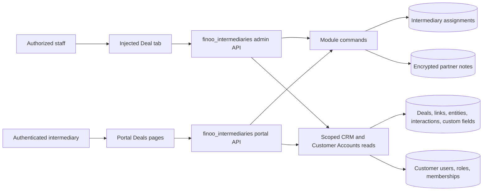

# Finoo Intermediary Customer Portal

## TLDR

**Key Points:**
- Add one isolated private FINOO module under `apps/mercato/src/modules/finoo_intermediaries/`.
- Let authorized staff assign exactly one existing intermediary portal user to a Deal currently in the exact `Sent To Partners` stage; the assignment captures that stage UUID and portal visibility requires the Deal to remain on that UUID.
- Give the assigned intermediary a scoped Deals list/detail, a separate `new → in_progress → done` partner status, private module-owned notes, and a minimal read-only projection of related Person activities.

**Scope:**
- Staff assignment, reassignment, unassignment, canonical read-back, role validation, and optimistic locking.
- Intermediary portal list/detail with approved Company, Person, Deal custom-field, note, and activity data.
- Tenant, organization, active-role, customer-user, assignment, stage, author, and field-level isolation.
- Self-contained integration coverage and private FINOO delivery gates.

**Non-goals:**
- Affiliate behavior, `apps/mercato/src/modules/finoo_affiliates/**`, THOM-89, finoo.pl ingress, scoring, dispatch automation, imports, generic workflows, or upstream contribution.
- Creating or renaming the tenant-owned `intermediary` role or any FINOO custom-field definition.
- Mutating the core Deal status, pipeline, Company/Person data, or canonical CRM interactions/comments from the portal.

**Primary risks:**
- Cross-tenant or cross-intermediary contact-data disclosure.
- Treating mutable stage text or a similarly named stage as eligibility.
- Free-text notes leaking through canonical CRM comment visibility or remaining plaintext at rest.
- Reassignment accidentally exposing the previous intermediary's notes.

## Overview

THOM-90 adds the intermediary-only half of the FINOO Customer Portal. A portal user can see a Deal only when all of the following remain true:

1. the user has `portal.finoo_intermediaries.view`;
2. an active module-owned assignment points to that customer user;
3. the assignment's captured intermediary role still exists and the user still has an active membership in it;
4. assignment, user, role, Deal, Company, Person, notes, and interactions match the authenticated tenant and organization;
5. the Deal's current `pipelineStageId` equals the stable stage UUID captured at assignment time.

The module is additive and app-owned. It references CRM and Customer Accounts records with scalar UUIDs only and introduces no cross-module ORM relationships. Removing the module removes only the intermediary surface and its private records; core CRM remains intact.

### Live FINOO configuration snapshot — 2026-08-13

An authenticated read-only API snapshot of `https://finoo.om.they.dev` confirmed:

| Contract | Canonical runtime value |
|----------|-------------------------|
| Portal role | `intermediary`; runtime role ID `0694b8f5-e1ad-436f-939f-41f7324f923d`; current feature list is empty and must receive the new portal feature during module setup/deployment |
| Eligible pipeline | `Web Form Sales Pipeline`; runtime pipeline ID `b00100fa-8c9c-430c-8931-98762207feb8` |
| Eligible stage | exact label `Sent To Partners`; runtime stage ID `43783d60-2f43-4d10-828f-4037576ca49e` |
| Explicitly ineligible similarly named stage | `Sent To Intermediaries`; runtime stage ID `85217d39-201d-4be4-a0f6-14b9e0008b24` |
| Deal custom fields | `turnover` (`integer`), `arrears` (`boolean`) |
| Company profile custom fields | `business_start_date` (`date`), `industry` (`dictionary`) |
| Person profile mobile custom field | `mobile` (`text`) |
| Built-in contact fields | Company `CustomerEntity.primaryPhone`; Person `CustomerEntity.primaryEmail` |

Runtime IDs are evidence, not source constants. Production code must resolve the current scoped role/stage and capture their IDs at the assignment boundary. Canonical custom-field keys are stable private FINOO contracts and are validated by kind before values are exposed.

### Market reference

[Odoo's official reseller CRM documentation](https://www.odoo.com/documentation/19.0/applications/sales/crm/track_leads/resellers.html) validates the basic pattern of manually forwarding leads to partners and exposing assigned records in a partner portal. This spec adopts explicit partner assignment and portal feedback/status, but rejects Odoo's broad “same information as CRM” default: FINOO uses an explicit field allowlist, separate partner notes, and no partner mutation of core CRM records.

## Problem Statement

Open Mercato already provides customer-portal authentication, role features, CRM Deals, Deal-to-Company/Person links, custom fields, comments, interactions, mutation guards, and widget injection. It does not provide the FINOO-specific contract that binds one intermediary to one eligible Deal and safely projects only approved business/contact data into the portal.

Using a custom field for assignment would be insufficient because assignment needs scoped identity validation, optimistic concurrency, a stable eligibility-stage snapshot, a separate lifecycle status, and isolated notes. Reusing canonical CRM comments would give intermediary-authored free text the broader staff/comment visibility model and lacks a customer-user author contract. Reusing mutable stage text on every request would make renames and the existing `Sent To Intermediaries` stage unsafe.

## Proposed Solution

Create `finoo_intermediaries` as one independently deployable app module. It owns two entities:

- an active-or-soft-deleted assignment for a Deal, including the assigned customer user, captured role ID, captured eligible stage ID, partner status, and audit timestamps;
- encrypted notes authored by the assigned customer user and linked to that assignment.

The module reads CRM and Customer Accounts through scoped scalar IDs and existing platform read helpers. It injects a staff tab into `detail:customers.deal:tabs`, adds an intermediary portal menu/page pair, and exposes custom APIs whose authorization is stricter than page visibility.

### Approved design decisions

| Decision | Rationale |
|----------|-----------|
| Verify normalized full label `Sent To Partners` only when creating the assignment, then capture `pipelineStageId` | Prevents partial matching and distinguishes the live `Sent To Intermediaries` stage; later eligibility survives a harmless label rename while remaining bound to the same stage record. |
| Require current Deal `pipelineStageId === assignment.eligibleStageId` on every portal read/mutation | Moving out of the stage immediately removes visibility; returning to the same stage UUID restores it without changing core CRM. |
| Store `intermediaryRoleId` and validate active membership on every portal request | Route security does not depend on a mutable role name after assignment and fails closed if membership or the role is removed. |
| Use module-owned encrypted partner notes | Keeps customer-user authorship and privacy separate from canonical CRM comments. |
| Portal note reads filter by current `authorCustomerUserId` | Reassignment never exposes the previous intermediary's notes to the next intermediary; authorized staff can see all partner notes in the Deal tab. |
| Use canonical Person interactions read-only with an output allowlist | Meets the activity requirement without exposing bodies, recipients, attachments, participants, private email content, or write actions. |
| Keep `partnerStatus` separate from Deal `status`, `pipelineId`, and `pipelineStageId` | Partner progress cannot mutate or redefine the CRM pipeline. |
| No application cache in MVP | Authorization and stage eligibility are volatile; bounded indexed reads are safer than stale cached projections. |

### Alternatives considered

| Alternative | Why rejected |
|-------------|--------------|
| Assignment and status as Deal custom fields | Cannot enforce one active assignment, active role membership, author isolation, optimistic locking, or stable stage identity without custom persistence. |
| Canonical `CustomerComment` for portal notes | Staff-oriented author/visibility semantics are wider than the approved portal contract. |
| Re-match stage label on every request | A mutable label becomes an authorization control and can collide with similarly named stages. |
| Hard-code live role/stage UUIDs | IDs differ across environments and fixture tenants. |
| Add intermediary fields/relations to `CustomerDeal` | Violates private module isolation and creates a cross-module contract. |
| Build a generic partner-management framework | Exceeds THOM-90 and introduces abstractions without a current second consumer. |

## User Stories and Acceptance Mapping

| User story | Acceptance surface |
|------------|--------------------|
| Staff assigns one existing intermediary to an eligible Deal | Staff Deal tab; assignment POST/read-back; role/stage validation |
| Staff corrects or removes an assignment without overwriting concurrent work | Reassignment/unassignment with `expectedUpdatedAt`; conflict response |
| Intermediary sees only assigned, still-eligible Deals | Portal list/detail; assignment + role + stage + tenant/org filters |
| Intermediary reads approved Company/Person/Deal fields | Allowlisted list/detail projection from built-in and custom fields |
| Intermediary records progress independently of CRM stage/status | Legal partner-status command only |
| Intermediary maintains private Deal notes | Encrypted note CRUD, author-scoped portal reads |
| Intermediary sees safe Person activity metadata | Read-only paginated activity projection |
| Staff audits partner status and all intermediary notes | Injected staff Deal tab, feature-gated read model |

## Architecture



### Module boundaries

- `finoo_intermediaries` owns all glue and depends on the existing `customers` and `customer_accounts` modules.
- Cross-module database references are scalar UUIDs. No `ManyToOne`/`OneToOne` is declared to external module entities.
- The module may use exported entity classes/read helpers for scoped reads, but never mutates CRM or Customer Accounts records.
- Same-module `FinooIntermediaryNote.assignment` may use a normal foreign key/ORM relation because both sides belong to this module.
- No events/subscribers/workers are needed: stage eligibility is checked synchronously at every portal boundary and there are no external side effects.
- Module absence leaves CRM and Customer Accounts behavior unchanged. No core file imports this module.

### Frontend Architecture Contract

| Surface | Server/client boundary |
|---------|------------------------|
| Portal list route | Server route shell and metadata; one client table island for pagination/navigation |
| Portal detail route | Server route shell; client islands for status mutation and notes CRUD; read-only details/activity sections remain server-renderable where the module framework permits |
| Staff Deal tab widget | Client widget because it consumes injection context, user picker, guarded mutations, and optimistic retry |

`"use client"` is allowed only in `*.client.tsx` widget/page islands that require hooks or mutation state. Route entry points, API routes, schemas, services, commands, and read projections stay server-only. No new global provider, app-shell provider, browser SDK, chart/editor package, or eager heavy dependency is introduced.

Budgets and evidence:

- no new production dependency;
- no single new client island above 50 KiB parsed source without explicit review;
- no route-specific code added to the global portal/backend shell;
- `yarn check:client-boundaries` is required if route generation or a shared shell boundary changes;
- integration tests must prove hydrated navigation, status mutation, note submit, stale conflict recovery, and narrow-viewport usability.

## Data Models

### `FinooIntermediaryAssignment`

Table: `finoo_intermediary_assignments`

| Field | Type | Contract |
|-------|------|----------|
| `id` | UUID PK | Generated |
| `tenantId` | UUID | Required scope |
| `organizationId` | UUID | Required scope |
| `dealId` | UUID scalar | External CRM reference; no ORM relation |
| `intermediaryCustomerUserId` | UUID scalar | External Customer Accounts reference; no ORM relation |
| `intermediaryRoleId` | UUID scalar | Captured active scoped role ID; no ORM relation |
| `eligibleStageId` | UUID scalar | Captured scoped `Sent To Partners` stage ID; no ORM relation |
| `partnerStatus` | text | `new`, `in_progress`, or `done`; default `new` |
| `assignedByUserId` | UUID scalar | Staff actor that created the assignment |
| `statusUpdatedByCustomerUserId` | UUID nullable | Last portal actor changing partner status |
| `statusUpdatedAt` | timestamptz nullable | Last partner-status change |
| `createdAt` | timestamptz | Required |
| `updatedAt` | timestamptz | Optimistic-lock token |
| `deletedAt` | timestamptz nullable | Soft unassignment |

Indexes/constraints:

- unique active `(tenant_id, organization_id, deal_id)` where `deleted_at is null`;
- portal lookup `(tenant_id, organization_id, intermediary_customer_user_id, deleted_at, updated_at, id)`;
- staff lookup `(tenant_id, organization_id, deal_id, deleted_at)`;
- check constraint for the three partner-status values.

### `FinooIntermediaryNote`

Table: `finoo_intermediary_notes`

| Field | Type | Contract |
|-------|------|----------|
| `id` | UUID PK | Generated |
| `tenantId` | UUID | Required scope |
| `organizationId` | UUID | Required scope |
| `assignmentId` | UUID FK | Same-module assignment relation |
| `authorCustomerUserId` | UUID scalar | Portal author; external scalar reference |
| `body` | text | Required, trimmed, 1–10,000 characters, encrypted at rest |
| `createdAt` | timestamptz | Required |
| `updatedAt` | timestamptz | Optimistic-lock token |
| `deletedAt` | timestamptz nullable | Soft delete |

Indexes:

- `(tenant_id, organization_id, assignment_id, author_customer_user_id, deleted_at, created_at, id)` for portal pagination;
- `(tenant_id, organization_id, assignment_id, deleted_at, created_at, id)` for authorized staff audit.

### Encryption

`encryption.ts` exports `defaultEncryptionMaps: ModuleEncryptionMap[]` and maps `FinooIntermediaryNote.body`. No hash sibling is needed because note bodies are never equality-filtered or sorted. Every note read uses `findWithDecryption`/`findOneWithDecryption` with the explicit tenant/organization scope. Assignment rows contain identifiers and workflow state only and need no encrypted column.

### Canonical read projection

The portal never returns raw CRM records. Its output allowlist is:

| Output | Source |
|--------|--------|
| `companyName` | selected linked Company `CustomerEntity.displayName` |
| `companyPhone` | selected linked Company `CustomerEntity.primaryPhone` |
| `personMobile` | primary linked Person profile custom field `mobile` |
| `personEmail` | primary linked Person `CustomerEntity.primaryEmail` |
| `turnover` | Deal custom field `turnover` |
| `businessStartDate` | Company profile custom field `business_start_date` |
| `arrears` | Deal custom field `arrears` |
| `industry` | resolved label for Company profile dictionary field `industry`; raw entry ID is not exposed |
| `partnerStatus` | module assignment |

Person selection uses the canonical `CustomerDealPersonLink.isPrimary`; without a primary Person, Person fields and activities are `null`/empty. Deal-to-Company links have no primary marker in the current schema, so Company selection is deterministic: the oldest active scoped link by `createdAt ASC, id ASC`. The API never substitutes an unlinked record. Tests cover multiple Company links so this rule cannot drift accidentally. `loadCustomFieldValues` is called with `tenantIdByRecord`, `organizationIdByRecord`, and scoped fallbacks so encrypted custom values remain supported. Missing definitions or kind mismatches fail closed for that configured field and produce an operational error rather than silently reading a similarly named field.

### Activity projection

Only active canonical interactions linked to the primary Person, matching tenant/organization, and explicitly marked `visibility === public` are considered. `team`, `private`, unset-visibility, and email rows are excluded. The response contains only:

- `id`;
- `type` from `interactionType`;
- `occurredAt`;
- `direction` only when a supported canonical activity source provides a normalized scalar direction, otherwise `null`;
- `summary` from a sanitized short title/subject, capped at 300 characters.

The API excludes `body`, recipients, participants, author identity/email, attachments, linked entities, location, recurrence, custom values, external-message IDs, private entries, and all `interactionType === 'email'` records in MVP. No activity mutation endpoint exists.

## Commands and State Transitions

All writes use registered commands and custom write routes run the mutation-guard registry before command execution. Mutations acquire database locks in the consistent order Deal → assignment → note, and validate the current Deal stage while holding the Deal lock.

| Command | Execute | Undo |
|---------|---------|------|
| `finoo_intermediaries.assignment.create` | Validate scope, exact stage, role membership, uniqueness; insert assignment | Soft-delete the created assignment if unchanged |
| `finoo_intermediaries.assignment.update` | Validate expected timestamp and replacement user's scoped active role; update user/role while preserving stage and partner status | Restore prior user/role/audit fields if unchanged |
| `finoo_intermediaries.assignment.delete` | Validate expected timestamp; soft-delete assignment | Restore the assignment if no replacement active assignment exists |
| `finoo_intermediaries.partner_status.update` | Validate portal authorization, expected timestamp, eligibility, and legal edge | Restore prior status/audit fields if unchanged |
| `finoo_intermediaries.note.create` | Validate portal authorization and body; encrypt/persist | Soft-delete created note if unchanged |
| `finoo_intermediaries.note.update` | Validate author, scope, eligibility, expected timestamp; encrypt new body | Restore prior encrypted/decrypted logical body if unchanged |
| `finoo_intermediaries.note.delete` | Validate author, scope, eligibility, expected timestamp; soft-delete | Restore note if assignment access still exists |

Legal partner-status edges:

```text
new -> in_progress -> done
```

Same-state updates and every backward/skip transition return `409 illegal_transition`. The status command never writes `CustomerDeal.status`, `pipelineId`, `pipelineStage`, or `pipelineStageId`.

## API Contracts

Every route exports `openApi` and per-method `metadata`. Inputs use zod. Error messages are minimal and do not reveal whether a foreign-tenant Deal, customer user, role, assignment, note, or activity exists.

### Staff assignment read

`GET /api/finoo_intermediaries/admin/assignments?dealId=<uuid>`

- Guard: staff auth + `finoo_intermediaries.view`.
- Response: `{ assignment: AssignmentView | null, eligibility: { canManage: boolean, reason: 'ineligible_stage' | null }, notes: StaffNoteView[] }`.
- Eligibility uses the exact configured stage for a new assignment and the captured stage UUID for an existing assignment.
- A scoped Deal without a stage is a normal ineligible result; inaccessible Deals return 404 and ambiguous/missing eligible-stage configuration returns 422.
- Staff notes are capped/paginated and available only to the authorized Deal scope.

### Staff intermediary picker

`GET /api/finoo_intermediaries/admin/intermediaries?query=<text>&pageSize<=100`

- Guard: staff auth + `finoo_intermediaries.manage`.
- Returns active customer users in the selected tenant/organization with an active membership in the scoped role whose current slug is `intermediary`.
- Response fields: `id`, `displayName`, `email`; reads use decryption helpers.

### Create assignment

`POST /api/finoo_intermediaries/admin/assignments`

Request:

```json
{ "dealId": "uuid", "intermediaryCustomerUserId": "uuid" }
```

- Guard: staff auth + `finoo_intermediaries.manage` + mutation guards mapped to `create`.
- `201`: canonical assignment read-back.
- `409`: Deal already has an active assignment.
- `422`: Deal is not currently in the exact normalized `Sent To Partners` stage, the stage/role is ambiguous or missing, or the user lacks active scoped intermediary membership.

### Reassign or unassign

- `PUT /api/finoo_intermediaries/admin/assignments/[id]`
- `DELETE /api/finoo_intermediaries/admin/assignments/[id]`

Update request:

```json
{
  "intermediaryCustomerUserId": "uuid",
  "expectedUpdatedAt": "ISO-8601"
}
```

Delete request: `{ "expectedUpdatedAt": "ISO-8601" }`.

- Guard: staff auth + `finoo_intermediaries.manage` + mutation guards mapped to `update`/`delete`.
- `409 stale_write` if the timestamp no longer matches.
- Reassignment preserves `eligibleStageId` and `partnerStatus`; it is rejected while the Deal is outside that captured stage.
- The previous intermediary immediately loses Deal and note access. The replacement never receives the previous author's notes.

### Portal list

`GET /api/finoo_intermediaries/portal/deals?cursor=<opaque>&pageSize<=100`

- Guard: customer auth + `portal.finoo_intermediaries.view`.
- Server additionally validates active assignment, captured role membership, user, tenant, organization, active Deal, and current stage UUID.
- Keyset order: assignment `updatedAt DESC, id DESC`.
- Response: `{ items: IntermediaryDealSummary[], nextCursor: string | null }`.

### Portal detail

`GET /api/finoo_intermediaries/portal/deals/[id]`

- Same scope checks as the list; `[id]` is a Deal ID.
- Returns only the approved canonical read projection plus assignment `id`, `partnerStatus`, and `updatedAt`.
- A moved, unassigned, wrong-user, wrong-role, wrong-org, or deleted record returns the same `404` shape.

### Portal status mutation

`PUT /api/finoo_intermediaries/portal/deals/[id]/status`

Request:

```json
{ "status": "in_progress", "expectedUpdatedAt": "ISO-8601" }
```

- Guard: customer auth + portal feature + assignment/role/stage scope + mutation guards mapped to `update`.
- `200`: canonical assignment status read-back.
- `409 stale_write` or `409 illegal_transition`.

### Portal notes

- `GET /api/finoo_intermediaries/portal/deals/[id]/notes?cursor=<opaque>&pageSize<=100`
- `POST /api/finoo_intermediaries/portal/deals/[id]/notes`
- `PUT /api/finoo_intermediaries/portal/deals/[id]/notes/[noteId]`
- `DELETE /api/finoo_intermediaries/portal/deals/[id]/notes/[noteId]`

Create request: `{ "body": "text" }`.

Update request: `{ "body": "text", "expectedUpdatedAt": "ISO-8601" }`.

Delete request: `{ "expectedUpdatedAt": "ISO-8601" }`.

- All routes repeat assignment/role/stage scope checks.
- Portal reads and mutations additionally require `authorCustomerUserId === auth.sub`.
- Notes use keyset order `createdAt DESC, id DESC`.
- Stale write: `409`; invalid body: `422`; inaccessible record: indistinguishable `404`.

### Portal activities

`GET /api/finoo_intermediaries/portal/deals/[id]/activities?cursor=<opaque>&pageSize<=100`

- Same scope checks as detail.
- Keyset order `occurredAt DESC NULLS LAST, id DESC`.
- Returns only the approved activity projection. There is no POST/PUT/DELETE route.

## Authorization Model

### Staff features

- `finoo_intermediaries.view`
- `finoo_intermediaries.manage` depends on `.view`

Default staff grants:

- `superadmin`, `admin`: `finoo_intermediaries.*`;
- `employee`: `finoo_intermediaries.view` only.

### Portal feature

- `portal.finoo_intermediaries.view`

`setup.ts` declares `defaultCustomerRoleFeatures.intermediary = ['portal.finoo_intermediaries.view']` for first provision. An existing tenant is reconciled only with `yarn mercato finoo_intermediaries ensure-portal-role-feature --tenant <uuid> --organization <uuid> --apply` after the exact candidate is healthy. The command locks the exact scoped `intermediary` role and ACL in one transaction, adds only the missing portal feature, advances the role aggregate version, and invalidates only the target tenant's portal RBAC cache after commit. It must not enumerate organizations or create a missing role or ACL. The live role exists, but integration fixtures create their own scoped role and membership.

The portal feature is necessary but never sufficient. Direct feature grants or portal-admin wildcard behavior cannot expose data without the active assignment, captured role membership, user scope, organization scope, and stage match.

## UI/UX

### Staff Deal tab

Inject one tab into `detail:customers.deal:tabs` with a stable widget/group ID owned by `finoo_intermediaries`.

- Read-only summary: assignment identity, captured stage, partner status, timestamps.
- Manage controls appear only with `finoo_intermediaries.manage`.
- Intermediary picker queries only active scoped role members.
- Outside the eligible stage, the picker and assignment mutation actions are disabled and an inline localized message tells staff to move the Deal to `Sent To Partners`; existing assignment data remains readable.
- Assign/reassign/unassign use `apiCallOrThrow` and `useGuardedMutation`; no raw `fetch`.
- Reassign/unassign confirmations use `useConfirmDialog()`.
- Dialogs support `Cmd/Ctrl+Enter` and `Escape`.
- Stale conflicts preserve entered state and expose `retryLastMutation` in the injection context.
- Authorized staff can view all module-owned notes for the Deal, clearly labeled by author and timestamp; staff cannot edit portal notes in MVP.

### Portal Deals list

Route: `/:orgSlug/portal/intermediary/deals`.

- Page metadata adds the Assigned deals navigation item and feature-gates the route.
- For an active scoped `intermediary` role membership, the shared Dashboard navigation item is removed and direct Dashboard, portal-root, and post-login navigation resolve to Assigned deals. Other portal roles retain the shared Dashboard unchanged.
- `DataTable` uses stable `entityId`/`extensionTableId`, page size 50, and the exact eight requested columns.
- Empty state uses `EmptyState`; loading/errors use shared detail/loading primitives.
- A row navigates to the scoped detail route.

### Portal Deal detail

Route: `/:orgSlug/portal/intermediary/deals/:id`.

- One primary surface with grouped text/dividers rather than nested card stacks.
- Read-only Company, Person, and financing-data sections.
- Partner status uses `StatusBadge` and exposes only the next legal action.
- Notes use `FormField` and a guarded mutation; submit supports `Cmd/Ctrl+Enter`; edit/delete controls are author-only and icon-only buttons include `aria-label`.
- Activities use a read-only chronological list and never render HTML from `summary`.
- All user-facing strings use `useT()`/`resolveTranslations()` with `en` and `pl` dictionaries.
- Semantic status tokens and the standard text scale are mandatory; no hard-coded color shades, arbitrary sizes, inline SVG, or unsafe HTML.

## Internationalization

Add module dictionaries for at least:

- navigation/list/detail titles;
- all eight field labels;
- partner-status values/actions;
- assignment, reassignment, unassignment, stale conflict, wrong-stage, and missing-role messages;
- note form/actions/empty states;
- activity empty state and safe field labels.

Stage and role matching use canonical data contracts, not translated UI strings.

## Performance, Pagination, and Cache

- All list endpoints cap `pageSize` at 100 and use opaque keyset cursors.
- List hydration is batched: assignments/Deals, primary links/entities/profiles, custom values by entity type, and dictionary labels. No per-row API calls or N+1 loops.
- Portal list target: bounded constant query groups for up to 100 rows; exact query count is asserted or profiled during implementation.
- Note and activity indexes match their cursor order and scope predicates.
- No app cache in MVP. Every request reads current assignment, role membership, and Deal stage; cache invalidation complexity is therefore N/A.
- If measurement shows the bounded list exceeds the agreed latency budget, optimize the batched query/read model before introducing cache.

## Migration & Backward Compatibility

The change is additive:

- new private module ID and auto-discovered files;
- two new private tables and indexes;
- three new ACL feature IDs;
- new private API routes and widget/menu registrations;
- one new entry in `apps/mercato/src/modules.ts`.

No existing table/column, type, function signature, import path, event ID, injection spot, API URL, DI service, ACL ID, notification ID, CLI command, or generated export is renamed or removed. The existing frozen spot `detail:customers.deal:tabs` and menu spot are consumed, not changed.

Migrations are generated from ORM entities with `corepack yarn db:generate`; no migration is handwritten. They contain only additive table/index/constraint statements and no backfill. Do not run `db:migrate` locally without explicit approval. If generation emits unrelated WMS drift, preserve the unrelated source and apply the repository's generated-migration cleanup rule.

Deployment is private and requires a database restore point, migration diff read-back, exact artifact provenance, safe rollback, and explicit preservation of the existing CTO password. The FINOO image must be built with `NEXT_PUBLIC_OM_PORTAL_ALLOW_SELF_REGISTRATION=false` as an explicit Docker build argument, because this public flag is compiled into the portal client bundle; setting it only on the runtime container does not hide registration links. Runtime configuration must repeat the same value, and headed acceptance must confirm that registration links are absent while signup POST remains unavailable. No deployment occurs from this spec phase.

## Implementation Plan

### Phase 1 — Persistence and authorization seam

1. Add module metadata, ACL, setup grants, validators, entities, encryption map, DI registration if needed, and generated migration.
2. Write failing unit tests for exact stage matching, legal partner-status transitions, note encryption mapping, and scope predicates.
3. Implement assignment and note commands with undo and optimistic locking.
4. Add module enablement to `apps/mercato/src/modules.ts`; run generators and inspect all generated diffs.

Exit: focused unit tests pass; migration is additive; no UI/API yet returns data.

### Phase 2 — Staff assignment surface

1. Add staff assignment/picker APIs with per-method metadata, OpenAPI, zod, mutation guards, scoped decryption, and commands.
2. Add the injected Deal tab and guarded assignment/reassignment/unassignment UI.
3. Prove canonical read-back, role/stage rejection, cross-org denial, and stale conflict.

Exit: authorized staff can manage exactly one assignment without changing any CRM Deal field.

### Phase 3 — Portal read model and lifecycle

1. Add the batched allowlisted Deal projection and keyset list/detail APIs.
2. Add role-membership/stage checks at every portal boundary.
3. Add portal list/detail pages and navigation.
4. Add the legal partner-status command/API/UI.

Exit: only the current assigned intermediary sees eligible Deals and can advance only the separate partner status.

### Phase 4 — Notes and activities

1. Add encrypted author-scoped note APIs/UI and staff read-only audit projection.
2. Add the safe primary-Person activity projection and read-only UI.
3. Prove reassignment note isolation and exclusion of private/email/body/recipient data.

Exit: notes and activities satisfy the approved data-sharing contract without canonical CRM mutations.

### Phase 5 — Integration, review, and private release evidence

1. Complete self-contained Playwright fixtures and all integration cases below.
2. Run generation, focused tests, app typecheck/lint, integration tests, client-boundary check when applicable, and `git diff --check`.
3. Obtain one fresh primary code review and an orthogonal security review; remediate validated findings and rerun affected checks.
4. Only after all gates pass, integrate the freshly deployed FINOO baseline, build an immutable artifact, deploy privately with backup/rollback, run headed desktop+narrow QA, attach durable Jira evidence, and obtain release-evidence review.

Exit: exact deployed revision and evidence pass; no upstream PR/contribution is created.

## Integration Test Coverage

All tests create tenant, organization, stage, role, portal users, Deal relationships, definitions/values, notes, and interactions in setup and remove them in `finally`. Tests never depend on FINOO seeded/demo data.

| ID | Scenario |
|----|----------|
| `TC-FINOO-INT-001` | Staff creates assignment for an active scoped intermediary while Deal is in exact `Sent To Partners`; read-back returns captured stage/role and leaves all Deal fields/custom values unchanged. |
| `TC-FINOO-INT-002` | Assignment read-back reports disabled eligibility outside `Sent To Partners` and enabled eligibility in the exact stage; direct creation outside the stage returns `ineligible_stage` and persists nothing; assignment also rejects partial/case-unrelated labels, wrong role, inactive user, missing role, cross-organization user, duplicate active assignment, and inaccessible Deal. |
| `TC-FINOO-INT-003` | Reassign/unassign requires `expectedUpdatedAt`; stale writes return 409; old user loses access immediately; new user gets Deal access but not the old user's notes; undo restores only when safe. |
| `TC-FINOO-INT-004` | Portal list/detail returns the eight canonical fields with correct types and dictionary label, including null primary-link behavior and selection of the oldest active scoped Company when an older link targets a soft-deleted Company, without extra CRM/PII fields. |
| `TC-FINOO-INT-005` | Moving Deal away from captured stage hides it; returning to the same UUID restores it; renaming the same stage does not break reads or reassignment; a different similarly named stage never qualifies. |
| `TC-FINOO-INT-006` | Only `new → in_progress → done` succeeds; stale, same-state, backward, skipped, foreign-user, and stage-ineligible mutations fail; core Deal status/pipeline/custom fields remain byte-for-byte logically unchanged. |
| `TC-FINOO-INT-007` | Note create/read/update/delete round-trip, encrypted-at-rest assertion, author isolation, stale conflict, cross-org denial, staff all-note read, reassignment isolation, and XSS-safe rendering. |
| `TC-FINOO-INT-008` | Activities expose only explicitly public type/time/direction/summary rows, exclude team/private/email/body/recipient/attachment/author/custom data, paginate deterministically, and provide no write route. |
| `TC-FINOO-INT-009` | Forged Deal/assignment/note IDs, portal-admin feature wildcard without assignment, direct feature grant without captured role membership, cross-intermediary, cross-organization, and cross-tenant requests all fail closed with indistinguishable not-found responses. |
| `TC-FINOO-INT-010` | Headed intermediary Dashboard navigation redirects to Assigned deals without a Dashboard sidebar item, then the portal list/detail/status/notes flow works in desktop and narrow viewport; keyboard contracts, navigation visibility, loading/error/empty states, and stale retry are observable. |

## Verification Commands

Use Corepack for every Yarn command and do not run multiple build/test commands concurrently in this repository.

```bash
corepack yarn generate
corepack yarn db:generate
corepack yarn test <focused-finoo-intermediaries-tests>
corepack yarn workspace @open-mercato/mercato typecheck
corepack yarn workspace @open-mercato/mercato lint
corepack yarn test:integration <TC-FINOO-INT selectors>
corepack yarn check:client-boundaries
git diff --check
```

The integration skill's environment mode must be selected before the first Playwright run. `db:migrate` is not part of local verification without explicit approval.

## File Manifest

| Path | Action | Purpose |
|------|--------|---------|
| `apps/mercato/src/modules/finoo_intermediaries/index.ts` | Create | Module metadata/dependencies |
| `apps/mercato/src/modules/finoo_intermediaries/acl.ts` | Create | Staff/portal feature declarations |
| `apps/mercato/src/modules/finoo_intermediaries/setup.ts` | Create | Staff defaults and existing intermediary-role feature merge |
| `apps/mercato/src/modules/finoo_intermediaries/data/entities.ts` | Create | Assignment and note entities |
| `apps/mercato/src/modules/finoo_intermediaries/data/validators.ts` | Create | Zod request/state schemas |
| `apps/mercato/src/modules/finoo_intermediaries/encryption.ts` | Create | Note body encryption map |
| `apps/mercato/src/modules/finoo_intermediaries/commands/*.ts` | Create | Undoable assignment/status/note commands |
| `apps/mercato/src/modules/finoo_intermediaries/lib/*.ts` | Create | Scoped authorization, projection, stage/status helpers |
| `apps/mercato/src/modules/finoo_intermediaries/api/admin/**` | Create | Staff picker/assignment APIs |
| `apps/mercato/src/modules/finoo_intermediaries/api/portal/**` | Create | Portal list/detail/status/note/activity APIs |
| `apps/mercato/src/modules/finoo_intermediaries/widgets/**` | Create | Staff Deal tab and portal menu injection |
| `apps/mercato/src/modules/finoo_intermediaries/frontend/[orgSlug]/portal/intermediary/deals/**` | Create | Portal list/detail pages |
| `apps/mercato/src/modules/finoo_intermediaries/overrides/**` | Create | Exact-role portal Dashboard redirect and navigation filtering |
| `apps/mercato/src/modules/finoo_intermediaries/i18n/en.json` | Create | English strings |
| `apps/mercato/src/modules/finoo_intermediaries/i18n/pl.json` | Create | Polish strings |
| `apps/mercato/src/modules/finoo_intermediaries/migrations/*` | Generate | Additive schema only |
| `apps/mercato/src/modules/finoo_intermediaries/__tests__/**` | Create | Focused unit/component tests |
| `apps/mercato/src/modules/finoo_intermediaries/__integration__/TC-FINOO-INT-001-010.spec.ts` | Create | Self-contained integration coverage |
| `apps/mercato/src/modules.ts` | Modify | Enable independent private module; preserve existing signup override and Affiliate entry |

No file under `apps/mercato/src/modules/finoo_affiliates/**` or the THOM-89 specification/worktree may be modified.

## Risks & Impact Review

### Cross-tenant or cross-intermediary disclosure

- **Scenario**: A forged ID, permissive feature, stale role link, or incomplete join exposes another party's Deal/contact/note/activity data.
- **Severity**: Critical
- **Affected area**: All portal APIs and pages.
- **Mitigation**: Central scoped authorization helper repeated at every route; tenant/org/user/assignment/captured-role/stage checks; scalar IDs; indistinguishable 404; negative integration matrix.
- **Residual risk**: A future route could bypass the helper; code review and route-level tests remain mandatory.

### Mutable or ambiguous stage authorization

- **Scenario**: Label matching accidentally treats `Sent To Intermediaries` or a renamed stage as eligible.
- **Severity**: High
- **Affected area**: Assignment and portal visibility.
- **Mitigation**: Full normalized equality only at assignment; capture UUID; every later read compares exact UUID; tests include both live-like labels.
- **Residual risk**: Staff could intentionally repurpose the captured stage record; this is tenant configuration authority and remains operationally auditable.

### Reassignment leaks old notes

- **Scenario**: A replacement intermediary reads free text created by the previous intermediary.
- **Severity**: High
- **Affected area**: Notes API/UI.
- **Mitigation**: Portal note filter includes `authorCustomerUserId === auth.sub`; staff-only projection can read all notes; reassignment test proves isolation.
- **Residual risk**: Staff can see all partner notes by design under staff ACL.

### Plaintext or unsafe note rendering

- **Scenario**: Sensitive free text is stored unencrypted or rendered as executable HTML.
- **Severity**: High
- **Affected area**: Notes persistence/UI.
- **Mitigation**: Module encryption map, scoped decryption helpers, no raw HTML, React text rendering, length limits, encrypted-at-rest integration assertion.
- **Residual risk**: Authorized users can enter unnecessary sensitive data; product copy should discourage it.

### Optimistic write conflict

- **Scenario**: Concurrent staff reassignment or portal status/note edit overwrites newer state.
- **Severity**: High
- **Affected area**: All module writes.
- **Mitigation**: Consistent Deal → assignment → note row-lock order, stage validation while the Deal is locked, `expectedUpdatedAt` comparison inside transaction, 409 response, guarded retry context, and concurrent/stale-write tests.
- **Residual risk**: Users must consciously reapply their change after reviewing fresh state.

### Partial multi-record write

- **Scenario**: Validation passes but a command writes only part of an assignment/note mutation.
- **Severity**: Medium
- **Affected area**: Command persistence/audit.
- **Mitigation**: One DB transaction per command, no external side effects, command undo payload, post-write canonical read-back.
- **Residual risk**: After-success guard callbacks may fail; route logs callback failure without corrupting committed state per platform contract.

### Activity overexposure

- **Scenario**: Canonical interactions carry email bodies, participants, author identity, private content, or linked records beyond the approved surface.
- **Severity**: Critical
- **Affected area**: Activities endpoint/detail UI.
- **Mitigation**: Query only scoped primary-Person interactions, exclude email/private rows, construct a new allowlisted DTO, never spread canonical records, negative field assertions.
- **Residual risk**: A sensitive subject may exist in a title; 300-character text-only output is accepted under the approved Q3 contract.

### Missing or drifted custom definitions

- **Scenario**: Required FINOO keys are deleted, disabled, or change kind.
- **Severity**: Medium
- **Affected area**: Portal field projection.
- **Mitigation**: Validate exact keys/kinds against scoped definitions; fail closed with operational error; deployment preflight repeats the read-only snapshot.
- **Residual risk**: Portal field availability depends on tenant configuration, which is explicitly authoritative.

### Query amplification

- **Scenario**: List hydration creates N+1 database work or large payloads.
- **Severity**: Medium
- **Affected area**: Portal list latency/database load.
- **Mitigation**: page size ≤100, keyset pagination, batched relation/custom-field/dictionary reads, index-aligned queries, query-count profiling.
- **Residual risk**: Extremely high per-tenant volume may require a later projection/cache; not justified for MVP.

### Migration/deployment failure

- **Scenario**: Generated migration contains unrelated drift or fails during private upgrade.
- **Severity**: High
- **Affected area**: FINOO runtime/database.
- **Mitigation**: inspect generated SQL, reject unrelated WMS drift, no local migrate, backup/restore point, idempotent private deployment lane, immutable provenance and rollback.
- **Residual risk**: Additive schema still requires a short operational migration window.

### THOM-89 integration drift

- **Scenario**: Affiliate work changes the FINOO baseline before THOM-90 deployment.
- **Severity**: Medium
- **Affected area**: Module registry, generated output, private image.
- **Mitigation**: no dependency/copy/edit of Affiliate; integrate freshly deployed FINOO baseline only after THOM-90 tests/reviews; rerun full targeted verification after integration.
- **Residual risk**: Both streams may touch `apps/mercato/src/modules.ts` or generated files and require a small explicit merge resolution.

## Final Compliance Report — 2026-08-13

### AGENTS.md Files Reviewed

- `AGENTS.md`
- `BACKWARD_COMPATIBILITY.md`
- `.ai/specs/AGENTS.md`
- `.ai/qa/AGENTS.md`
- `packages/core/AGENTS.md`
- `packages/core/src/modules/customers/AGENTS.md`
- `packages/core/src/modules/customer_accounts/AGENTS.md`
- `packages/ui/AGENTS.md`
- `packages/ui/src/backend/AGENTS.md`
- `.ai/skills/om-spec-writing/references/frontend-architecture-contract.md`
- `.ai/review-checklist.md`

### Compliance Matrix

| Rule source | Rule | Status | Notes |
|-------------|------|--------|-------|
| root `AGENTS.md` | App-specific module placement and plural snake_case ID | Compliant | `apps/mercato/src/modules/finoo_intermediaries` |
| root `AGENTS.md` | No direct ORM relationships between modules | Compliant | External Deal/user/role/stage references are scalar UUIDs only |
| root `AGENTS.md` | Tenant and organization scoping | Compliant | Every read/write authorization includes both scopes |
| root `AGENTS.md` | Do not mutate unrelated adjacent code | Compliant | Independent module plus one registry entry; Affiliate is forbidden |
| `packages/core/AGENTS.md` | Zod validation and per-method metadata/OpenAPI | Compliant | Required for every custom route |
| `packages/core/AGENTS.md` | Custom writes use mutation guards and commands | Compliant | Explicit in API/commands sections |
| `packages/core/AGENTS.md` | Encryption maps and scoped decryption | Compliant | Note body map; contact/custom reads use canonical helpers |
| `packages/core/AGENTS.md` | Setup grants accompany ACL features | Compliant | Staff defaults plus existing `intermediary` customer-role feature merge |
| `packages/ui/AGENTS.md` | DataTable, guarded mutations, dialog keys, DS primitives | Compliant | Required in UI contract |
| `packages/ui/src/backend/AGENTS.md` | `apiCall` family; no raw fetch | Compliant | Required in staff and portal clients |
| UI design rules | Semantic tokens, text scale, shared primitives, safe icons | Compliant | Explicit; no CSS snippets introduce exceptions |
| BC contract | Additive-only contract change | Compliant | No existing surface renamed/removed/narrowed |
| QA rules | Self-contained Playwright tests and cleanup | Compliant | TC-FINOO-INT-001–010 create/clean fixtures |
| Spec workflow | Frontend architecture contract and risk register | Compliant | Included above |

### Internal Consistency Check

| Check | Status | Notes |
|-------|--------|-------|
| Data models match API contracts | Pass | Assignment/note IDs, timestamps, status, and author scopes are represented |
| API contracts match UI/UX | Pass | Staff tab and portal pages map to named routes |
| Risks cover all write operations | Pass | Assignment, status, notes, encryption, concurrency, and deployment covered |
| Commands defined for all mutations | Pass | Seven commands with execute/undo contracts |
| Cache strategy covers all read APIs | Pass | Explicit no-cache MVP with bounded indexed reads |
| Approved Q1–Q3 reflected | Pass | Stable stage UUID, module notes, activity allowlist |
| Affiliate/THOM-89 boundary preserved | Pass | Explicit non-goal and forbidden manifest boundary |

### Non-Compliant Items

None identified in the authored specification. Implementation readiness remains subject to the separate pre-implementation analysis and fresh-context scope review.

### Verdict

**Fully compliant: Approved for pre-implementation readiness analysis.** This is not yet authorization to deploy or create an upstream contribution.

## Changelog

### 2026-08-18 — THOM-102

- Removed the unconditional portal retry alert that appeared without a blocked mutation; the portal Deal detail renders the shared conflict surface only after a real optimistic-lock conflict and clears it when leaving the record.
- Removed the technical Customer User UUID from staff-facing note metadata while retaining the note timestamp.
- Renamed only the staff Deal-tab label from `Partner status` to `Intermediary status` (`Status partnera` to `Status pośrednika`). Portal wording, success messages, and the technical `partnerStatus`/`partner_status` contracts remain unchanged because Partner and Intermediary are separate domain concepts.

### 2026-08-17 — THOM-97

- Added server-derived assignment eligibility to the staff Deal tab read model.
- Disabled intermediary selection, save, unassign, and retry outside the eligible stage, with a localized inline instruction to move the Deal to `Sent To Partners`.
- Preserved captured-stage UUID behavior for existing assignments and the direct API no-persistence guard; added focused access, widget, and integration coverage.

### 2026-08-17 — THOM-98

- Prevented legacy non-UUID `industry` values from reaching the dictionary-entry UUID query and crashing Assigned deals with PostgreSQL `22P02`.
- Invalid legacy dictionary references now fail closed as `industry: null`; the portal projection allowlist and assignment authorization remain unchanged.
- Added focused UUID-normalization coverage and a portal-list integration regression for the malformed legacy value.

### 2026-08-17 — THOM-96

- Made Assigned deals the landing page for active scoped intermediary portal users.
- Removed the shared Dashboard navigation item only for the exact intermediary role while preserving Dashboard for affiliate and other portal roles.
- Added focused role-policy, page-redirect, navigation-response, and override-wiring coverage; extended `TC-FINOO-INT-010` with the direct Dashboard path.

### 2026-08-13

- Created skeleton after code/Jira/baseline audit.
- Resolved Q1–Q3 with user approval.
- Added authenticated FINOO configuration snapshot, architecture, data/API/UI contracts, tests, risks, compatibility, and compliance report.

### Review — 2026-08-13

- **Reviewer**: Fresh-context scope-cohesion agent
- **Security**: Passed at specification level; detailed security review remains an implementation gate
- **Performance**: Passed; bounded keyset/batched read design
- **Cache**: Passed; explicit no-cache MVP
- **Commands**: Passed; all mutations have execute/undo contracts
- **Risks**: Passed; no missing scope-cohesion risk identified
- **Verdict**: Approved — KEEP as one independently deployable capability

### Implementation and Verification — 2026-08-13

- Implemented the private `finoo_intermediaries` module, module registry entry, generated additive migration, staff Deal injection, portal pages, APIs, commands, encryption, pagination, and English/Polish dictionaries.
- Preserved the Q1–Q3 decisions: captured canonical stage UUID, module-owned encrypted notes, and read-only allowlisted canonical activities.
- Remediated primary-review findings for canonical pipeline/stage ambiguity, API identifier/response contracts, assignment/note pagination, reassignment note isolation, optimistic concurrency, duplicate-create races, and `occurredAt DESC NULLS LAST, id DESC` activity ordering.
- Remediated security-review findings for mutable-role authorization, cross-scope undo, generic redo after staff/portal feature revocation, note plaintext in generic audit snapshots, and route mutation-guard coverage.
- Fresh focused verification: `6/6` suites and `29/29` tests passed; app typecheck passed; app lint passed with zero errors and 12 pre-existing warnings outside this module; client-boundary check passed; `git diff --check` passed.
- Fresh isolated integration verification: `TC-FINOO-INT-001–010` passed `10/10` after database initialization/migrations, module generation, package rebuild, app build, desktop/narrow headed portal status and note actions, and automatic teardown.
- No files under `apps/mercato/src/modules/finoo_affiliates/**` changed. No upstream contribution, PR, push, deployment, credential read/reset, or CTO-password change was performed.
- Private deployment remains gated on a freshly integrated deployed FINOO baseline, immutable artifact/backup/rollback evidence, headed runtime QA, Jira evidence, and independent release-evidence review.
