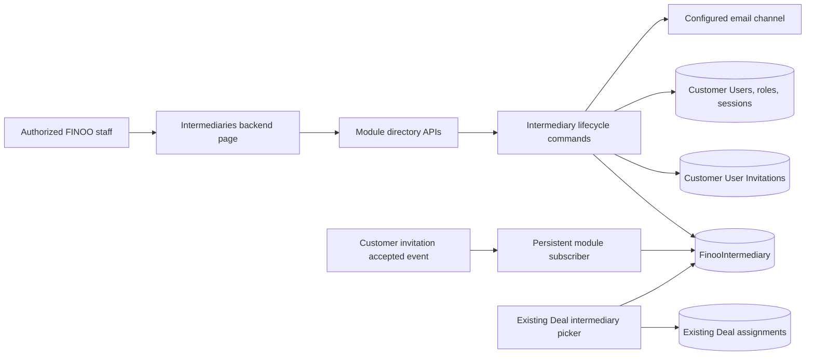

# FINOO Intermediary Management and Invitations

## TLDR

**Key points:**

- Extend the existing private `finoo_intermediaries` module with one staff-facing `Intermediaries` list and a durable `FinooIntermediary` lifecycle record.
- Let authorized FINOO administrators invite an intermediary with email, first name, and last name; track delivery and acceptance; and safely cancel, resend, deactivate, or reactivate access.
- Preserve the existing Deal assignment, portal eligibility, notes, and activities contracts. Only `active` intermediary records are assignable.

**Scope:**

- Scoped intermediary membership records, encrypted identity fields, invitation lifecycle, existing-account activation, and idempotent backfill.
- Backend list, search, status filter, invite/edit dialogs, status-aware actions, related-Deal count, ACL, optimistic locking, audit events, and integration coverage.
- Private FINOO implementation and deployment gates only.

**Non-goals:**

- Any change under `apps/mercato/src/modules/finoo_affiliates/**` or alignment of the Affiliate invite form.
- Affiliate commission behavior, including the separate THOM-99 scope.
- Migration of existing Deal assignments to an intermediary-membership foreign key.
- Public upstream contribution or pull request.

## Overview

The existing FINOO intermediary module begins at the point where an active Customer Portal user already has the scoped `intermediary` role. Staff can assign that user to a Deal, and portal authorization then checks the assignment, captured role membership, tenant, organization, customer user, and eligible Deal stage. It does not provide a durable staff-owned record for an invited person before account creation, delivery failure, expiry, cancellation, or deactivation.

This specification adds that missing lifecycle without replacing the established portal or assignment model. A module-owned `FinooIntermediary` record becomes the staff management source of truth, while Customer Accounts remains authoritative for authentication, invitations, sessions, roles, and portal accounts.

General membership-management references support the chosen shape: [GitLab invitations](https://docs.gitlab.com/api/invitations/) model pending invitations as administratively listable, editable, and cancellable resources, while [Keycloak fine-grained administration](https://www.keycloak.org/docs/latest/server_admin/) distinguishes member viewing from member and role management. FINOO adopts these separations but keeps its existing 72-hour Customer Portal token contract and explicit `Delivery failed` state.

## Problem Statement

FINOO staff currently cannot manage Intermediaries as a coherent business list. The picker exposes only active Customer Users who already have the role, so it cannot show the invited person's first and last name, delivery failure, pending or expired invitation, cancellation, preserved inactive history, or a safe retry path. Reusing only Customer Users and Customer User Invitations would also lose the durable module state required when core invitation cleanup removes expired rows.

The solution must not weaken the existing portal authorization predicate, expose another tenant's identities or assignments, leave a stale invitation token valid after edits or cancellation, or disable unrelated Customer Portal accounts accidentally without an explicit product rule.

## Proposed Solution

Add one encrypted, tenant- and organization-scoped `FinooIntermediary` entity to the existing module. It stores the administrator-provided identity, lookup hash, lifecycle state, optional scalar links to the current Customer User and Customer User Invitation, delivery metadata, audit timestamps, and an optimistic-lock version. Existing assignments continue to point to `intermediaryCustomerUserId`.

Module-owned commands orchestrate invitation creation, editing, retry/resend, cancellation, acceptance linkage, deactivation, and reactivation. Customer Accounts continues to generate and validate hashed 72-hour tokens and send mail through the configured communication channel. A module subscriber links the accepted invitation to the resulting Customer User. Deactivation always disables the entire Customer User account, revokes its sessions, and removes the intermediary membership even when the account has other portal roles; reactivation restores the account and intermediary membership while preserving other role rows and all Deal assignments. An existing inactive Customer User is linked as `inactive` and is never reactivated by the Invite action itself.

### Approved design decisions

| Decision | Rationale |
|----------|-----------|
| Add `FinooIntermediary`; keep assignments keyed by Customer User | Represents pre-account and inactive lifecycle without migrating the proven Deal/portal authorization model. |
| Require email, first name, and last name at invitation time | Makes pending records identifiable and removes the current blank-name ambiguity. |
| Keep one non-deleted record per organization and normalized email | Retry, resend, edit, cancellation, and reactivation update one history instead of creating duplicates. |
| Only `active` records are assignable | Existing assignments require a real active Customer User and active intermediary role membership. |
| Count every non-soft-deleted assignment as Related Deals | The management count is historical/current assignment ownership; Deal stage remains a separate portal visibility condition. |
| Preserve assignments on deactivation | Access is revoked through the account and role boundary while the business history remains auditable. |
| Deactivate the entire Customer User account | Explicit product choice: all Customer Portal access stops, including access from other preserved roles. |
| Require explicit Reactivate for an already inactive account | Invite must not silently restore unrelated portal roles or sessions. |
| Derive expiry from the stored invitation expiry timestamp | Avoids a scheduler whose only purpose would be changing `invited` to `expired`. |
| Keep Affiliate alignment separate | Affiliate links, commissions, transactions, and payouts create a larger regression surface and remain outside this capability. |

### Alternatives considered

| Alternative | Why rejected |
|-------------|--------------|
| Migrate assignments from `intermediaryCustomerUserId` to `intermediaryId` | Cleaner in isolation, but forces migration and changes every portal access predicate without a current requirement. |
| Derive the list from Customer Users, roles, and invitations only | Cannot durably represent delivery failure, expiry after invitation cleanup, administrator-owned names, cancellation history, or inactive records. |
| Reuse the Affiliate membership entity or invite UI | Couples unrelated private modules and risks commission/link/payout regressions. |
| Roll back the record when email delivery fails | Contradicts the approved `Delivery failed` row and removes the Retry recovery path. |
| Automatically reactivate an inactive matching account | Can unexpectedly restore every other portal role and is therefore not an acceptable Invite side effect. |

## User Stories and Acceptance Mapping

| User story | Acceptance surface |
|------------|--------------------|
| Staff with view access sees every Intermediary lifecycle state | Backend DataTable list, search, status filter, paginated API |
| Admin invites a new Intermediary with an unambiguous identity | Invite dialog; durable row; Customer Accounts invitation; email delivery result |
| Admin recovers from a failed or expired invitation | Retry/Resend rotates the token, extends expiry by 72 hours, and preserves one record |
| Admin corrects pending identity data | Edit updates names; changing a pre-activation email cancels the old token and sends a replacement |
| Existing active portal user becomes an Intermediary without duplicate credentials | Role grant, active record, informational email, no invitation token |
| Existing inactive portal user is not silently reactivated | Inactive row followed by explicit Reactivate confirmation |
| Admin cancels an unaccepted invitation | Current token becomes invalid and the record remains Inactive |
| Admin deactivates an active Intermediary without losing Deal history | Whole account disabled, sessions revoked, intermediary role removed, assignments preserved |
| Admin reactivates an Intermediary | Account and intermediary role restored; preserved assignments become visible again only when their existing stage predicate is satisfied |
| Staff understands the relationship footprint | Related Deals shows the count of non-soft-deleted assignments |

## Architecture



### Module boundaries and integration seams

- `finoo_intermediaries` remains the private app-owned module and owns the new entity, UI, commands, events, subscriber, delivery state, and backfill command.
- The existing `.ai/specs/enterprise/2026-08-13-finoo-intermediary-portal.md` remains authoritative for Deal eligibility, assignments, partner status, notes, activities, and portal projections. This specification only narrows the picker to active directory records and manages the account/role state that those checks already enforce.
- `CustomerUser`, `CustomerRole`, `CustomerUserRole`, `CustomerUserSession`, and `CustomerUserInvitation` are referenced with scoped scalar IDs from `FinooIntermediary`; no cross-module ORM relation is added.
- Customer Accounts remains authoritative for token generation/hashing, invitation acceptance, login, sessions, customer role membership, and RBAC cache behavior.
- Invitation acceptance is integrated through a persistent `customer_accounts.invitation.accepted` subscriber owned by `finoo_intermediaries`. Customer Accounts does not import the private module.
- Invite/resend uses the existing Customer Accounts invitation service and email helper. The implementation may add only the minimum additive transactional service entry point required to use the caller's command EntityManager; it must not fork token, TTL, or deduplication logic into the private module.
- Account, role, session, and intermediary changes during deactivate/reactivate are one compound same-database command because access revocation is the primary atomic outcome, not an eventually consistent notification side effect. Cache invalidation and events run only after commit.
- Module absence leaves Customer Accounts and CRM behavior unchanged. No Affiliate file imports or is imported by this capability.

### Frontend Architecture Contract

| Route / surface | Server root | Client islands | Data owner | Notes |
|-----------------|-------------|----------------|------------|-------|
| `/backend/finoo-intermediaries/intermediaries` | `page.tsx` | `intermediaries.client.tsx` | Directory API | Page root remains server-only. |
| Invite/edit interaction | Page client | `invite-intermediary-dialog.client.tsx`, `edit-intermediary-dialog.client.tsx` | Lifecycle APIs | Embedded `CrudForm` inside the shared dialog host; no raw form implementation. |
| Row lifecycle actions | Page client | `intermediary-row-actions.client.tsx` or a bounded local component | Lifecycle APIs | Confirmations and retry state only. |

`"use client"` ledger:

| File | Browser-only reason | Imported by | Heavy dependencies | Cleanup / hydration risk | Rejected alternative |
|------|---------------------|-------------|--------------------|--------------------------|----------------------|
| `intermediaries.client.tsx` | DataTable search/filter/pagination and dialog state | Server page | None | Abort/ignore stale list requests | A server-only table cannot provide the required interactive lifecycle actions. |
| `invite-intermediary-dialog.client.tsx` | Embedded `CrudForm`, keyboard submit, create mutation | Page client | None | Reset state on close | Raw form would bypass shared dialog/form behavior. |
| `edit-intermediary-dialog.client.tsx` | Embedded `CrudForm`, conditional email editing, and optimistic conflict recovery | Page client | None | Refresh row after save | A separate route adds navigation without product value. |
| Row actions client | Confirmation state and guarded mutations | DataTable row | None | One shared confirmation instance | Inline ad-hoc handlers would make the list client a large blob. |

Budgets:

- zero new global providers or global bootstrap imports;
- zero new production dependencies or heavy browser libraries;
- no client file above 300 lines without a fresh architecture review;
- page-root `"use client"` count remains zero;
- one hydration smoke plus key invite/edit/action interaction coverage for the route;
- `corepack yarn check:client-boundaries` and one app build are required before release.

## Data Model

### `FinooIntermediary`

Table: `finoo_intermediaries`

| Field | Type | Contract |
|-------|------|----------|
| `id` | UUID PK | Generated module identity |
| `tenantId` | UUID | Required scope |
| `organizationId` | UUID | Required scope |
| `firstName` | text | Required administrator-owned identity; encrypted |
| `lastName` | text | Required administrator-owned identity; encrypted |
| `email` | text | Lowercased/trimmed; encrypted |
| `emailHash` | text | Deterministic lookup hash; never returned |
| `lifecycleState` | text | Stored: `delivery_failed`, `invited`, `active`, `inactive` |
| `invitationId` | UUID nullable | Scalar current Customer User Invitation ID; may outlive a cleaned core row |
| `customerUserId` | UUID nullable | Scalar Customer User ID after linkage or existing-account discovery |
| `invitationExpiresAt` | timestamptz nullable | Snapshot supporting effective expiry after core invitation cleanup |
| `lastEmailKind` | text nullable | `invitation` or `access_notice` |
| `lastEmailStatus` | text nullable | `pending`, `delivered`, or `failed` |
| `lastEmailAttemptAt` | timestamptz nullable | Latest provider-submission attempt |
| `lastEmailDeliveredAt` | timestamptz nullable | Latest accepted provider submission |
| `lastEmailErrorCode` | text nullable | Sanitized module error code only; never provider detail or recipient data |
| `activatedAt` | timestamptz nullable | Most recent activation/reactivation timestamp; prior activations remain in command/event audit history |
| `deactivatedAt` | timestamptz nullable | Latest cancellation/deactivation timestamp |
| `createdByUserId` | UUID scalar nullable | Staff actor; null only for an explicit system backfill |
| `updatedByUserId` | UUID scalar nullable | Last staff actor; null only for an explicit system subscriber/backfill |
| `createdAt` | timestamptz | Required |
| `updatedAt` | timestamptz | Required optimistic-lock version |
| `deletedAt` | timestamptz nullable | Reserved soft-delete; normal lifecycle uses `inactive` |

Effective API status is `expired` when the stored state is `invited` and `invitationExpiresAt <= now`; no database write occurs during a GET. Every other effective status equals `lifecycleState`. An active row is assignable only when its linked Customer User is active and has an active membership in the exact scoped `intermediary` role.

Constraints and indexes:

- unique active `(tenant_id, organization_id, email_hash)` where `deleted_at is null`;
- unique active `(tenant_id, organization_id, invitation_id)` where `invitation_id is not null and deleted_at is null`;
- unique active `(tenant_id, organization_id, customer_user_id)` where `customer_user_id is not null and deleted_at is null`;
- list index `(tenant_id, organization_id, lifecycle_state, deleted_at, updated_at, id)`;
- customer-user/count index alignment reuses the existing assignment portal index;
- check constraints cover stored lifecycle and email delivery enum values.

### Encryption and search

`encryption.ts` adds a `finoo_intermediaries:finoo_intermediary` map for `first_name`, `last_name`, and `email`; `email` declares `email_hash` as its hash sibling. Reads use `findWithDecryption`/`findOneWithDecryption` with both tenant and organization scope. Raw email, names, tokens, provider errors, and email bodies never enter command audit payloads or logs.

`search.ts` declares `first_name` and `last_name` as canonical searchable text and `email` as `hashOnly` through `email_hash`. Partial search is therefore limited to first and last name. Email lookup is exact after normalization and hash-candidate resolution. No name, email, delivery metadata, token, or provider detail enters vector/source text. Search never uses SQL `LIKE` against ciphertext or an unbounded decrypt-and-filter scan. Lifecycle writes emit the canonical CRUD/index side effects after commit. Related Deals is batch-enriched from assignments and is not denormalized or indexed.

### State machine

```text
new invite:          delivery_failed --Retry--> invited --time--> expired
                                             \--Cancel invitation--> inactive
invited/expired:     --Resend--> invited
invited:             --Accept--> active
active:              --Deactivate--> inactive
inactive + user:     --Reactivate--> active
inactive - user:     --Reactivate--> delivery_failed|invited
```

The persisted pre-send state is `delivery_failed` with `lastEmailStatus = pending`. It changes to `invited` only after the email provider accepts the send request. Therefore a process crash before confirmed submission fails closed as retryable rather than presenting an unconfirmed invitation as delivered. Provider bounce/complaint processing is outside this task; `Delivery failed` means synchronous provider submission failed or was never confirmed.

## Commands, Atomicity, and Side Effects

Every custom mutation route runs mutation guards before a registered command. Commands validate zod input, scope, ACL, expected `updatedAt`, legal current state, exact role configuration, and any linked core record while holding consistent row locks.

| Command | Atomic database work | External/post-commit work | Undo / compensation |
|---------|----------------------|---------------------------|---------------------|
| `finoo_intermediaries.intermediary.invite` | Upsert pending directory row; rotate/create scoped invitation; link an existing account; create/restore exact role membership only when that existing account is already active | Send invitation or access notice; emit events; invalidate RBAC when membership changed | Delivered email cannot be undone. `Cancel invitation` or `Deactivate` is the explicit compensating action. |
| `finoo_intermediaries.intermediary.update` | Update names; before activation, an email change cancels the current invitation and creates a replacement in fail-closed delivery state | Send replacement invitation when email changed | Undo restores names only when no replacement email was sent; email replacement uses cancellation compensation. |
| `finoo_intermediaries.invitation.resend` | Invalidate prior token, create/rotate current invitation, extend expiry by 72 hours, set delivery pending | Send invitation; mark delivered or failed | Non-undoable after email; Cancel invitation compensates. |
| `finoo_intermediaries.invitation.cancel` | Set core `cancelledAt` when row exists; set directory inactive; preserve identity/history | Emit cancellation event | Reactivate creates a fresh invitation; old token is never restored. |
| `finoo_intermediaries.intermediary.activate_from_invitation` | Persistent subscriber receives the frozen event payload, reloads by trusted `invitationId + tenantId`, then locks and revalidates invitation/directory/user organization scope before linking the Customer User, verifying exact role membership, and setting active | Emit activation/index effects | Deactivate compensates. |
| `finoo_intermediaries.intermediary.deactivate` | Set Customer User inactive; soft-delete exact intermediary membership; revoke all active sessions; set directory inactive; preserve other memberships and assignments | Invalidate user RBAC cache; emit customer and module events | Reactivate compensates, but revoked sessions are never resurrected. |
| `finoo_intermediaries.intermediary.reactivate` | With user: activate whole account and restore/create exact intermediary membership. Without user: create a new invitation in delivery-pending state | Invalidate RBAC, send access notice or invitation, emit events | Deactivate or Cancel invitation compensates. |
| `finoo_intermediaries.intermediary.backfill` | Idempotent scoped upsert from existing active intermediary role memberships | Index side effects and sanitized count report | Dry-run first; inserted rows can be identified by command log, but routine delete/rollback is not exposed. |

Invitation/account database changes and the module row commit together. Email sends occur after the database transaction because an external send cannot participate in the transaction. Success/failure is written in a second scoped compare-and-set update that applies only when the same current `invitationId` and `updatedAt` lineage still match; a stale delivery result cannot overwrite a newer resend/cancel/edit.

Deactivation lock order is directory row → Customer User → intermediary membership → active sessions. It preserves all non-intermediary role membership rows but sets the whole Customer User inactive, so none can authorize login until Reactivate. Reactivate restores `isActive` and the intermediary role, leaves other memberships unchanged, invalidates RBAC cache, and requires a new login because revoked sessions remain revoked.

Events are declared with `createModuleEvents` and singular entity naming. Payloads contain IDs, status, tenant, organization, and actor IDs only; no name or email. Required events are `finoo_intermediaries.intermediary.invited`, `.updated`, `.activated`, `.deactivated`, `.reactivated`, `.invitation_cancelled`, and `.invitation_delivery_failed`.

The existing frozen `customer_accounts.invitation.accepted` payload contains only `invitationId`, `userId`, and `tenantId`. The core acceptance route must preserve those three fields while emitting with `{ persistent: true }`; persistent subscriber metadata alone is insufficient because the event bus only queues persistent emit calls. The subscriber must not infer or trust an event `organizationId`: it reloads the scoped invitation by `invitationId + tenantId`, verifies the event user, then requires equality between the invitation organization, linked Customer User organization, and directory organization while holding the command locks. A missing, foreign, stale, or already-processed relationship is a fail-closed no-op or recorded internal failure; it never activates another organization's row.

Customer Invitation acceptance must claim the invitation atomically before creating or linking a Customer User. The claim remains valid only while `acceptedAt` and `cancelledAt` are null and expiry is in the future. A concurrent Cancel/Resend/Edit-email may therefore win and make the stale acceptance fail without creating a user or role; acceptance must never commit from a previously loaded, now-cancelled token.

## Invitation and Existing-Account Resolution

The Invite command normalizes and hashes email, then resolves within the authenticated tenant and selected organization:

1. **No directory row and no Customer User:** create the directory row and Customer User Invitation with the exact scoped intermediary role.
2. **Pending directory row:** update first/last name, rotate the token, extend expiry by 72 hours, and resend. One row remains; the prior token becomes invalid.
3. **Directory row already active:** return `409 already_active`; Admin uses Edit instead of creating another invitation.
4. **Inactive directory row:** return the current row and require its explicit Reactivate action.
5. **Active Customer User in the same organization, no directory row:** create/link the directory row, restore/create the intermediary role membership, set Active immediately, and send an informational access notice. Notice failure is a warning; it does not roll back access or change Active status.
6. **Inactive Customer User in the same organization, no directory row:** create/link an Inactive directory row only. No role, account, or session state is changed until explicit Reactivate.
7. **Matching tenant email owned by another organization:** fail closed with a generic scoped conflict and do not reveal the foreign account or create a directory row.

Customer Invitation acceptance may still accept a user-supplied Customer User `displayName`; the module's first and last name remain administrator-owned directory fields and are not overwritten by portal acceptance. Email becomes immutable in this module once `customerUserId` is present. Account email changes remain a separate Customer Accounts workflow.

For an unlinked Inactive row, Edit may change names and encrypted email/hash but remains Inactive and sends no mail or token. Only the explicit Reactivate action starts a new invitation. For pending effective states (`delivery_failed`, `invited`, `expired`), an email edit cancels/rotates the current invitation and sends the replacement as specified above.

## API Contracts

All routes export per-method `metadata` and `openApi`, parse with zod, cap `pageSize <= 100`, use minimal errors, run mutation guards, and return no hashes, raw tokens, provider errors, role lists, or session data. The directory list is a custom read projection because effective expiry and grouped Related Deals are not direct entity fields; it must use the canonical Query Engine/index services and one bounded post-page batch enrichment rather than recreate filtering/search infrastructure. Every write remains a custom command route with the canonical mutation-guard registry. Persisted actor columns use a real linked staff `auth.userId` UUID; an API-key principal without one fails closed instead of writing `auth.sub` into UUID fields.

### Directory list

`GET /api/finoo_intermediaries/admin/directory?search=<text>&status=<status>&cursor=<opaque>&pageSize<=100`

- Guard: staff auth + `finoo_intermediaries.view`.
- Uses keyset pagination. Search matches partial first/last name through canonical text search, or an exact normalized email through `emailHash`; email is never partially searched.
- Response: `{ items: IntermediaryDirectoryItem[], nextCursor }`.
- Item: `id`, `firstName`, `lastName`, `email`, effective `status`, `hasLinkedAccount`, `relatedDeals`, `invitationExpiresAt`, `lastEmailStatus`, safe `lastEmailErrorCode`, `updatedAt`. `hasLinkedAccount` is the only linkage discriminator exposed; raw Customer User IDs remain private.
- Every status is included when the filter is absent.

### Invite

`POST /api/finoo_intermediaries/admin/directory/invite`

- Guard: `finoo_intermediaries.manage`, `customer_accounts.invite`, and `customer_accounts.manage`.
- Reuses Customer Accounts invite email/IP rate-limit helpers.
- Request: `{ email, firstName, lastName }`.
- New invitation success: `201` with the directory item.
- Existing account activation/link success: `200` with the directory item and optional `warningCode: access_notice_delivery_failed`.
- Inactive existing account: `200` with status `inactive` and `requiresReactivation: true`; no access mutation.
- Provider submission failure: `502` with `code: invitation_delivery_failed` and the persisted `delivery_failed` item so UI can refresh and expose Retry.

### Edit

`PUT /api/finoo_intermediaries/admin/directory/[id]`

- Guard: `finoo_intermediaries.manage`; adding/changing a pre-activation invitation also requires the two Customer Accounts permissions above.
- Request: `{ firstName, lastName, email?, expectedUpdatedAt }`.
- Email is rejected when `customerUserId` exists.
- Pending email change cancels the old invitation and follows the same delivery response contract as Invite.

### Resend / Retry

`POST /api/finoo_intermediaries/admin/directory/[id]/resend`

- Guard: `finoo_intermediaries.manage`, `customer_accounts.invite`, `customer_accounts.manage`.
- Request: `{ expectedUpdatedAt }`.
- Legal for stored `invited`, effective `expired`, and stored `delivery_failed`; UI label is `Resend` for Invited/Expired and `Retry` for Delivery failed.
- Always rotates the current token and creates a fresh 72-hour expiry.

### Cancel invitation

`POST /api/finoo_intermediaries/admin/directory/[id]/cancel-invitation`

- Same invitation guards.
- Request: `{ expectedUpdatedAt }`.
- Legal before account linkage for invited, expired, or delivery-failed rows.
- Response status is Inactive; every previous token fails acceptance.

### Deactivate

`POST /api/finoo_intermediaries/admin/directory/[id]/deactivate`

- Guard: `finoo_intermediaries.manage` + `customer_accounts.manage`.
- Request: `{ expectedUpdatedAt }`.
- Legal only for Active.
- Response includes Inactive status and the preserved Related Deals count.

### Reactivate

`POST /api/finoo_intermediaries/admin/directory/[id]/reactivate`

- Guard: `finoo_intermediaries.manage` + `customer_accounts.manage`; an unlinked record also requires `customer_accounts.invite`.
- Request: `{ expectedUpdatedAt }`.
- Linked account: activates the whole account and intermediary membership, sends best-effort access notice, returns Active.
- Unlinked account: creates a new invitation and follows Invite's delivery response contract.

### Existing Deal picker compatibility

`GET /api/finoo_intermediaries/admin/intermediaries` keeps its URL, `id = customerUserId`, `displayName`, and `email` response meanings. It remains guarded by `finoo_intermediaries.manage` and becomes stricter by returning only users linked to an effective Active directory row, an active Customer User, and the exact active intermediary role membership. No existing response field is removed or repurposed.

Error classes:

- `400` invalid syntax/body;
- `401` unauthenticated;
- `403` insufficient features;
- `404` missing or foreign scoped resource, without existence disclosure;
- `409` optimistic conflict, duplicate/illegal lifecycle transition, or foreign-organization email conflict;
- `422` missing/ambiguous intermediary role configuration;
- `429` invite rate limit;
- `502` durable invitation delivery failure.

## UI/UX

Backend route: `/backend/finoo-intermediaries/intermediaries`. Metadata requires auth plus `finoo_intermediaries.view`. A stable `Intermediaries` navigation item is injected into the main Customers group and is gated by the same view feature. The page follows the canonical list structure `Page` → `PageBody` → `DataTable`, with the title and conditional Invite action owned by the DataTable header. It uses stable `entityId` and `extensionTableId`; it does not add a standalone `PageHeader`, nested dashboard cards, or a detail route.

Columns:

1. First Name
2. Last Name
3. Email
4. Status via `StatusBadge`/semantic status tokens
5. Related Deals as a plain integer
6. stable-ID `RowActions`

The table includes basic search and a status filter through DataTable's own FilterBar integration. All statuses appear by default. Filtered/search/no-record/loading/error states use shared DataTable and backend primitives. Cursor pagination is exposed as an explicit `Load more` action rather than emulating page-number totals that the API does not provide. Related Deals is informational and does not link to a new filtered Deals route in this task.

The top-right `Invite intermediary` action is rendered only when the effective staff features contain every management permission. The dialog contains Email, First Name, and Last Name. Invite and Edit host embedded `CrudForm` instances so canonical validation, submit, conflict, Cmd/Ctrl+Enter, and Escape behavior is preserved; neither dialog implements a raw form or raw fetch.

Row actions:

| Effective status | Actions |
|------------------|---------|
| Invited | Edit, Resend, Cancel invitation |
| Delivery failed | Edit, Retry, Cancel invitation |
| Expired | Edit, Resend, Cancel invitation |
| Active | Edit first/last name, Deactivate |
| Inactive | Edit; Reactivate |

Invite/Edit use embedded `CrudForm` with the canonical CRUD error/conflict path. Resend, Retry, Cancel invitation, Deactivate, and Reactivate use `useGuardedMutation`, the `apiCall` family, `retryLastMutation`, and `surfaceRecordConflict`. Deactivate uses `useConfirmDialog` and displays Related Deals plus an explicit warning that the entire Customer Portal account and every role-derived access path will stop. Reactivate for a linked account explicitly warns that the entire account and all preserved roles will resume. Informational-email failure on an Active row uses an `Alert`/flash warning and a row indicator without changing its status. Provider error details are never rendered.

## Access Control

Existing immutable feature IDs remain unchanged:

- `finoo_intermediaries.view`: list/search/filter/read count;
- `finoo_intermediaries.manage`: directory edits and lifecycle actions;
- `portal.finoo_intermediaries.view`: existing portal Deal access.

Default grants remain:

- `superadmin`, `admin`: `finoo_intermediaries.*` plus their existing Customer Accounts permissions;
- `employee`: `finoo_intermediaries.view` only.

The backend page and GET route require only view. Mutating UI is hidden without manage, but every API repeats server authorization. Invitation operations also require `customer_accounts.invite` and `customer_accounts.manage`; linked account deactivate/reactivate requires `customer_accounts.manage`. Role names are never used for staff authorization. The exact scoped customer role slug is resolved only as tenant configuration and ambiguity fails closed.

Existing portal reads continue to require all conditions from the prior spec, including active Customer User, exact membership, assignment, tenant, organization, customer user, and captured Deal stage. Removing the role and deactivating the user therefore denies data immediately even if an old JWT still contains stale features. Session revocation prevents refresh and continued login.

## Backfill and Operational Reconciliation

The schema migration creates only the additive table, constraints, indexes, and encryption metadata. It does not scan encrypted Customer Accounts or CRM data in SQL.

An idempotent module CLI/upgrade action supports dry-run and apply modes for one explicit tenant and organization. It:

1. resolves exactly one scoped `intermediary` role;
2. loads active scoped membership rows and active Customer Users with decryption;
3. derives first/last name from the linked scoped CRM Person profile when both are available;
4. otherwise splits trimmed `displayName` deterministically at the final whitespace boundary;
5. fails the dry-run without writes when a record cannot produce both non-empty names or when email/user uniqueness conflicts;
6. upserts one encrypted Active directory row by email hash/customer user;
7. leaves roles, passwords, sessions, Customer User profile, assignments, notes, activities, and Deal data unchanged;
8. logs only counts and internal IDs, never decrypted identity values.

Deployment must run dry-run, read back the proposed counts, then apply the exact scope after schema availability. A second apply must report zero changes. Existing external account/role drift after deployment fails closed at the picker and portal authorization boundaries; a persistent customer-user update subscriber may reconcile an affected directory row to Inactive, but must never reactivate an account automatically.

## Internationalization

All copy is added to the module's existing locale files, at least English and Polish, under a dedicated `finooIntermediaries.directory.*` namespace. Keys cover page title/description, columns, five statuses, invite/edit fields, action labels, confirmation text, whole-account warnings, success messages, delivery warnings, validation, empty/filter/search states, optimistic conflict recovery, and safe error codes. No user-facing string is hard-coded in JSX.

## Performance and Cache Strategy

- Directory pagination is keyset/cursor based with `pageSize <= 100`.
- Partial search is limited to indexed first/last names; normalized email search is exact and hash-only. No decrypted full-table scan or identity vector/source text is allowed.
- One page performs bounded directory hydration, one grouped Related Deals count query keyed by linked Customer User IDs, and batched account/membership consistency reads. No per-row query is allowed.
- Related Deals counts use `deleted_at is null` only and intentionally ignore Deal stage.
- No module application cache is added. Lifecycle/account/role/session changes are authorization-sensitive and the expected FINOO cardinality does not justify another invalidation graph.
- Customer RBAC's existing DI cache is invalidated by user after role/account changes and cold misses fall back to the scoped database query.
- Directory/index side effects invalidate the canonical entity/query index after commit.
- Operations are single-record. A worker is unnecessary; backfill is explicit, scoped, dry-run-first, and may batch in fixed chunks when the preflight count exceeds 1,000.

## Migration and Backward Compatibility

- Add one table and indexes only; no existing column/table/index is removed, renamed, or narrowed.
- Add new API routes, backend route, entity ID, event IDs, commands, and i18n keys additively.
- Preserve the existing `/api/finoo_intermediaries/admin/intermediaries` URL and response field meanings.
- Preserve assignment, partner-status, notes, activities, portal paths, ACL feature IDs, widget IDs, and generated registry contracts.
- `FinooIntermediaryAssignment.intermediaryCustomerUserId` is unchanged.
- Existing tenants require the explicit scoped backfill; new tenants begin with an empty directory.
- No migration runs locally via `db:migrate` without explicit approval. Generated migration and snapshot diffs are reviewed for unrelated drift.
- No public Open Mercato contract is removed or changed. The private module remains removable without altering core CRM records, though deactivated Customer Users must be explicitly reactivated before module removal if product access is desired.

## Implementation Plan

### Pre-implementation gate

After the user approves this written specification, create and read back one scoped Jira task in English, bind the implementation branch/worktree to that task and the freshly fetched authoritative `origin/fork/finoo` baseline, and attach/reference the approved acceptance mapping. No production code or migration implementation starts before that gate.

### Phase 1 — Entity, encryption, events, and domain state

1. Add `FinooIntermediary`, indexes/checks, entity identifier, encryption map, validators, lifecycle resolver, and unit tests.
2. Add module events and command schemas with redacted audit snapshots.
3. Generate and inspect the additive module migration/snapshot and registry output.

Exit: entity/state/encryption tests pass; no UI or live write exists.

### Phase 2 — Invitation and account lifecycle

1. Implement invite/edit/resend/cancel commands with transactional Customer Invitation reuse and fail-closed delivery state.
2. Add the backward-compatible caller-EM invitation seam and atomic acceptance claim; preserve the current service signature, return shape, TTL, and token rules for existing callers.
3. Make the frozen invitation-accepted event emission durable and add persistent invitation-accepted and customer-user reconciliation subscribers.
4. Implement whole-account deactivate/reactivate with session revocation, exact role membership, RBAC invalidation, compensating behavior, and focused multi-role tests.
5. Add scoped APIs, OpenAPI, mutation guards, rate limits, PII-safe command logging, and integration tests for every lifecycle edge.

Exit: all API paths pass against a fresh database and old tokens fail after replacement/cancellation.

### Phase 3 — Directory UI and picker integration

1. Add the Customers-group navigation item, server backend page, DataTable client, status/search/filter, embedded-`CrudForm` invite/edit dialogs, stable row actions, confirmations, and delivery warnings.
2. Add Related Deals batch enrichment and one shared effective-Active eligibility predicate for both the existing picker and direct Deal-assignment authorization, without changing the picker response contract.
3. Add English/Polish copy, hydration/component tests, and keyboard/narrow-view evidence.

Exit: view-only staff cannot mutate; Admin can complete every approved flow from one list.

### Phase 4 — Backfill, review, and private release

1. Implement scoped dry-run/apply backfill and prove zero-change second run.
2. Run fresh-DB initialization, focused tests, typecheck, lint, integration suite, client-boundary check, build, and diff checks.
3. Obtain one fresh primary review and one security review; remediate validated findings and rerun affected gates.
4. Only after implementation/readiness gates pass, integrate the current authoritative FINOO baseline and build an immutable artifact. Make the additive schema available, run the exact tenant/organization backfill dry-run, apply, read back, and zero-change second apply before exposing the stricter picker/direct-assignment predicate at cutover.
5. Deploy privately with backup/rollback, run headed desktop+narrow QA and controlled email tests, attach Jira evidence, and obtain release-evidence review.

Exit: exact private revision/digest and evidence pass. No upstream contribution or PR is created.

## File Manifest

| Path | Action | Purpose |
|------|--------|---------|
| `apps/mercato/src/modules/finoo_intermediaries/data/entities.ts` | Modify | Add durable intermediary entity |
| `apps/mercato/src/modules/finoo_intermediaries/data/validators.ts` | Modify | Directory/lifecycle zod schemas |
| `apps/mercato/src/modules/finoo_intermediaries/encryption.ts` | Modify | Encrypt names/email with email hash |
| `apps/mercato/src/modules/finoo_intermediaries/search.ts` | Create | Searchable names and exact hash-only email policy |
| `apps/mercato/src/modules/finoo_intermediaries/events.ts` | Create | Lifecycle event definitions |
| `apps/mercato/src/modules/finoo_intermediaries/commands/*` | Modify/create | Directory, invitation, account lifecycle, backfill commands |
| `apps/mercato/src/modules/finoo_intermediaries/lib/*` | Modify/create | State resolution, delivery orchestration, scoped account/membership helpers, count enrichment |
| `apps/mercato/src/modules/finoo_intermediaries/subscribers/*` | Create | Invitation acceptance and account-state reconciliation |
| `apps/mercato/src/modules/finoo_intermediaries/api/admin/directory/**` | Create | List and lifecycle APIs |
| `apps/mercato/src/modules/finoo_intermediaries/api/admin/intermediaries/route.ts` | Modify | Preserve picker contract; require active directory record |
| `apps/mercato/src/modules/finoo_intermediaries/backend/finoo-intermediaries/intermediaries/**` | Create | Staff directory page and metadata |
| `apps/mercato/src/modules/finoo_intermediaries/components/intermediaries/**` | Create | Bounded DataTable/dialog/action clients |
| `apps/mercato/src/modules/finoo_intermediaries/i18n/en.json` | Modify | English copy |
| `apps/mercato/src/modules/finoo_intermediaries/i18n/pl.json` | Modify | Polish copy |
| `apps/mercato/src/modules/finoo_intermediaries/cli.ts` | Modify | Scoped dry-run/apply backfill |
| `apps/mercato/src/modules/finoo_intermediaries/migrations/*` | Generate | Additive table/index/check migration and snapshot |
| `apps/mercato/src/modules/finoo_intermediaries/__tests__/**` | Modify/create | Unit, API, component, security contract tests |
| `apps/mercato/src/modules/finoo_intermediaries/__integration__/**` | Modify/create | Self-contained fresh-DB lifecycle/UI coverage |
| `packages/core/src/modules/customer_accounts/services/customerInvitationService.ts` | Modify | Additive caller-EM support and atomic acceptance claim; preserve signature/return/TTL/token behavior |
| `packages/core/src/modules/customer_accounts/api/invitations/accept.ts` | Modify | Persist the frozen invitation-accepted event without changing its payload |
| `packages/core/src/modules/customer_accounts/services/__tests__/customerInvitationService.test.ts` | Modify | Caller-EM and cancel/accept concurrency coverage |
| `packages/core/src/modules/customer_accounts/api/invitations/__tests__/*` | Modify/create | Durable accepted-event emission contract |

No file under `apps/mercato/src/modules/finoo_affiliates/**` may change.

## Integration Test Coverage

All integration tests create their own tenant, organization, exact intermediary role/ACL, staff roles, portal users, invitations, sessions, Deal stages, Deals, assignments, notes, and email capture records; they clean every fixture in `finally`. Tests do not depend on FINOO demo data or send to real recipients.

| ID | Scenario |
|----|----------|
| `TC-FINOO-INT-MGMT-001` | View-only employee sees all statuses/counts and cannot see or call any mutation; Admin/Superadmin can. |
| `TC-FINOO-INT-MGMT-002` | New invite stores encrypted names/email, no raw token, sends one captured email, returns Invited, and exposes the user only after acceptance/Active linkage. |
| `TC-FINOO-INT-MGMT-003` | Duplicate pending Invite updates names, rotates token, extends 72 hours, preserves one row, and rejects the prior link. |
| `TC-FINOO-INT-MGMT-004` | Synchronous email failure preserves Delivery failed; Retry rotates token and succeeds; a stale delivery callback cannot overwrite Retry/Cancel. |
| `TC-FINOO-INT-MGMT-005` | Time expiry renders Expired without GET mutation; Resend creates a fresh invitation; Cancel makes every old/current token invalid and leaves Inactive, including a cancel-versus-accept race where exactly one terminal transition wins. |
| `TC-FINOO-INT-MGMT-006` | Pre-activation email edit cancels the old invitation and sends a replacement; post-activation email edit is rejected; names remain administrator-owned after portal acceptance. |
| `TC-FINOO-INT-MGMT-007` | Same-org active Customer User gets one intermediary membership and Active row without invitation; access-notice failure leaves Active with a warning. |
| `TC-FINOO-INT-MGMT-008` | Same-org inactive Customer User becomes only an Inactive directory row; explicit Reactivate restores the whole account/role and requires a new login; Invite never silently restores it. |
| `TC-FINOO-INT-MGMT-009` | Multi-role active user Deactivate becomes account-inactive, loses all portal access immediately, has all sessions revoked, keeps non-intermediary membership rows and every assignment/note; Reactivate resumes preserved roles but not old sessions. |
| `TC-FINOO-INT-MGMT-010` | Related Deals uses one grouped query per page, counts all non-soft-deleted assignments regardless stage, excludes soft-deleted assignments, and stays unchanged across deactivate/reactivate. Picker and direct assignment share the same effective-Active predicate; portal Deal visibility still follows the captured stage and note/activity isolation. |
| `TC-FINOO-INT-MGMT-011` | Forged IDs, cross-tenant/org email/record/account/role/invitation requests, ambiguous role config, duplicate races, and stale `updatedAt` fail closed with the specified status classes. |
| `TC-FINOO-INT-MGMT-012` | Backfill dry-run/apply creates Active encrypted rows from CRM names/display-name fallback, changes no account/role/password/session/assignment data, and the second apply is a no-op. |
| `TC-FINOO-INT-MGMT-013` | Headed desktop and narrow UI prove list/search/filter, status badges, invite/edit, Retry/Resend/Cancel, whole-account warnings, Deactivate/Reactivate, keyboard behavior, and clean fixture teardown. |

## Verification Commands

Choose one runner mode for the gate sequence according to `.ai/docs/agent-instructions.md`; use Corepack and never run repository builds/tests concurrently.

```bash
corepack yarn generate
corepack yarn db:generate
corepack yarn workspace @open-mercato/app test --runInBand src/modules/finoo_intermediaries
corepack yarn workspace @open-mercato/search test
corepack yarn workspace @open-mercato/app typecheck
corepack yarn workspace @open-mercato/app lint
corepack yarn test:integration --grep 'TC-FINOO-INT-MGMT'
corepack yarn check:client-boundaries
corepack yarn build:app
git diff --check
```

Generated-registry verification must assert that the existing FINOO CLI command `ensure-portal-role-feature` and the new backfill command are both present; the new command must not replace the old entry. `db:migrate` is excluded from local verification without explicit approval. Live email acceptance uses a controlled they.dev test recipient only after the deployed runtime and SES channel are freshly verified.

## Risks & Impact Review

### Cross-tenant identity or account mutation

- **Scenario**: A forged directory/account/invitation ID reads PII or modifies a Customer User in another tenant or organization.
- **Severity**: Critical
- **Affected area**: Directory APIs, Customer Accounts, portal access.
- **Mitigation**: Every lookup includes tenant and organization; email uses scoped hash resolution; foreign conflicts are generic; scalar links are revalidated under lock; negative matrix covers every identifier.
- **Residual risk**: A future route could omit the central helper; route-level authorization tests and security review remain mandatory.

### Whole-account deactivation removes unrelated access

- **Scenario**: An Intermediary also has buyer/admin-like portal roles; Deactivate stops all of them.
- **Severity**: Critical
- **Affected area**: Every Customer Portal feature for that account.
- **Mitigation**: This is an explicit product decision; destructive confirmation states whole-account impact and Related Deals count; one compound transaction disables the user, revokes sessions, removes only intermediary membership, and preserves all other roles for explicit Reactivate; multi-role headed/integration proof is required.
- **Residual risk**: An Admin can intentionally interrupt unrelated portal work. That authority is accepted under `customer_accounts.manage` and the explicit confirmation.

### Reactivate restores preserved unrelated roles

- **Scenario**: Reactivate resumes access from roles that remained attached during deactivation.
- **Severity**: High
- **Affected area**: Customer Portal authorization.
- **Mitigation**: Separate explicit Reactivate action and confirmation warn that the whole account/all preserved roles resume; RBAC cache invalidated; old sessions stay revoked; event/audit records actor and target IDs.
- **Residual risk**: Role appropriateness can change while inactive; Admin must review Customer Accounts roles before confirming when needed.

### Stale or reusable invitation token

- **Scenario**: Email edit, Retry, Resend, or Cancel leaves a previous invitation link valid.
- **Severity**: Critical
- **Affected area**: Account creation and portal access.
- **Mitigation**: Token rotation/cancellation occurs under lock before external send; only hashed token persists; 72-hour core validation remains authoritative; integration tests attempt every superseded token.
- **Residual risk**: A recipient can accept the newest link before a later administrative cancellation transaction commits; normal transaction ordering defines the boundary.

### Acceptance and delivery-result race

- **Scenario**: Acceptance, cancellation, and an asynchronous send result update the same directory row out of order.
- **Severity**: High
- **Affected area**: Displayed lifecycle and account linkage.
- **Mitigation**: Persistent acceptance subscriber; invitation ID plus version compare-and-set for delivery state; legal transition matrix; row locks; stale result no-op with audit signal.
- **Residual risk**: Subscriber latency can briefly show Invited after account creation; picker and portal still verify actual account/membership state and fail closed.

### Email provider unavailable

- **Scenario**: SES/configured channel rejects invitation or access notice.
- **Severity**: Medium
- **Affected area**: Onboarding communication.
- **Mitigation**: Invitation row remains Delivery failed with Retry; pre-send state fails closed; active-account notice failure never rolls back access; sanitized warning only; controlled deployment email proof.
- **Residual risk**: Accepted provider submission is not proof of inbox delivery; bounce/complaint integration is deferred.

### Encrypted identity search or uniqueness drift

- **Scenario**: Ciphertext is searched directly, legacy hashes differ, or duplicate rows arise during concurrent invite/backfill.
- **Severity**: High
- **Affected area**: Directory correctness and PII handling.
- **Mitigation**: Encryption map + hash field, lookup hash candidates where required, partial name search only, exact hash-only email search, no identity vector/source text, partial unique indexes, transaction/race tests, and no decrypt-all scan.
- **Residual risk**: Search index lag may briefly omit a just-updated row; direct command read-back and eventual index side effects preserve source truth.

### Backfill assigns incorrect names

- **Scenario**: CRM names are absent and a display name cannot be safely split.
- **Severity**: Medium
- **Affected area**: Staff directory identity.
- **Mitigation**: Prefer scoped CRM first/last, deterministic final-whitespace fallback, dry-run fails without writes when both non-empty names cannot be produced, Admin can edit names later.
- **Residual risk**: A syntactically splittable display name may still be culturally ambiguous; administrator correction is the accepted recovery.

### Partial account/role/session mutation

- **Scenario**: Deactivate/reactivate commits only part of the whole-account state.
- **Severity**: Critical
- **Affected area**: Authentication, RBAC, directory state.
- **Mitigation**: One database transaction and consistent lock order; cache/events only after commit; no email inside transaction; fresh read-back verifies user, role, sessions, directory, assignments.
- **Residual risk**: Post-commit cache/event failure can delay UI convergence; direct database authorization checks and retryable invalidation/subscriber paths limit impact.

### Existing assignment or notes regression

- **Scenario**: Directory rollout changes assignment ownership, stage eligibility, or intermediary note/activity isolation.
- **Severity**: Critical
- **Affected area**: THOM-90 portal contract.
- **Mitigation**: No assignment schema migration; current scalar Customer User link retained; active picker only; existing TC-FINOO-INT suite plus new deactivate/reactivate cases rerun; Affiliate files forbidden.
- **Residual risk**: Shared module helpers may still be touched; primary/security review must compare behavior against the prior spec.

### Migration or private release drift

- **Scenario**: Generated migration includes unrelated schema drift, baseline changes, or live backfill targets the wrong scope.
- **Severity**: High
- **Affected area**: FINOO database/runtime.
- **Mitigation**: Fresh `origin/fork/finoo` integration, focused generated diff, explicit tenant/org dry-run, immutable image, backup/restore proof, runtime lock, headed QA, release-evidence review.
- **Residual risk**: Additive schema/backfill still requires a controlled operational window.

## Final Compliance Report — 2026-08-17

### AGENTS.md Files Reviewed

- `AGENTS.md`
- `BACKWARD_COMPATIBILITY.md`
- `.ai/specs/AGENTS.md`
- `.ai/docs/module-development.md`
- `.ai/ui-backend-components.md`
- `packages/core/AGENTS.md`
- `packages/core/src/modules/customer_accounts/AGENTS.md`
- `packages/core/src/modules/customers/AGENTS.md`
- `packages/ui/AGENTS.md`
- `packages/ui/src/backend/AGENTS.md`
- `.ai/skills/om-spec-writing/references/frontend-architecture-contract.md`
- `.ai/skills/om-spec-writing/references/spec-checklist.md`
- `.ai/skills/om-spec-writing/references/compliance-review.md`

### Compliance Matrix

| Rule source | Rule | Status | Notes |
|-------------|------|--------|-------|
| root `AGENTS.md` | Extend the existing app-specific plural snake_case module | Compliant | Uses `apps/mercato/src/modules/finoo_intermediaries`; no duplicate module. |
| root `AGENTS.md` | No direct cross-module ORM relationships | Compliant | Customer/role/invitation links are scalar UUIDs only. |
| root `AGENTS.md` | Tenant and organization scope every private record/query | Compliant | Entity, APIs, commands, events, search, backfill, and tests declare both. |
| root `AGENTS.md` | New editable entity uses optimistic locking by default | Compliant | Required `updatedAt`, expected version, 409 and shared conflict UI. |
| `packages/core/AGENTS.md` | Zod, per-method metadata/OpenAPI, mutation guards, commands | Compliant | Required for every custom route and write. |
| `packages/core/AGENTS.md` | Sensitive fields use encryption map and scoped decryption | Compliant | Names/email encrypted; email hash; no raw token/error/audit PII. |
| `packages/core/AGENTS.md` | Cross-module consumer owns event/subscriber glue | Compliant | Intermediaries owns acceptance/reconciliation subscribers; Customer Accounts stays unaware. |
| `packages/core/src/modules/customer_accounts/AGENTS.md` | Hash tokens/emails, keep 72-hour TTL, rate-limit invitations, revoke sessions | Compliant | Reuses core service/helpers; no raw token persistence or TTL change. |
| `packages/ui/AGENTS.md` | DataTable, shared forms/dialogs, guarded mutations, apiCall, i18n | Compliant | Explicit UI contract and stable actions. |
| UI/DS rules | Semantic statuses, shared Alert/StatusBadge/Page/ConfirmDialog, keyboard and aria behavior | Compliant | No hardcoded color/size or raw HTML control is specified. |
| Frontend architecture contract | Server root, client ledger, blob/provider/budget/test guardrails | Compliant | Included above; zero global provider/dependency change. |
| BC contract | Existing routes/ACL/events/schema are additive or preserved | Compliant | Picker URL/field meaning and all THOM-90 contracts remain stable. |
| Spec/QA rules | One capability with self-contained API/UI integration coverage | Compliant | Lifecycle and one directory screen are one deployable capability; TC-MGMT-001–013 create/clean fixtures. |

### Internal Consistency Check

| Check | Status | Notes |
|-------|--------|-------|
| Data model matches API contracts | Pass | Every response/action state maps to entity/snapshot fields. |
| API contracts match UI actions | Pass | Five lifecycle actions and status-specific labels map to named endpoints. |
| Risks cover all writes and external side effects | Pass | Invitation, email, account, role, sessions, backfill, index, and deployment covered. |
| Commands cover all mutations | Pass | Invite, update, resend, cancel, activation, deactivate, reactivate, and backfill specified. |
| Cache/search behavior is complete | Pass | No module cache; RBAC invalidation, partial name search, and exact hash-only email search defined. |
| Existing portal/assignment contract remains intact | Pass | No assignment migration; active role/user/stage checks remain authoritative. |
| Affiliate and THOM-99 boundaries remain intact | Pass | Explicit non-goals and forbidden manifest boundary. |

### Non-Compliant Items

None identified after the readiness corrections. The fresh-context scope review passed, the user approved the written specification, and Jira THOM-100 was created/read back. Implementation remains gated only on the task-bound branch/baseline read-back and implementation-time verification.

### Verdict

**Fully compliant at design level: ready for implementation after the task-bound branch/baseline read-back.** This authorizes the approved private implementation workflow, but not deployment before implementation/test/review gates and not any upstream contribution or public PR.

## Changelog

### 2026-08-18 — THOM-102

- Aligned the Intermediaries directory contract with canonical Open Mercato list pages by moving the title and Invite action into the DataTable header.
- Preserved the existing search, status filter, cursor pagination, lifecycle actions, permissions, and stable DataTable extension contracts.

### 2026-08-17

- Added the initial codebase-backed specification from the approved Intermediaries management decisions.
- Preserved the existing THOM-90 assignment/portal contract and isolated Affiliate/THOM-99 work.
- Added durable delivery/expiry/inactive lifecycle, whole-account deactivate/reactivate semantics, idempotent backfill, API/UI contracts, integration coverage, risks, and compliance review.
- Applied pre-implementation readiness corrections: partial name plus exact hash-only email search, `search.ts`, embedded `CrudForm`, trusted acceptance-subscriber reload, Customers navigation placement, shared assignment eligibility, CLI preservation, and backfill-before-cutover ordering.
- Applied implementation-discovery corrections: durable accepted-event emission with scheduled reconciliation of accepted-but-unlinked rows, atomic invitation acceptance claim, Inactive-unlinked edit semantics, PII-safe command logs and actor UUIDs, safe linked-account projection, per-entity search ACL enforcement, hash-only token exclusion, and cursor `Load more` UI.

## Implementation Status

| Phase | Status | Date | Notes |
|-------|--------|------|-------|
| Phase 1 — Entity, encryption, events, and domain state | Done | 2026-08-17 | Additive entity/search/events, migration/snapshot, 11 suites/54 module tests, 28 suites/262 search tests, app typecheck, targeted lint, generation, and repeat schema diff for FINOO passed. |
| Phase 2 — Invitation and account lifecycle | Done | 2026-08-17 | Invite/edit/resend/cancel/deactivate/reactivate commands, scoped APIs, atomic acceptance, persistent subscriber, and durable accepted-row reconciliation implemented. |
| Phase 3 — Directory UI and picker integration | Done | 2026-08-17 | Directory DataTable, invite/edit/lifecycle UX, active-only picker/direct assignment eligibility, and stage eligibility protections implemented. |
| Phase 4 — Backfill, review, and private release | In Progress | 2026-08-17 | Idempotent backfill and integration matrix implemented; final merged verification, private deploy, headed QA, release evidence, and Jira closure remain. |

### Phase 1 — Detailed Progress

- [x] Add `FinooIntermediary`, indexes/checks, entity ID, encryption map, validators, lifecycle resolver, and tests.
- [x] Add module lifecycle event declarations and typed PII-free payload contract.
- [x] Generate and inspect the additive migration/snapshot and convention registries.

### Review — 2026-08-17

- **Reviewer**: Fresh-context scope-cohesion agent
- **Security**: Not a security implementation review; access/token risks remain a required implementation gate
- **Performance**: Passed at scope level; search, count batching, pagination, and backfill bounds belong to the same directory capability
- **Cache**: Passed; explicit no-module-cache strategy with Customer RBAC invalidation
- **Commands**: Passed after clarifying inactive-account role behavior and Resend legal states
- **Risks**: Passed at scope level; whole-account deactivate/reactivate is explicit
- **Verdict**: Approved — KEEP as one independently deployable capability
