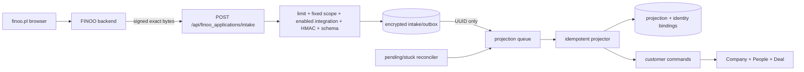

# FINOO Application Form Ingestion

## TLDR

- Accept the current `https://finoo.pl/apply` server-to-server payload at a private FINOO endpoint with an exact 64 KiB limit.
- Authenticate exact bytes with a scoped HMAC, timestamp, nonce, and server-generated string `leadId`.
- Atomically persist a sanitized encrypted intake/outbox before success; queue jobs contain only intake UUID and scope.
- Reconcile pending/stuck intake so a queue outage cannot lose an accepted application.
- Project each `leadId` idempotently into the existing CRM graph without persisting the raw Kontomatik token.

## Overview

- Jira: THOM-104
- Target: `https://finoo.om.they.dev`
- Source: `https://finoo.pl/apply`
- Module: `apps/mercato/src/modules/finoo_applications`
- Delivery: private FINOO branch/instance only
- Dependencies: `customers`, `dictionaries`, `integrations`, `scheduler`, optional `finoo_affiliates`

The reviewed shared-webhook route is not used: it persists all headers and the route-local parsed payload, emits full PII in a persistent legacy event, commits receipt/ingestion/enqueue separately, does not retry source-handler failures, and cannot enforce FINOO's 64 KiB response contract.

## Behavior

| Decision | Contract |
|---|---|
| Caller | FINOO backend only; no browser credential/direct call. |
| Idempotency | Canonical string `leadId` identifies one projection and Deal per scope. |
| Draft/final | Draft uses `Created`; qualified final `Submitted`; disqualified final is retained in `Closed`. |
| Ordering | Draft cannot regress terminal state; first conflicting terminal wins with a warning. |
| Company | Match 10-digit NIP. Update automatically only when the Company is already owned by this source binding; unrelated existing NIP awaits the explicit decision below. |
| People | Match source-owned PESEL/email bindings; representatives never duplicate applicant. |
| Affiliate | Existing Deal code; unknown/inactive code is a warning. |
| Visibility | Existing staff ACL/entity visibility unchanged. |
| Kontomatik | Strip `kontomatikToken` and unknown values before every durable write. |

## Architecture



- Scope comes only from `OM_FINOO_APPLICATION_TENANT_ID` and `OM_FINOO_APPLICATION_ORGANIZATION_ID`.
- Integration `finoo_application` owns enabled/revoked state and encrypted `signingSecret`. Unavailable or revoked configuration fails before writes.
- `finoo_applications` owns auth, sanitization, intake/outbox, retries, projection order, identity bindings, mapping, and warnings.
- Customer commands own CRM side effects. Additive optional create IDs are system-only recovery pointers.
- Optional affiliate validation uses a scope-aware service via `tryResolve`.
- No full-payload persistent event, lead UI, new ACL, NovaLend call, or automatic stage after `Submitted`.

## Inbound Contract

`POST /api/finoo_applications/intake`

```text
Content-Type: application/json
Finoo-Message-Id: <base64url/UUID nonce, 16..128 chars>
Finoo-Timestamp: <Unix epoch seconds>
Finoo-Signature: v1,<canonical base64 HMAC-SHA256>
```

HMAC input is the ASCII prefix `<message-id>.<timestamp>.` followed by exact raw bytes. Authenticate bytes first, then reject invalid UTF-8 and parse JSON. Timestamp skew is five minutes. Nonce uniqueness includes tenant and organization. Retain only the three normalized signing headers.

| Status | Meaning |
|---|---|
| `202 { ok: true, intakeId }` | Sanitized encrypted intake/outbox committed; enqueue may be repaired later. |
| `200 { ok: true, duplicate: true, intakeId }` | Same scoped nonce/body accepted; non-terminal delivery repaired. |
| `409` | Nonce reused with different authenticated bytes. |
| `400` | Invalid nonce/timestamp/UTF-8/JSON/schema. |
| `401` | Invalid signature. |
| `413` | Exact raw body over 64 KiB. |
| `429` | Mandatory ingress budget exceeded. |
| `503` | Scope/integration/credential/encryption unavailable or revoked. |

- `leadId` must be a string matching `^[A-Za-z0-9][A-Za-z0-9_-]{7,127}$`; JSON numbers are rejected.
- Final requires Company name, NIP, applicant names, and a valid PESEL. Email remains optional for identity matching; incomplete draft remains durable.
- The stripping schema recognizes only current form fields. Unknown values are discarded. Only safe bounded warning codes are retained; unsafe unknown names are not retained.
- `kontomatikToken` is recognized only to discard it. Logs contain internal UUIDs/error codes, never body, identity, contact, document, IP, consent, signature, or secret.

## Durable intake and retry

`finoo_application_intakes` stores UUID, scope, scoped-unique message ID, body digest, lead ID, source timestamp, encrypted allowlisted payload, `pending|processing|retrying|processed|failed`, attempt/error/next-attempt/lease metadata, and timestamps.

The route inserts once transactionally. Duplicate success requires matching digest and repairs delivery. Enqueue after commit is best-effort. Queue payload is only `{ intakeId, tenantId, organizationId }`. Earlier failures remain `retrying`; `failed` is terminal only after retry exhaustion. A scheduled reconciler re-enqueues pending/due/expired-lease rows. Locks and compare-and-set leasing prevent concurrent projection.

Queue/dead-letter contains no PII. The separate Person-retention capability owns the single retention clock and invokes downstream erasure seams; this module registers no second clock or scheduler. The FINOO identity erasure seam redacts identity-document/PESEL keys from Person-linked encrypted intakes and deletes that Person's PESEL binding. Retention of the remaining application/projection/consent data stays with the external Person-retention owner.

## Projection and recovery

`finoo_application_projections` is unique by scope+lead ID and stores state, Company/Person/Deal IDs, last intake/timestamp, bounded warnings and safe error code.

`finoo_application_identity_bindings` is unique by scope+kind+keyed hash for NIP/PESEL/email. It stores projection ID, optional CRM entity ID, and a reserved deterministic core UUID/source marker; no raw identity.

Projector locks scope+lead and normalized identities in deterministic order. Before create it persists the reserved UUID. Company/Person/Deal create commands accept an additive optional system ID. If a command stops after core commit, retry finds that exact ID and completes it through update instead of creating a duplicate. Failure injection covers core/custom-field/event boundaries.

Incoming state: `completed: true` plus `disqualified: true` -> `disqualified`; `completed: true` -> `completed`; `completed: false` -> `draft`. `completed` is a required strict boolean; missing or translated string values fail validation, and `disqualified: true` is invalid unless `completed: true`. Allowed are draft refresh/promotion and same-terminal refresh. Terminal-to-draft and conflicting terminal are no-op warnings. Older source timestamps cannot overwrite newer accepted state.

## Mapping

- Company: `companyName` -> display/legal name; NIP -> encrypted `tax_number`; business type -> existing company dictionary; start date -> existing field.
- Applicant/representatives: core name/email/phone plus encrypted mobile and existing job-position dictionary; links to Company/Deal. Applicant PESEL and document values go only through the write-only `finooIdentityTechnicalImport` port. The projector never writes the six legacy identity custom fields, including during the controlled rollback window; existing legacy values are reserved for the scoped migration tool.
- Deal: lead ID -> `external_id`; state -> `form_complete` and exact stage; financial values -> existing fields/core PLN value; reason -> description; affiliate/UTM/click/touch/referrer -> existing fields; disqualification and Kontomatik completion -> bounded history. Never advance after `Submitted`.
- Consent: reuse prepared Terms & Conditions, channel, data-sharing, JDG, legal, and NovaLend fields. Backend derives acceptance time from trusted server context and selects text/code from a versioned server registry; browser-supplied evidence is rejected. The server-to-server peer address is not represented as the applicant IP and is not copied to prepared `*_ip_address` fields. Only its keyed digest is included in append-only evidence bound to scope, lead, intake, acceptance, version/code and server time. If legal requires applicant IP, the caller contract needs a separately signed, validated claim and a new consent registry version. Missing content/code remains unset.

Before projection, require enabled tenant encryption, recoverable DEK, active monotonic encryption maps containing the full canonical and currently configured field union for the core, audit and intake destinations, and `configJson.encrypted=true` for every active non-identity sensitive custom-field destination. Legacy identity definitions never control projector behavior. The existing-tenant `prepare-encryption` rollout authenticates existing ciphertext and encrypts active and soft-deleted rows before activating the map union in the same transaction; duplicate scoped maps fail closed. Deployment requires a pre-migration backup and a maintenance window that drains all relevant writers before apply, restarts every app/worker process to clear local map caches, and performs post-restart dry-run/raw/decrypted read-back before reopening traffic.

## Compatibility and gates

- Private additive endpoint, integration definition, entities, migrations, workers, and optional system create IDs.
- The first external caller contract uses only `completed: boolean`. The earlier Polish draft field was removed before finoo.pl integration began, so no external compatibility bridge or migration is required.
- Existing routes, events, fields, stages, visibility, and affiliate behavior remain authoritative.
- No public contribution or production dependency.
- Production HMAC creation/rotation and finoo.pl routing are explicit last-responsible-moment approval gates.

## Verification

1. Exact-byte HMAC/base64, malformed UTF-8, timestamp, nonce, string lead ID, schema stripping, 64 KiB/413.
2. Revoked integration, credential/DEK/encrypted-field/limiter failures have zero writes.
3. Token/PII canaries in known/unknown fields, unknown keys, headers, errors, logs, intake, queue, events, CRM.
4. Atomic receipt/digest conflict and enqueue outage -> reconciler -> one delivery.
5. Retry vs terminal failure; manual/reconciler replay reaches one success.
6. Draft/final/disqualified, duplicate/stale/conflict, one graph.
7. Failure after each command phase and concurrent messages recover reserved IDs.
8. Cross-scope, guessed lead ID, unrelated identity, optional affiliate unavailable/unknown.
9. Trusted consent/integrity, valid final PESEL, write-only identity import, cutover mode, and Person-retention erasure seam without a second scheduler.

Runtime QA uses signed synthetic calls and exact-SHA deployment, raw-DB/application read-backs, headed Created/Submitted/Closed UI, canary search, and zero-residual cleanup. Caller handoff documents exact signing/retry/limit/string-lead/trusted-consent/no-browser/token rules without secrets or PII.

## Implemented verification

- Seven unit suites cover exact-byte signing, UTF-8/body limits, schema stripping, consent versioning, route status separation, revocation, mandatory limiter, trusted-proxy IP fail-closed, encryption-map fail-closed, duplicate repair, durable retry terminality, crash lease and dispatch recovery.
- `TC-FINOO-APP-001` uses the repository-managed ephemeral environment and real Postgres, booted HTTP route discovery, module bootstrap, encrypted integration credentials, tenant encryption, local durable queue and customer commands. It covers draft -> final refresh, disqualified -> Closed, stale/terminal no-op warnings, digest duplicate/conflict, concurrent same-lead delivery with one Company/Person/Deal graph, unrelated and foreign-null identity bindings, changed-NIP non-overwrite, recovery of a source-owned representative after a partial create, and faithful Company/Person/Deal partial-core states that preserve the reserved core ID while removing projection/binding, custom-field and audit-event side effects before normal queue recovery. It also covers dictionary and phone-prefix mapping, optional affiliate unavailable/unknown, real CLI replay -> reconciler -> queue success, cross-scope payload stripping, retention of aged processed and failed encrypted payloads, append-only consent evidence, non-empty audit logs, existing-tenant plaintext backfill before exact encryption-map activation, raw ciphertext canaries and decrypted scoped API read-back.
- Async Redis queue fault injection and production callback execution remain runtime rollout evidence, not local-test substitutes.

### Current form E2E contract (THOM-110)

The 2026-08-24 audit of `https://finoo.pl/apply` captured a three-step form (`Firma i kontakt`, `Wnioskodawca`, `Zgody`) with JDG/company branches and ID card/passport/mDowód document branches. The displayed consent registry remains byte-equivalent to the accepted server registry, so the consent version does not change; the current application bundle is `index-DcYdDW8y.js` with SHA-256 `d7476e2c3fdb801466fdde3494111db6df0892af4877082cd535daf7dbf81b`.

The current public mapper is not the Open Mercato wire contract. Its contact/marketing channel OR operations lose consent provenance, its NovaLend clause keys use the legacy `jdg,jdg1,jdg2` and `legal,legal1` layout, and it does not supply `consentVersion`. The finoo.pl backend must preserve the three consent groups, translate clause keys to canonical `jdg1..jdg3` / `legal1..legal2`, add the deployed registry version, sign exact canonical bytes, and call the endpoint server-to-server. `monthlyTurnover` is sent as canonical `earnings` and projected to both existing CRM fields `earnings` and `turnover`. The UI-only `propertyCollateral` field has no prepared CRM destination and remains explicitly outside the wire contract until a field and mapping are approved.

Executable THOM-110 scenarios cover all 27 step submissions across JDG/company × ID card/passport/mDowód plus the reachable arrears, too-young and combined automatic rejection paths. Live verification also covers same-body duplicate, message-ID conflict, missing consent version, invalid signature, stale timestamp, invalid media type and oversized body. Exact-host QA must read back intake/projection/Company/People/Deal/stage/custom-field/consent evidence and remove every synthetic graph by its run-scoped lead IDs.

## Production rollout decisions

Security review rejects overwriting an unrelated Company solely from public NIP. Recommended: update only a Company already bound to this source; on first unrelated NIP match, link and record `existing_company_requires_review` without changing canonical fields. This supersedes the earlier “always update by NIP” decision only after explicit approval.

The immutable consent registry is pinned to the current 2026-08-19 `finoo.pl/apply` application bundle `index-BnFiOo84.js` (SHA-256 `7e72cbeb84185992210acd39a9fae843ccaf351836f36e868809d52f18a4c906`); the ordered server registry itself has SHA-256 `b53f8ffac9d0aaf4b82f3d48951082e1201c1e85ac1c2bbed5dca95edad95c3c`. It maps the current BIK, BIG InfoMonitor and KRD clauses (`jdg1..jdg3`, `legal1..legal2`) and keeps application-contact consent separate from optional FINOO.PL and partner marketing channels. Legal/business approval of this exact version, or an approved successor registry, is required before production consent evidence is treated as authoritative.

The current client decision is one Person-level retention clock for all user-linked data, including PESEL and document data. This module therefore registers no independent schedule. Its identity-specific erasure port is invoked by the external Person-retention owner and removes identity keys from linked encrypted intakes plus the Person's PESEL binding; it does not independently decide when erasure is due.

## Changelog

### 2026-08-24

- Required valid PESEL for final projection, moved PESEL/document writes exclusively to the narrow FINOO identity import port, stopped projector writes to legacy identity custom fields, and bound identity-copy erasure to the external single Person-retention clock.
- Added the current three-step form inventory, canonical legacy-consent translation, turnover projection, executable exact-host E2E matrix, and Polish finoo.pl backend integration handoff under THOM-110.

### 2026-08-18

- Replaced unsafe shared-webhook design after architecture/security review with private transactional intake/outbox, fixed scope/revocation, identifier-only queue, retry reconciliation, identity ownership, encryption preflight, consent integrity, and explicit no-deletion retention.
