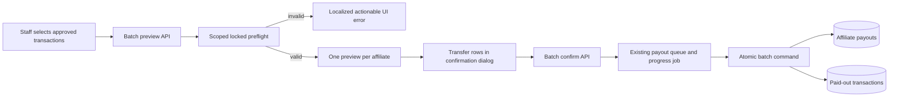

# FINOO Batch Payouts and Visible Operation Errors

## TLDR

- Allow staff to select approved transactions belonging to one or many affiliates.
- Preflight the whole selection before any payout write, group it by affiliate, and show one manual bank-transfer row and payment reference per affiliate.
- Confirm the batch atomically: either every affiliate payout and transaction transition is recorded, or none is.
- Show actionable UI errors, including every affiliate whose payout profile lacks the account holder name or account number.
- Add an account-readiness column to the Affiliates list and make payout preview/confirmation failures visible and actionable.

## Overview

- Jira: THOM-103
- Target: `https://finoo.om.they.dev`
- Module: `apps/mercato/src/modules/finoo_affiliates`
- Delivery: private FINOO branch and instance only
- Related specification: `.ai/specs/enterprise/2026-08-12-finoo-affiliate-portal-and-attribution.md`

## Problem Statement

The current payout preview requires every selected transaction to belong to one affiliate and throws `MIXED_AFFILIATES` otherwise. A valid same-affiliate selection already becomes one payout, but staff cannot process a mixed selection as one operation. When preview fails because the affiliate profile is incomplete, the DataTable action rejects without displaying a useful message, so the only evidence is in the browser/server logs.

Staff also cannot see payout readiness from the Affiliates list. The broader cross-module mutation-feedback audit is specified separately in `.ai/specs/enterprise/2026-08-18-finoo-visible-operation-errors.md`.

## Proposed Solution

Treat a selection as one payout batch containing one existing payout preview per affiliate. The preview path loads and locks the exact transaction selection, validates every transaction and affiliate before writing previews, groups transactions by affiliate, and returns all transfer rows. `FinooPayoutPreview` gains a nullable batch ID and aggregate binding hash so newly issued groups cannot be omitted or recombined; nullable columns preserve already-issued legacy single previews.

Confirmation accepts the exact preview groups and creates all payouts inside one database transaction. Each payout snapshots its affiliate bank data and owns only that affiliate's transactions. A retry of an already completed exact batch returns the existing payouts; a partially matching retry fails stale rather than producing a mixed result.

The UI maps structured payout errors to localized, visible flash or dialog content. Profile preflight returns only the affiliate identity needed by staff and the names of missing fields; it never returns bank values. The Affiliates API adds a derived boolean readiness field and the list renders it as a semantic status badge.

### Approved behavior

| Decision | Contract |
|----------|----------|
| Transfer execution | Staff sends bank transfers outside Open Mercato; the system records confirmation only. |
| Grouping | One payout and one payment reference per affiliate, regardless of how many selected transactions belong to that affiliate. |
| Mixed selection | Supported as one batch. |
| Preflight | All-or-nothing and performed before preview persistence. |
| Complete payout profile | Non-blank account holder name and non-blank account number. |
| Confirmation | All payout records and transaction transitions commit atomically. |
| Currency | PLN only, preserving the existing contract. |
| Error visibility | Payout preview and confirmation must end in visible success, visible actionable failure, or a visible progress job. |

## Architecture



### Boundaries

- `finoo_affiliates` owns payout grouping, preview binding, confirmation, queue payload, worker, events, readiness projection, and payout UI.
- The existing progress and queue packages remain the only long-running-operation mechanism.
- No payment-provider integration, bank API, transfer file, automatic transfer, payout cancellation, or currency conversion is introduced.
- The broader Affiliate/Intermediary error audit belongs to the companion THOM-103 error-feedback specification.
- No public upstream contribution is in scope.

## Data Model

One additive private migration adds nullable `batch_id` and `batch_binding_hash` columns plus scope/batch and batch/affiliate constraints to `finoo_payout_previews`.

- `FinooPayoutPreview` remains one affiliate's exact, expiring preview and binding hash and also stores the server-issued batch ID and shared aggregate binding.
- `FinooAffiliatePayout` remains one affiliate's immutable manual-payment record.
- `FinooAffiliateTransaction.payoutId` continues to point to exactly one payout.
- A payout batch is an API/command aggregate represented by an ordered array of per-affiliate previews. Its stable identity is a server-generated UUID plus a hash over scope and the canonical sorted set of payment-reference/group bindings.

## API Contracts

### POST `/api/finoo_affiliates/payouts/preview`

The request remains additive-compatible:

```ts
{ transactions: Array<{ id: string; updatedAt: string }> }
```

The response adds a batch envelope:

```ts
{
  batchId: string
  groups: Array<{
    paymentReference: string
    affiliateId: string
    affiliateEmail: string
    affiliateUpdatedAt: string
    accountHolderName: string
    accountNumber: string
    amount: string
    currency: 'PLN'
    selectedCount: number
    transactions: Array<{ id: string; updatedAt: string }>
    expiresAt: string
  }>
  selectedCount: number
  affiliateCount: number
  totalAmount: string
  currency: 'PLN'
}
```

For a single-affiliate selection the response also MUST preserve every existing flat top-level field (`paymentReference`, `affiliateId`, `affiliateEmail`, `affiliateUpdatedAt`, `accountHolderName`, `accountNumber`, `amount`, `currency`, `selectedCount`, `transactions`, `expiresAt`) with the same meanings and types. This is the mandatory compatibility bridge for existing clients. Mixed-affiliate responses use the batch envelope only because that selection was previously rejected. The FINOO UI accepts both shapes during the bridge and normalizes a flat response to one group.

Groups are ordered by affiliate ID, and transactions by transaction ID, so retries and tests are deterministic. The server independently enforces tenant and organization scope, exact versions, approved/unpaid status, active affiliate membership, PLN, and complete profile.

Incomplete profiles return HTTP 409:

```ts
{
  error: 'PAYOUT_PROFILES_INCOMPLETE'
  affiliates: Array<{
    affiliateId: string
    affiliateEmail: string
    missingFields: Array<'accountHolderName' | 'accountNumber'>
  }>
}
```

Every incomplete affiliate is returned in deterministic order. No account holder or account number value is returned in the error.

### POST `/api/finoo_affiliates/payouts/confirm`

The grouped request contains the server-issued `batchId` and the exact `groups` returned by preview. Validation rejects omitted/additional/recombined groups, duplicate affiliates, duplicate references, duplicate transaction IDs across groups, more than 100 transactions across the complete batch, stale affiliate/transaction versions, changed bank profiles, expired previews, or a group whose transactions no longer belong to its affiliate. The worker repeats the aggregate check after locking every preview in deterministic order.

If all groups already completed as the same exact batch, return HTTP 200 with all payout IDs. Otherwise create one non-cancellable progress job and enqueue one batch job. The worker executes one registered batch command and uses one database transaction for every group. Success returns a result summary with payout IDs and payment references. A failed attempt remains non-terminal while the queue can retry; only the exhausted final attempt marks the progress job failed with a sanitized localized-facing error. This prevents a transient progress-service error after the payout commit from presenting a false financial failure, and preserves the database all-or-nothing guarantee.

The existing single-group payload shape MUST remain accepted as a compatibility bridge for at least one private minor release, but only when the referenced server batch contains exactly one group; the exact completed retry continues to return the existing singular response. The FINOO UI sends the new batch-bound grouped shape after deployment and falls back to the legacy shape only when normalizing an older flat preview response. Existing route paths, ACL feature IDs, queue name, and event IDs remain stable.

### GET `/api/finoo_affiliates/affiliates`

Each item adds:

```ts
{ payoutProfileComplete: boolean }
```

The value is derived server-side from both trimmed encrypted fields. It does not expose either value. The change is additive.

## UI and Accessibility

- `TransactionsClient` catches preview failures and always displays a localized flash. For `PAYOUT_PROFILES_INCOMPLETE`, the message lists each affiliate email and localized missing-field labels.
- The payout dialog renders a compact row/section per affiliate with amount, holder, account number, reference, and transaction count, plus aggregate affiliate count, transaction count, and amount.
- Confirm failure remains in the open dialog and displays a localized error; the user can retry or cancel. `Cmd/Ctrl+Enter` confirms and `Escape` cancels while idle.
- The Affiliates DataTable adds `Payout account` with semantic `Ready`/`Missing data` badges. It exposes no account value.
- Payout preview and confirmation catch rejected mutations. A caught payout error cannot be empty: it must call the existing conflict surface or a localized flash/inline `Alert`. Load-only failures continue to use the established table/page error state.
- All added strings are provided in every locale already shipped by the touched module. No hard-coded status colors or arbitrary values are introduced.

## Error Mapping

| Server code / condition | Visible UI outcome |
|-------------------------|--------------------|
| `PAYOUT_PROFILES_INCOMPLETE` | Affiliate-by-affiliate missing-field message |
| `TRANSACTION_NOT_APPROVED` | Selection contains a transaction that is no longer approved |
| `PAYOUT_PREVIEW_STALE` / optimistic conflict | Refresh and retry instruction through the shared conflict/error surface |
| `AFFILIATE_NOT_FOUND` | Affiliate is unavailable in the current organization |
| `PAYOUT_CURRENCY_MISMATCH` | Selection cannot be paid because currencies differ from PLN |
| queue failure | Visible failed progress job and localized generic payout failure |
| unknown failure | Localized generic action failure; details remain in server logs |

## Backward Compatibility

- No route is removed and no persisted field or event ID changes.
- The Affiliate list change is response-additive.
- One affiliate still yields exactly one payout and behaves like the existing flow.
- Existing immutable payout and transaction snapshots remain unchanged.
- Existing historical previews continue to be valid as one-group previews until expiry.
- The implementation does not broaden payout ACLs, tenant visibility, organization scope, or portal access.

## Testing Strategy

### Focused

- Batch preview groups mixed selections into one deterministic group per affiliate.
- Same-affiliate multi-transaction selection stays one payout.
- Preflight reports all incomplete affiliates and persists zero previews when any group fails.
- Readiness treats whitespace-only values as missing and never returns account values.
- Confirmation creates all payouts and transitions all transactions in one transaction.
- Confirmation rejects omitted, recombined, duplicate-affiliate, and aggregate-over-100 group sets.
- A failure in any group rolls back every payout and transaction change.
- Exact completed retry is idempotent; partial/stale retry fails.
- UI renders grouped transfers and visible mapped errors for preview and confirm.
- Payout preview and confirmation tests prove rejected promises create visible feedback.

### Integration

- `TC-FINOO-AFF-019`: mixed-affiliate preview and aggregate totals.
- `TC-FINOO-AFF-020`: multi-affiliate atomic confirmation and one payout per affiliate.
- `TC-FINOO-AFF-021`: incomplete-profile all-or-nothing preflight with structured safe error.
- `TC-FINOO-AFF-022`: stale second group rolls back the full batch.
- `TC-FINOO-AFF-023`: Affiliate list readiness projection and cross-scope privacy.

Fixtures create their own affiliates, encrypted profiles, transactions, and statuses and clean them in `finally`. Runtime QA exercises same-affiliate and mixed-affiliate selection, incomplete profile feedback, retry behavior, progress completion, and the readiness column.

## Risks & Impact Review

### Financial partial completion

Risk: one affiliate payout commits while another fails.

Mitigation: all previews are revalidated and all payouts are created inside one transaction with deterministic lock order.

### Duplicate payout on retry

Risk: worker retry creates a second record.

Mitigation: the server-issued batch ID and aggregate binding, exact preview bindings, unique payment references, completed-batch comparison, and transaction locks preserve idempotency.

### Sensitive bank-data exposure

Risk: readiness or validation errors expose banking details.

Mitigation: readiness is boolean; structured failures carry only affiliate identity and missing field names; actual bank values remain limited to the authorized confirmation view and immutable payout snapshot.

## Final Compliance Report

- Private FINOO scope only; no upstream PR.
- One additive private preview-binding migration; no production dependency.
- Existing queue, progress, mutation-guard, encryption, i18n, and optimistic-lock patterns are reused.
- Completion requires focused tests, integration coverage, generation, typecheck/lint, exact-revision deployment, headed QA, and fresh primary review.

## Open Questions

None.

## Changelog

### 2026-08-18

- Initial THOM-103 specification based on the approved all-or-nothing mixed-affiliate payout model and live FINOO configuration audit.
- Added the server-issued aggregate batch binding after financial-integrity review proved that independently bound groups could otherwise be omitted or recombined.
