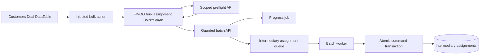

# FINOO Bulk Intermediary Assignment from the Deal List

## TLDR

- Add a bulk action to the existing Customers Deal DataTable.
- Let authorized staff choose one active intermediary and review the selected Deals before submitting.
- Only Deals in the exact `Web Form Sales Pipeline` / `Sent To Partners` stage are eligible.
- Treat existing assignment to the same intermediary as a no-op, require explicit confirmation for reassignment, and commit the whole selection atomically.
- Run the mutation through one progress job and queue item with optimistic locking and visible failures.

## Overview

- Jira: THOM-103
- Target: `https://finoo.om.they.dev`
- Module: `apps/mercato/src/modules/finoo_intermediaries`
- Host extension: `data-table:customers.deals.list:bulk-actions`
- Delivery: private FINOO branch and instance only
- Related specifications: `.ai/specs/enterprise/2026-08-13-finoo-intermediary-portal.md`, `.ai/specs/enterprise/2026-08-17-finoo-intermediary-management-and-invitations.md`

## Problem Statement

Staff can currently assign or reassign one Deal from its detail tab. The Customers Deal list has an additive bulk-action injection point, but `finoo_intermediaries` does not use it. Assigning many eligible Deals therefore requires opening and saving every Deal separately.

The bulk-action contract can execute or navigate but does not provide an embedded intermediary selector. A safe solution must gather the selection from the list, offer a proper accessible selector and review state, preserve exact stage and active-intermediary rules, make same-target assignments idempotent, and avoid partial mutation.

## Proposed Solution

Inject `Assign intermediary` into `data-table:customers.deals.list:bulk-actions`. The action validates selected row identities and navigates to a module-owned backend review page with a canonical comma-separated list of at most 100 Deal UUIDs. The page loads the current scoped selection, current assignments, eligibility, and active intermediary choices from one preflight endpoint.

Staff selects an intermediary. The page shows counts for new assignments, unchanged assignments to the same intermediary, and reassignments from another intermediary. Any missing or ineligible Deal blocks submission and is listed by Deal name with its reason. If at least one Deal will be reassigned, submission requires an explicit confirmation.

On submit, one guarded API call creates a non-cancellable progress job and enqueues one batch. The worker re-locks and revalidates every Deal, assignment, selected intermediary, and expected version in deterministic order, then creates/updates all assignments in one database transaction. A no-op row is verified but not updated. Any failure rolls back the complete batch.

## Architecture



### Boundaries and coupling

- `customers` remains the owner of Deals and the Deal list. It is not modified; the private module uses the existing public DataTable injection contract.
- `finoo_intermediaries` owns the injected action, review page, preflight, batch route, command, worker, queue payload, and assignment changes.
- The module references Deal IDs and loads scoped Deals through existing access helpers; no cross-module ORM relationship is added.
- Existing single-Deal assignment routes, portal access predicates, notes, activities, partner statuses, and assignment entity remain unchanged.
- No public upstream contribution is in scope.

## User Flow

1. Staff selects one to 100 rows in `/backend/customers/deals` and chooses `Assign intermediary`.
2. The action navigates to `/backend/finoo-intermediaries/bulk-assignments?dealIds=<canonical ids>`.
3. The review page loads exact current Deal and assignment state and active directory-backed intermediaries.
4. Staff selects one intermediary.
5. The page classifies every Deal as `create`, `no_change`, `reassign`, or `blocked`.
6. Any `blocked` row disables submit and displays its reason.
7. If `reassign > 0`, staff confirms the transfer explicitly.
8. Submit starts one progress job. Completion returns staff to the Deal list and the top bar records the terminal success/failure; retryable attempts do not emit a terminal failure.

## Data Model

One private additive migration adds an internal batch receipt. No existing assignment column or relation changes.

- `FinooIntermediaryAssignment` remains the only assignment entity and continues to allow one active assignment per scoped Deal.
- Existing assignment IDs and partner status are preserved during reassignment; only intermediary user/role and `updatedAt` change, matching the existing single-record update command.
- New assignments use partner status `new`, the exact eligible stage ID, and the current actor ID.
- No-op assignments are not touched, so `updatedAt`, actor history, and partner status remain unchanged.

### `FinooIntermediaryAssignmentBatch`

Table: `finoo_intermediary_assignment_batches`

| Field | Type | Contract |
|-------|------|----------|
| `id` | UUID PK | Stable operation ID; equals the progress job ID |
| `tenantId` / `organizationId` | UUID | Required scope |
| `bindingHash` | text | Hash of canonical Deal versions, assignment versions, target intermediary, and reassign confirmation |
| `result` | JSON | Sanitized ordered assignment IDs and create/reassign/no-op counts |
| `completedAt` | timestamptz | Set in the same transaction as assignment writes |
| `createdAt` | timestamptz | Receipt creation timestamp |

The receipt is internal and not user-editable. The unique scoped operation ID and binding hash make queue retries converge after a successful database commit even if progress completion failed. It contains IDs and counts only, never Deal names, intermediary names, or emails.

## API Contracts

### GET `/api/finoo_intermediaries/admin/bulk-assignments`

Query:

```ts
{ dealIds: string } // comma-separated, unique UUIDs, 1..100
```

Response:

```ts
{
  deals: Array<
    | {
        id: string
        state: 'blocked'
        name: null
        updatedAt: null
        blockedReason: 'not_found'
        assignment: null
      }
    | {
        id: string
        state: 'available'
        name: string
        updatedAt: string
        blockedReason: 'ineligible_stage' | null
        assignment: null | {
      id: string
      intermediaryCustomerUserId: string
      intermediaryDisplayName: string
      updatedAt: string
        }
      }
  >
  intermediaries: Array<{
    id: string
    displayName: string
    email: string
  }>
}
```

The server returns one result per requested ID in canonical order. Missing, cross-scope, or soft-deleted Deals use the blocked discriminant with null name/version and do not disclose data. Only active, scoped, directory-backed intermediaries are returned.

### POST `/api/finoo_intermediaries/admin/bulk-assignments`

Request:

```ts
{
  deals: Array<{
    id: string
    updatedAt: string
    assignmentId: string | null
    assignmentUpdatedAt: string | null
  }>
  intermediaryCustomerUserId: string
  confirmReassign: boolean
}
```

Validation requires 1..100 unique Deal IDs, coherent nullable assignment fields, and no duplicate assignment IDs. The route uses `finoo_intermediaries.manage`, organization resolution, mutation guards, and a batch resource ID derived from canonical Deal IDs.

Before enqueueing, the route performs a fresh preflight. A blocked Deal returns HTTP 422 with all blocked items. Reassignments with `confirmReassign = false` return HTTP 409 with the reassign count. A fully unchanged selection returns HTTP 200 with `affectedCount = 0`, `unchangedCount`, and no progress job.

For a mutating batch, return HTTP 202:

```ts
{
  progressJobId: string
  createCount: number
  reassignCount: number
  unchangedCount: number
}
```

The worker repeats all validation under locks. The command first loads the scoped receipt by operation ID. A completed receipt with the exact binding returns its stored result without touching assignments; the same operation ID with another binding fails closed. Otherwise the command enforces optimistic locks on every Deal and every existing assignment with the submitted versions. Mutation order is canonical Deal ID order. It loads the exact eligible pipeline/stage and target intermediary once per transaction, applies every create/update, persists the completed receipt, and flushes once. The transaction commits all assignment results and the retry receipt or none.

## Command, Queue, and Audit

- Command ID: `finoo_intermediaries.assignment.bulk_upsert`
- Queue ID: `finoo-intermediaries-assignment-bulk`
- Worker ID: `finoo-intermediaries:assignment-bulk`
- Progress job type: `finoo_intermediaries.assignment.bulk_upsert`
- Non-cancellable after enqueue because the database mutation is one short transaction.
- Queue retry uses the same progress job ID as `operationId`. If assignment commit succeeds but progress completion fails, the non-terminal retry reads the completed exact receipt, returns the stored result, and completes the original progress job without reapplying writes. The progress job is marked failed only after the active queue strategy's final attempt is exhausted.
- The registered command is non-undoable as one batch; existing single-assignment commands retain their current undo behavior. Reversing a mixed create/reassign batch through generic command undo would require a compound recovery contract not requested here.
- Command audit stores assignment IDs and create/reassign/no-op counts without names, emails, or Deal content.
- Existing assignment event behavior is preserved. If there is no existing per-assignment event, this task does not invent a public event contract solely for the batch.

## UI and Accessibility

### Injection widget

- Validates row `id` values, canonicalizes and deduplicates them, enforces at most 100, and navigates using the injection context.
- Returns `{ ok: false, message }` for invalid/oversized selections so DataTable shows a visible localized error.

### Review page

- Server page root remains server-only; one bounded client component owns loading, intermediary selection, confirmation, and guarded submit.
- Uses `Page`, `Select`, `Alert`, `StatusBadge`, `Button`, `LoadingMessage`, and `ErrorMessage` from existing packages.
- Lists every selected Deal in a plain responsive table/list with current assignment and classification; no nested card stack.
- Blocked reasons are localized and explicit. Submit remains disabled while any row is blocked or no intermediary is selected.
- Reassignment confirmation names the target intermediary and count, uses the shared confirmation dialog, and is keyboard accessible.
- `Cmd/Ctrl+Enter` submits when valid; the shared confirmation dialog handles `Escape`, and the visible Cancel action returns to the Deal list.
- Submit failure remains on the page with a visible localized message and Retry action. Success with a progress job navigates back and lets the global progress UI refresh the Deal list after completion.

`"use client"` ledger:

| File | Browser-only reason | Imported by | Budget |
|------|---------------------|-------------|--------|
| `widgets/injection/deal-bulk-assignment/widget.ts` | Data widget callback/navigation; no React component | generated injection registry | small static adapter |
| `components/bulk-assignments/bulk-assignment.client.tsx` | load, select, confirmation, mutation, navigation | server review page | below 300 lines |

No new provider, global bootstrap import, or production dependency is introduced.

## Backward Compatibility

- The DataTable spot use is additive and module-optional.
- No Customers module file or contract changes.
- Existing assignment APIs and command IDs stay stable.
- Existing assignment rows, notes, partner statuses, and portal history are preserved.
- Reassignment semantics match the current single-assignment update: partner status is not reset.
- The module still fails closed if the eligible pipeline/stage configuration is missing or ambiguous.

## Testing Strategy

### Focused

- Injection table registers only `data-table:customers.deals.list:bulk-actions` for this capability.
- Widget canonicalizes IDs, blocks invalid/oversized input, and navigates to the correct review URL.
- Preflight returns all requested rows, exact classifications, and only active intermediaries.
- Same-intermediary selection is a no-op and does not update timestamps.
- A different intermediary requires explicit confirmation.
- Any ineligible, missing, cross-scope, stale, or duplicate Deal blocks the entire batch.
- Worker/command creates and reassigns in one transaction and rolls everything back on an injected late failure.
- Client renders blocked reasons, confirmation, visible API failure, retry, and progress handoff.

### Integration

- `TC-FINOO-INT-MGMT-014`: bulk create for multiple eligible unassigned Deals.
- `TC-FINOO-INT-MGMT-015`: mixed create/no-op/reassign with explicit confirmation.
- `TC-FINOO-INT-MGMT-016`: one ineligible Deal blocks all writes.
- `TC-FINOO-INT-MGMT-017`: stale assignment or Deal version rolls back all writes.
- `TC-FINOO-INT-MGMT-018`: tenant/organization and inactive-intermediary isolation.

Fixtures create their own pipeline/stage, Deals, active intermediary, role membership, and assignments and clean up in `finally`. Runtime QA exercises desktop and narrow layouts, keyboard submit/cancel, a blocking selection, explicit reassignment, progress completion, and result read-back.

## Risks & Impact Review

### Partial assignment

Risk: earlier Deals are reassigned before a later Deal fails.

Mitigation: one locked command transaction, deterministic order, one flush, and rollback coverage.

### Stale list selection

Risk: stage or assignment changes after the review page loads.

Mitigation: versions are submitted, route preflight refreshes them, and the worker revalidates under locks before any write.

### Accidental reassignment

Risk: a bulk create silently transfers Deals already owned by another intermediary.

Mitigation: classification is visible, any reassignment requires explicit confirmation, and the server independently enforces the flag.

### Cross-module regression

Risk: changing the Customers Deal list to support FINOO behavior affects every deployment.

Mitigation: no Customers change; use the existing optional DataTable injection spot.

## Final Compliance Report

- Private FINOO module only; no upstream PR.
- One private additive internal-receipt migration; no dependency or Customers code modification.
- Existing ACL, guarded mutation, optimistic locking, queue/progress, i18n, and injection contracts are reused.
- Completion requires focused tests, integration coverage, `yarn generate`, typecheck/lint, exact-revision deployment, headed QA, and fresh primary review.

## Open Questions

None.

## Changelog

### 2026-08-18

- Initial THOM-103 specification based on the approved exact-stage, explicit-reassignment, no-op, and all-or-nothing rules.
