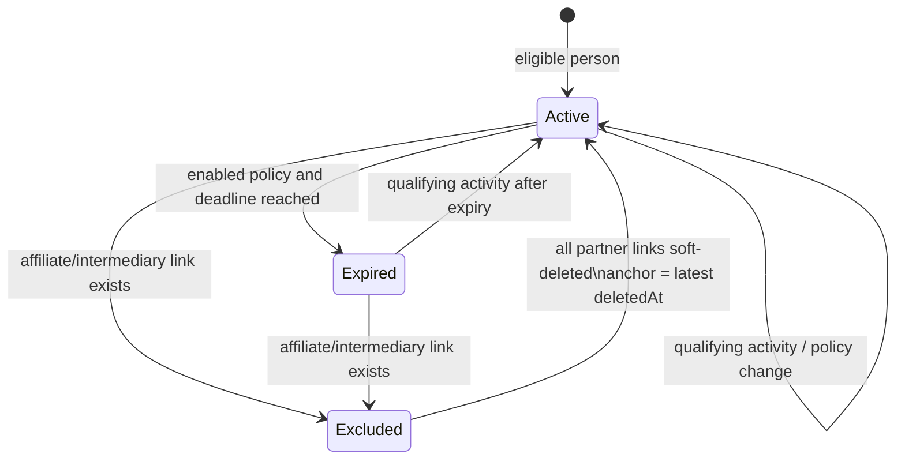
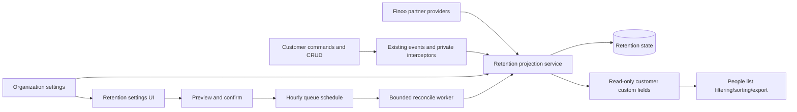

# Finoo customer data-retention expiry

**Status:** Implemented and locally verified; final review and private deployment pending
**Date:** 2026-08-24
**Tracker:** [THOM-109](https://th-ey.atlassian.net/browse/THOM-109)
**Delivery:** Finoo-private only; no upstream contribution

## TL;DR

Add an organization-wide inactivity policy for eligible Finoo people. Maintain a dedicated retention projection and two read-only customer custom fields, mark due people as `expired`, and expose filtering without changing `CustomerEntity.status` or `isActive`. Qualifying activity normally requests an immediate projection refresh; an organization-scoped hourly queue schedule is the authoritative repair path for missed events and expires due records. The first enablement and every period reduction require a fresh dry-run and explicit confirmation.

This capability applies to people only, including manually created/imported people, applicants, and company representatives created through the Finoo application flow. Companies are never eligible. People linked to a non-deleted Finoo affiliate or intermediary record are excluded.

## 1. Problem and goals

Finoo needs to find customers whose personal data reached an inactivity threshold so downstream data-retention work can be performed deliberately. The current CRM `CustomerEntity.status` dictionary already drives unrelated business processes and filters, so adding `expired` there would conflate retention state with CRM lifecycle state.

Goals:

- configure one inactivity window per organization, from 1 to 3650 days, or disable it;
- calculate deadlines for eligible people using system timestamps;
- reset the deadline on qualifying activity;
- mark due people as retention-expired within approximately one hour;
- keep expired people in the default people list and make retention status filterable;
- preserve expired state across policy increase or disablement;
- provide a mandatory impact preview before first enablement or period reduction;
- keep all reads, writes, jobs, and events tenant- and organization-scoped.

Non-goals:

- automatic or general Person deletion/anonymization, legal-hold handling, notifications, or scheduled retention execution; the only execution bridge is the separately authorized THOM-108 command that removes identity-data copies through the narrow identity-retention port;
- a full immutable activity/retention ledger;
- per-person overrides or a manual expiry toggle;
- company expiry;
- expiry of Finoo affiliates or intermediaries;
- changing the CRM status dictionary, `CustomerEntity.status`, or `isActive`;
- upstream/public Open Mercato contribution in this task.

### 1.1 MVP and user stories

The MVP is the complete flagging loop described here: configure, preview, project, expire/reactivate, filter, reconcile, and operate it safely. A styled custom badge, automatic/general Person deletion or anonymization, legal holds, per-person exceptions, and a historical ledger are future work and are not prerequisites for deployment. A separate operator-only command may use this authoritative `expired` projection to invoke the THOM-108 identity erasure seam; it is never called by hourly reconciliation.

- As a Finoo administrator with `customers.settings.manage`, I can enable, disable, or change one organization-wide inactivity window and see the destructive impact before first enablement or reduction.
- As a CRM user with `customers.people.view`, I can see and filter retention status/deadline while expired people remain in the ordinary people list.
- As a compliance operator, I can rely on customer activity resetting expiry and on the hourly reconciliation repairing missed signals within the stated lag.
- As a separately authorized compliance operator, I can run a count-only identity-erasure preview and an explicitly confirmed bounded apply against only due `expired` people in one tenant and organization.
- As a tenant administrator, I can trust that affiliates, intermediaries, companies, deleted people, and data from another tenant or organization cannot be incorrectly expired by this policy.

## 2. Context and repository placement

Implement a private module under `apps/mercato/src/modules/finoo_customer_retention/`. The module owns settings, the current retention projection, reconciliation, private UI, and customer custom-field integration.

The module consumes existing public core capabilities without modifying their contracts:

- `customers` for people, interactions, comments, customer users, custom fields, ACL, and events;
- `audit_logs` for the durable, scoped proof that a person deletion was undone;
- `queue` for a durable hourly schedule and bounded reconciliation jobs;
- `progress` for visible long-running policy reconciliation;
- `events` for immediate projection refreshes.
- `finoo_identities` as a required private dependency only for the separately authorized `finooIdentityRetention` erasure port; the full identity service and raw values are never resolved here.

Finoo affiliate/intermediary eligibility is optional cross-module integration. The retention module must not introduce direct ORM relationships to peer modules. It consumes narrow scoped DI providers owned by `finoo_affiliates` and `finoo_intermediaries`, while the optional consumer owns all orchestration. At runtime it compares the structural enabled-module registry with provider resolution: an absent module ID yields an empty result; an enabled module whose provider is missing or throws aborts the affected evaluation without changing state or mirrors. This distinction is integration-tested in the private retention module; the public reduced-core `module-decoupling.test.ts` remains unchanged.

Identity erasure is a separate operator action, not part of projection reconciliation. `erase-expired-identities` selects only non-deleted states in the exact tenant/organization with `retentionStatus = expired` and `retentionExpiresAt <= now`. Dry-run reports counts only. Apply is bounded and requires `--maintenance-window --confirm THOM-108`; it fails closed unless the narrow `finooIdentityRetention` port is present and propagates the first erasure failure. Re-running apply is safe because the identity erasure seam is idempotent. Merely becoming `expired` never deletes data automatically.

No infrastructure CRON is required. Scheduling uses the repository queue scheduler, producing the same flat organization-scoped payload in local and asynchronous queue modes.

## 3. Accepted product rules

### 3.1 Eligibility

An eligible subject is every non-deleted `CustomerEntity` with `kind = 'person'` in the current tenant and organization, including:

- the applicant referenced by `finoo_application_projections.applicant_entity_id`;
- every company representative submitted by the company path at `https://finoo.pl/apply`;
- manually created people;
- imported people;
- people whose CRM status is inactive or archived;
- people with `isActive = false`.

A person is excluded while a non-deleted `FinooAffiliate` or `FinooIntermediary` links to a `CustomerUser` whose `personEntityId` equals that customer entity. Invitation or active state does not matter.

When a person becomes an affiliate or intermediary:

- set the retention projection to `excluded` immediately;
- clear `retentionExpiresAt`, `expiredAt`, and both retention custom-field mirrors.

When every excluding relationship is soft-deleted:

- re-enter the person as `active`;
- set `eligibilityAnchorAt` to the latest relevant relationship `deletedAt`;
- start a fresh retention window from that timestamp, not from historical customer creation.

This re-entry is the one explicit exception to the rule that only qualifying activity reactivates an expired retention record.

### 3.2 Qualifying activity

| Source | Timestamp used | Qualifies | Notes |
| --- | --- | --- | --- |
| Person creation | `CustomerEntity.createdAt` | Yes, as baseline | Imported people begin at their system creation/import time. |
| Comment creation | persisted `createdAt` | Yes | Editing a comment does not qualify. |
| Note/direct interaction creation | persisted `createdAt` | Yes | Includes direct interactions such as email, call, meeting, or note. |
| Planned task creation | persisted `createdAt` | Yes | Never use scheduled/due time. |
| Planned task completion | persisted completion/`occurredAt` | Yes | A real transition to completed resets again. |
| Imported interaction | max(system `createdAt`, non-future business occurrence) | Yes | A historical imported occurrence cannot backdate the retention clock before import. |
| Future scheduled/occurrence time | ignored until a qualifying system event | No | Prevents future timestamps from extending retention. |
| Edit of existing note/comment/task | unchanged prior timestamp | No | No new activity is added. |
| Deal/order/payment or related-object change | n/a | No | Outside the accepted activity definition. |

Deleting or cancelling the latest qualifying comment/interaction/task must recompute the deadline from the latest remaining qualifying activity. Legacy customer activity/todo storage that remains readable must be included until its data is migrated; duplicate representations are harmless because the projection uses the maximum trusted timestamp.

For imported activity, clamp the business occurrence timestamp so it cannot be later than the current system time, then use the later of that value and the activity record's system `createdAt`.

### 3.3 Retention state machine

The retention projection has three states: `active`, `expired`, and `excluded`.



Deadline calculation is exact UTC elapsed time: `anchor + inactivityWindowDays * 24 hours`.

Rules:

- Without qualifying activity, the anchor is `CustomerEntity.createdAt` or the partner-exclusion re-entry anchor, whichever governs the current eligibility period.
- New qualifying activity later than `expiredAt` immediately changes `expired` to `active`, clears `expiredAt`, and calculates a new deadline when the policy is enabled.
- Increasing the inactivity window recalculates future deadlines for `active` people but never reactivates `expired` people.
- Disabling the policy clears future deadlines for `active` people and stops new expiries; existing `expired` people stay expired.
- Re-enabling recalculates only non-expired people. Expired people remain sticky until qualifying activity or exclusion/re-entry.
- Reducing the window or enabling it for the first time can expire active people only after the required preview and confirmation.
- Every run re-evaluates current partner eligibility; a stale projection cannot override a live exclusion.
- When an eligible person is soft-deleted or changes to `kind = 'company'`, soft-delete the retention projection and clear both mirrors. This is not a retention reactivation or an `excluded` partner state.
- When such a customer is restored or changes back to `kind = 'person'`, create a fresh `active` eligibility period anchored at the persisted restoration/kind-change system timestamp. Historical activity before that timestamp cannot make the newly eligible person immediately expired.
- For a restored deletion, use the latest scoped `customers.people.delete` action log in `undone` state after the prior eligibility anchor. The immediate queue signal is only a latency optimization: hourly reconciliation discovers the durable action independently, and advancing the eligibility anchor makes each undo one-shot.
- The authoritative timestamp for a signalled or later-discovered restoration/kind transition is scoped `CustomerEntity.updatedAt`, clamped to the current database time. If a later non-activity customer edit has replaced the original transition timestamp before reconciliation, using that later persisted system timestamp is the conservative fallback and may delay—but never prematurely trigger—expiry.
- An `expired` projection retains the reached `retentionExpiresAt` for explanation/filtering and records the actual transition in `expiredAt`.
- If deletion or cancellation removes the activity that reactivated an expired person, recompute under the per-subject lock. When the resulting deadline is already due, transition back to `expired` with a new `expiredAt` equal to the current evaluation time.

## 4. Architecture



Private event subscribers and interceptors keep ordinary activity responsive. The hourly worker is authoritative reconciliation for missed delivery, deletions/cancellations, policy changes, partner eligibility changes, and due expiries. Both paths call the same idempotent projection service.

### 4.1 Cross-module seams

The private module reads customers through scoped services/repositories and optional partner providers registered by the two private partner modules. It stores only scalar IDs; there are no ORM relations across modules and the providers expose no entity classes.

No public customer event or API contract changes in this task. The private module owns the integration glue:

- subscribers consume existing person, comment, interaction, todo, and email-link events and always reload trusted persisted facts;
- private command interceptors cover customer people/comment/interaction/activity/todo commands, capturing the affected person before destructive writes and requesting an after-success projection refresh; command interception is authoritative because the custom complete/cancel/todo routes converge on the command bus but do not opt into custom-route API interceptors;
- private command interceptors cover `customers.*` command paths, including undo, and request refresh only after successful execution;
- private subscribers/interceptors for enabled Finoo affiliate/intermediary modules request exclusion refreshes;
- handlers enqueue a deduplicated single-subject refresh rather than performing a second business mutation inside a customer transaction;
- the hourly reconcile remains authoritative for imports, direct database writes, unavailable best-effort signals, and any path not represented by an event or interceptor.

Interceptors do not change results, permissions, or customer behavior except that a verified non-completed to completed task transition receives a system `occurredAt` timestamp so the accepted completion reset remains durable across later edits and hourly reconciliation. They identify an affected person from authenticated/scoped command input, pre-write state, or command result and enqueue a private refresh after success. Missing or ambiguous identity causes no inline projection mutation and is repaired by reconciliation; it must never guess a cross-tenant customer ID.

## 5. Data model

### 5.1 `FinooCustomerRetentionSettings`

Table: `finoo_customer_retention_settings`

| Column | Type | Constraint/purpose |
| --- | --- | --- |
| `id` | UUID | Primary key. |
| `tenant_id` | UUID | Required scope. |
| `organization_id` | UUID | Required scope. |
| `inactivity_window_days` | integer nullable | `NULL` disables; otherwise `1..3650`. |
| `preview_token_hash` | varchar nullable | SHA-256 of the latest unexpired preview token. |
| `preview_window_days` | integer nullable | Proposed preview value. |
| `preview_total_eligible` | integer nullable | Fresh preview count. |
| `preview_newly_expired` | integer nullable | Fresh preview count. |
| `preview_already_expired` | integer nullable | Fresh preview count. |
| `preview_expires_at` | timestamptz nullable | Ten-minute validity window. |
| `reconciliation_generation` | integer | Monotonic generation invalidating stale jobs. |
| `created_at` | timestamptz | Audit timestamp. |
| `updated_at` | timestamptz | Optimistic-lock version. |

Unique index: `(tenant_id, organization_id)`. Check constraint enforces the day range. Storing only the latest preview on the singleton intentionally avoids a history table; generating a new preview invalidates the old token.

### 5.2 `FinooCustomerRetentionState`

Table: `finoo_customer_retention_states`

| Column | Type | Constraint/purpose |
| --- | --- | --- |
| `id` | UUID | Primary key. |
| `tenant_id` | UUID | Required scope. |
| `organization_id` | UUID | Required scope. |
| `customer_entity_id` | UUID | Scalar person ID; no ORM relation. |
| `retention_status` | enum/string | `active`, `expired`, or `excluded`. |
| `eligibility_anchor_at` | timestamptz | Current eligibility-period baseline. |
| `last_qualifying_activity_at` | timestamptz nullable | Latest trusted activity. |
| `retention_expires_at` | timestamptz nullable | Current active deadline. |
| `expired_at` | timestamptz nullable | When the projection entered expired. |
| `last_evaluated_at` | timestamptz | Reconciliation timestamp. |
| `created_at` | timestamptz | Audit timestamp. |
| `updated_at` | timestamptz | Projection version. |
| `deleted_at` | timestamptz nullable | Soft-delete support. |

Unique active index: `(tenant_id, organization_id, customer_entity_id)` where `deleted_at IS NULL`. Add an expiry index over scope, status, and `retention_expires_at`, plus a scope/customer keyset index.

The private tables contain no names, contact details, free text, credentials, or other directly identifying payloads. IDs, enum state, counters, and operational timestamps are not equality-searched PII fields requiring a module encryption map, so `encryption.ts` is N/A for this module. Customer and partner reads select only IDs/lifecycle timestamps/status needed for calculation; where an encrypted customer entity is loaded, use `findWithDecryption`/`findOneWithDecryption` with explicit tenant and organization scope. Activity bodies and contact data are never selected.

### 5.3 Customer custom-field mirrors

Create read-only definitions on `customers:customer_person_profile`:

- `finoo_retention_status`: select with values `active` and `expired`; filterable, sortable, list-visible, not form-editable;
- `finoo_retention_expires_at`: datetime; filterable, sortable, list-visible, not form-editable.

Excluded people have both values cleared. These mirrors deliberately use the existing customer query/custom-field path so filtering, totals, search combinations, perspectives, saved views, and export happen before pagination. Projection updates and mirror updates occur in one unit of work; reconciliation repairs divergence. After commit, the service uses the canonical scoped query-index upsert for the affected person unless the canonical custom-field write service already emitted it; tests prove filters/search observe the new mirror without manual reindexing.

Use the standard custom-field column and select-value renderer. This preserves native filtering, sorting, totals, perspectives, saved views, and export without a shared `DataTable` change or a duplicate injected column. A specialized badge is explicitly deferred; it is not required to identify or filter expired people.

## 6. Commands, APIs, and concurrency

All routes derive tenant and organization from authenticated request context, validate with Zod, export method-level `metadata` with `requireAuth` and `requireFeatures`, expose `openApi`, and require `customers.settings.manage`. These action-style write routes use the mutation-guard registry with the `update` operation, bridge a legacy guard when present, run modified payloads, and execute returned after-success callbacks with logged failures. Business writes execute through module commands so action logs and side effects have a single owner.

`PreviewRetentionSettingsChange` mutates only the short-lived preview fields and may undo by clearing them only while the same preview hash/settings version is still current. `UpdateRetentionSettings` uses one transaction-bound entity manager to atomically write the policy, clear preview material, increment `reconciliationGeneration`, and create the pending `ProgressJob`; any progress event is emitted only after commit. The pending progress row is the durable enqueue intent: queue submission happens after commit, and the worker atomically advances a cursor/checkpoint in that row so duplicate page delivery cannot increment progress twice. The hourly starter re-enqueues pending or running jobs older than the recovery threshold from their stored cursor. Policy updates are intentionally non-undoable because restoring a shorter window could bypass mandatory impact preview; reversal uses the normal guarded settings flow and requires preview whenever it can newly expire people. Stale generations are harmless. Derived projection writes are also non-undoable and are reproducibly rebuilt from source facts.

### 6.1 Read settings

`GET /api/finoo_customer_retention/settings`

Response:

```ts
{
  inactivityWindowDays: number | null
  updatedAt: string
}
```

Tenant setup idempotently creates the disabled singleton. If it is unexpectedly missing, the read fails as an internal setup error rather than mutating data from a `GET` request.

### 6.2 Preview a change

`POST /api/finoo_customer_retention/settings/preview`

Request:

```ts
{ inactivityWindowDays: number | null }
```

The request uses the settings record optimistic-lock header. The service computes current eligibility and projection state at one database `now()` instant, then returns:

```ts
{
  previewToken: string
  previewExpiresAt: string
  totalEligible: number
  newlyExpired: number
  alreadyExpired: number
  updatedAt: string
}
```

The plaintext token is random and returned once; only its SHA-256 hash is stored. It is scoped to tenant, organization, proposed value, current settings version, and the preview counts, and expires after ten minutes.

Count semantics:

- `totalEligible`: all currently eligible, non-deleted people after live partner exclusion;
- `newlyExpired`: eligible projections not currently `expired` whose proposed deadline is at or before the preview instant;
- `alreadyExpired`: eligible projections currently `expired`, regardless of whether the proposed window would put their calculated deadline in the future.

### 6.3 Confirm a change

`PUT /api/finoo_customer_retention/settings`

Request:

```ts
{
  inactivityWindowDays: number | null
  previewToken?: string
}
```

A preview token is mandatory for `null -> integer` and for any period reduction. Under a settings-row lock and one repeatable-read snapshot, the service validates hash, scope, proposal, version, and expiry, then recomputes all three counts using the same transaction-bound entity manager for people, activities, customer-user bridges, and partner-provider reads. Any count change—including a deadline crossing, new activity, customer lifecycle change, or partner-link change—returns a structured `409` stale-preview response and makes no change. A successful command clears preview fields, increments the reconciliation generation, creates a `ProgressJob`, enqueues reconciliation, and returns `202` with the updated settings plus progress job ID.

Period increases and disabling do not require preview because they cannot newly expire people, but still require optimistic locking and enqueue reconciliation. The UI may show an informational impact read before confirmation.

Mutation UI uses `useGuardedMutation`/shared conflict handling, passes `retryLastMutation` through its injection context, and sends the settings `updatedAt`. HTTP uses `apiCall`/`apiCallOrThrow` and defensive response readers; no raw `fetch` or raw response `.json()` is allowed. Responses render no HTML and user values are passed as React text, so normal framework escaping applies. No file paths or user-provided URLs are accepted.

Errors are structured and translated by the UI: `400` invalid value/token shape, `401` unauthenticated, `403` missing feature, `409` optimistic-lock or stale-preview conflict, and `500` internal/setup failure with no token, customer, or partner detail.

## 7. Scheduler and reconciliation

Register one stable organization-scoped interval schedule with a one-hour cadence targeting queue `finoo-customer-retention-reconcile`. The scheduler and worker use the repository queue abstractions; no OS or infrastructure CRON is introduced.

Module setup and the organization-created lifecycle subscriber register the same deterministic schedule for newly initialized organizations. Existing deployments do not rerun `setup.seedDefaults` automatically. The Finoo upgrade therefore runs the private, idempotent, exact-scope command `mercato finoo_customer_retention ensure-organization-setup --tenant <uuid> --organization <uuid> --apply`; the command first verifies that the non-deleted organization belongs to the requested tenant, then ensures the disabled settings row and repairs the schedule. Global `seed:defaults` is rejected because it invokes unrelated, non-convergent module seeds; raw SQL is rejected because it would bypass the durable scheduler registration path. Schedule registration, repair, and invalid-scope rejection are covered by scoped tests.

Flat payload:

```ts
{
  tenantId: string
  organizationId: string
  progressJobId?: string
  actorUserId?: string
  afterCustomerEntityId?: string
  reconciliationGeneration?: number
}
```

Worker requirements:

- concurrency `1` per worker process, without relying on that setting for correctness;
- reload current settings and verify organization scope for every page;
- the stable hourly starter omits generation, reads the current value, and puts it on every continuation; user-triggered reconciliation starts with the just-written generation;
- no-op successfully when a present payload generation differs from the current settings generation;
- keyset page by customer entity ID, batch size at most `200`;
- use a bounded, constant number of queries per page rather than N+1 loading;
- dynamically resolve partner exclusions and latest activity;
- idempotently update projection and custom-field mirror only on change;
- enqueue a continuation with the next keyset cursor;
- report progress for user-triggered policy reconciliation;
- allow scheduled reconciliation without a progress job;
- atomically compare and advance the `ProgressJob` page cursor before changing progress, so duplicate/retried user-triggered pages are progress-idempotent; scheduled pages remain projection-idempotent and generation-bound;
- surface failures through queue retry/dead-letter behavior and structured logs without PII.

Every single-subject evaluation—whether started by a worker, subscriber, or interceptor—runs in a scoped transaction, obtains a transaction-scoped advisory subject lock, and locks the existing customer entity row before reloading partner/activity facts and the current projection. The worker never holds more than one subject lock at once. Projection and custom-field mirror changes commit together, and concurrent projection evaluations for the same subject are serialized. Customer source commands do not participate in the advisory lock, and activity writes touch separate rows, so a source commit can overlap an evaluation; after-success refresh requests and the hourly authoritative sweep provide bounded eventual consistency instead of a false cross-module serialization guarantee. The settings row is separately locked for preview confirmation and policy commands; workers reload the generation after acquiring the subject lock.

The maximum normal expiry lag is the one-hour cadence plus queue delay. Immediate activity and partner lifecycle events normally update a single subject without waiting for the sweep.

## 8. UI and access control

Add `/backend/config/customers/retention` as the settings surface, linked from customer settings. Use existing backend page structure and design-system components: `Page`, `PageHeader`, `PageBody`, `FormField`, `SwitchField`, `Input`, `Alert`, `Button`, `useConfirmDialog`, flash feedback, and existing progress UI. Async states use `LoadingMessage`/`Spinner`; no new list or empty-state component is required.

The page uses the established authenticated config-page client-loading pattern. `RetentionSettingsClient` loads the setting through the scoped API after hydration; the API derives tenant and selected organization from the full authenticated request, and no client component receives secrets or tenant identifiers. A server-first settings read is intentionally not introduced because the repository has no existing server-page helper that preserves this selected-organization request context; adding one would be a shared auth/scoping change outside this private task.

Behavior:

- toggle disabled/enabled and enter integer days;
- validate `1..3650` client- and server-side;
- first enable and reductions call preview and show all three counts in the mandatory confirmation dialog;
- stale confirmation refreshes the preview instead of applying the change;
- `Cmd/Ctrl+Enter` confirms and `Escape` cancels dialogs;
- reconciliation progress is visible through existing progress surfaces;
- success/error/conflict feedback uses shared translated patterns.

Permissions:

- view/mutate settings: `customers.settings.manage`;
- see retention columns and filter on the people list: `customers.people.view`;
- no new role-name checks or role-specific grants;
- organization and tenant scoping remain mandatory independently of ACL.

The people list continues to include expired people by default. Users opt into a retention-status filter. CRM status, active flag, default list inclusion, and existing customer workflows remain unchanged.

People-list requests retain the existing `pageSize <= 100` UI/API limit. The private settings page introduces no collection endpoint.

All settings-page copy lives under private module locale files for English, Polish, Spanish, and German. The standard custom-field renderer consumes literal definition/option labels and currently has no private localization seam, so the two standard retention column/filter labels remain source-language labels rather than introducing a shared renderer change. No status-color customization is introduced. Any touched UI uses semantic design tokens, Lucide page-body icons at design-system sizes, and accessible labels for icon-only buttons; no hard-coded Tailwind colors, arbitrary values, dark overrides, or inline SVGs are allowed.

## 9. Performance, caching, and observability

Performance budget:

- no more than 200 people per reconciliation page;
- bounded reads per subject after its lock is acquired: settings, person/profile/projection, comments, interactions including legacy rows, customer-user bridges, and the two partner providers; this deliberately permits more than eight reads per 200-person page because authoritative post-lock reload and one-subject-at-a-time locking cannot be satisfied by a preloaded eight-query page snapshot without reintroducing the activity-versus-expiry race;
- no unbounded organization scan in a single queue job;
- people-list query remains on the indexed custom-field path before pagination;
- preview may scan all eligible people through bounded pages but must not retain the entire subject set in memory.

Do not add a cache. Settings reads are point lookups on the unique tenant/organization index, and projection reads are indexed; a cache miss is therefore the normal database path. There are no cache keys, TTLs, write invalidations, or composed invalidation chains in this MVP, eliminating stale cross-tenant cache risk. If a future cache is introduced, it must be organization-scoped and invalidated on settings mutation.

Emit structured, PII-free telemetry for schedule registration, reconciliation page counts, status transitions, mirror repairs, preview application, retries, and failures. Do not log customer names, email addresses, raw preview tokens, or activity bodies.

## 10. Migration and backward compatibility

This feature adds only private tables, indexes, custom-field definitions, routes, interceptors, subscribers, commands, and workers. It does not modify an existing public route, event payload, import, DI key, ACL feature, DataTable contract, or database field.

Migration sequence:

1. Add the two private tables and indexes with the private module snapshot.
2. Deploy code with settings disabled by default.
3. Seed/ensure the two read-only custom-field definitions idempotently.
4. For Finoo's existing organization, run the exact-scope `ensure-organization-setup` command from the immutable upgrade script to create the disabled settings row and register the hourly schedule idempotently. New organizations use module lifecycle setup.
5. Verify the live Finoo customer-status dictionary. Core setup normally idempotently ensures `active`, `inactive`, `pending`, and `archived`; deployment evidence must read back the live instance rather than infer it. Do not seed a CRM `expired` value.
6. An administrator runs the mandatory preview before first enablement.

Rollback:

- disable the policy through the settings command, which increments `reconciliationGeneration` and invalidates every queued continuation/retry from an older generation;
- while the module remains active, leave the stable hourly schedule registered; disabled-policy jobs read the current generation/policy and perform no expiry transition;
- leave private tables/mirrors intact for recoverability;
- before module deactivation, unregister its deterministic schedules, then confirm no jobs are running or pending before removing the private UI/module activation;
- do not automatically reactivate sticky expired subjects during rollback.

Rollback acceptance includes an old-generation continuation arriving after disablement: it must no-op without touching projections or mirrors. The private schema remains recoverable and can be re-enabled with a new preview/reconciliation generation. Implementation still follows `BACKWARD_COMPATIBILITY.md` for the module's additive auto-discovery and database surfaces.

## 11. Implementation plan and file manifest

### Phase 1: contracts and persistence

- add private entities, validators, repositories/services, setup, migrations, snapshot, ACL wiring, events, and DI;
- add optional affiliate/intermediary provider contracts and the minimal provider registrations inside the two existing private Finoo modules;
- add read-only person custom-field definitions;
- add unit tests for eligibility, trusted activity timestamp selection, sticky transitions, and scope isolation.

Expected private files:

- `apps/mercato/src/modules/finoo_customer_retention/index.ts`
- `apps/mercato/src/modules/finoo_customer_retention/acl.ts`
- `apps/mercato/src/modules/finoo_customer_retention/ce.ts`
- `apps/mercato/src/modules/finoo_customer_retention/setup.ts`
- `apps/mercato/src/modules/finoo_customer_retention/cli.ts`
- `apps/mercato/src/modules/finoo_customer_retention/di.ts`
- `apps/mercato/src/modules/finoo_customer_retention/data/entities.ts`
- `apps/mercato/src/modules/finoo_customer_retention/data/validators.ts`
- `apps/mercato/src/modules/finoo_customer_retention/commands/*.ts`
- `apps/mercato/src/modules/finoo_customer_retention/subscribers/*.ts`
- `apps/mercato/src/modules/finoo_customer_retention/api/settings/**/*.ts`
- `apps/mercato/src/modules/finoo_customer_retention/workers/*.ts`
- `apps/mercato/src/modules/finoo_customer_retention/services/*.ts`
- `apps/mercato/src/modules/finoo_customer_retention/migrations/*`
- `apps/mercato/src/modules/finoo_customer_retention/i18n/{en,pl}.json`
- `infra/aws-upstream-baseline/finoo-demo-upgrade.sh`

Exact filenames may follow discovered module conventions, but ownership and public surface must remain as specified.

### Phase 2: private integration and queue reconciliation

- add private customer/Finoo event subscribers and command interceptors that enqueue scoped subject refreshes after successful writes/undo;
- reload trusted persisted interaction/comment/task/person and partner facts rather than trusting event payload timestamps;
- implement stable hourly schedule, worker, keyset continuation, idempotency, and progress;
- test event-driven refresh and authoritative reconciliation.

All orchestration glue remains under `apps/mercato/src/modules/finoo_customer_retention/`; peer-module edits are limited to narrow provider registration. No shared/core producer or contract file is changed.

### Phase 3: settings API and UI

- add GET/preview/PUT routes with optimistic locking, locking, token hashing, and stale-preview protection;
- add settings navigation/page/client and translations;
- expose the standard read-only retention custom fields on the people list;
- verify people-list custom-field filter, sort, totals, perspectives, saved views, and export without a custom column replacement.

### Phase 4: integration, deployment, and QA

- run generation and the smallest relevant package/type/lint/unit gates using the repository-selected runner;
- run self-contained integration tests in a fully managed ephemeral environment;
- perform one fresh deep primary review and an orthogonal security review;
- deploy the private branch only after current identity, target, diff, migration, and artifact gates pass;
- verify live dictionary values and schedule/job state;
- execute headed Finoo QA with evidence, then obtain an independent release-evidence review;
- update and close THOM-109 only when durable evidence covers implementation, deployment, and QA.

## 12. Test plan

Unit/component tests cover:

- eligibility across person/company/deleted/customer status/isActive combinations;
- affiliate/intermediary exclusion, dual links, and latest soft-delete re-entry anchor;
- timestamp normalization for manual, imported, scheduled, completed, cancelled, edited, and deleted activity;
- active/expired/excluded transitions and sticky policy semantics;
- preview hashing, TTL, invalidation, lock/version mismatch, and recomputed-count mismatch;
- tenant/organization isolation and fail-closed optional-provider behavior;
- projection serialization plus eventual repair when a customer source commit overlaps an evaluation;
- idempotent schedule registration, generation invalidation, keyset continuation, retries, and mirror repair;
- standard custom-field column rendering and unchanged DataTable behavior.

Required self-contained integration scenarios:

| ID | Coverage |
| --- | --- |
| `TC-FINOO-RET-001` | Settings GET/preview/confirm; first enable, reduction, increase, disable/re-enable; sticky expiry; exact count races; optimistic-lock/ACL/scope failures. |
| `TC-FINOO-RET-002` | Manual/imported/applicant/representative people; comment/note/direct interaction/task create and completion through API and command paths; edit non-reset; undo/delete/cancel recomputation; real queue execution. |
| `TC-FINOO-RET-003` | Affiliate/intermediary exclusion, dual relationship, partner lifecycle signal, soft-delete re-entry including create+delete before the first queued refresh, person delete+undo recovered by payload-free hourly reconciliation, one-shot undo consumption, untrusted queue-field rejection, person-update undo mirror repair, missing-provider fail-closed behavior, and cross-scope isolation. |
| `TC-FINOO-RET-004` | More than 200 people; page-two retention filter; totals; search plus advanced filter; sort; perspective/saved view; export contains the correct retention values. |
| `TC-FINOO-RET-005` | Settings hydration, mandatory preview dialog/counts, keyboard behavior, conflict/error/progress states, standard retention columns, default inclusion, and people-list filter. |
| `TC-FINOO-RET-006` | Rollback safety: disabling increments generation, queued old-generation continuation/retry no-ops, sticky expired people remain expired, and a newly scheduled disabled-policy run is harmless. |
| `TC-FINOO-RET-007` | Confirmed identity erasure uses the exact tenant/organization retention clock, emits count-only PII-free reports, removes or redacts all Finoo identity copies, preserves active/future/foreign-scope data, and is idempotent on rerun. |

Fixtures are created through API/setup helpers and removed in `finally`; tests cannot depend on seeded/demo records. Verify database state and visible UI state. Headed QA must exercise the deployed Finoo instance, not only local static evidence.

## 13. Risk register

| Risk | Severity | Mitigation/verification |
| --- | --- | --- |
| Cross-tenant or cross-organization exposure | Critical | Context-derived scope on every query/write/job; negative integration tests. |
| Activity races with an expiry sweep | High | Scoped projection locking, after-success refresh, and authoritative hourly recomputation from persisted facts. |
| Missed or incomplete lifecycle signal | High | Private subscribers/interceptors plus hourly authoritative reconcile and repair telemetry. |
| Projection/custom-field mirror divergence | High | Same unit of work, idempotent comparison, periodic repair test. |
| Stale or bypassed destructive preview | High | Hashed scoped token, 10-minute TTL, optimistic lock, count recomputation, `409`. |
| Policy change accidentally reactivates expired people | High | Explicit sticky transition table and regression tests. |
| Optional partner provider unavailable | High | Distinguish absent peer from provider failure; fail closed on enabled-peer failure. |
| CRM status/process regression | High | Never write `CustomerEntity.status`/`isActive`; integration assertions. |
| Migration or release drift | High | Generated SQL/snapshot review, immutable candidate verification, staged deploy and rollback evidence. |
| Large organization creates long jobs | Medium | 200-row keyset pages, continuation jobs, progress, constant query budget. |
| Scheduler unavailable or delayed | Medium | Queue health/read-back, structured failure evidence, alert on overdue successful schedule run, and idempotent recovery on the next run. |

Residual risk remains that direct database writes or a prolonged queue outage delay a reset/expiry beyond one hour; this is operationally visible through last-success telemetry and dead-letter/retry state, and reconciliation repairs it without a divergent code path. The blast radius of a defect is bounded to the current organization by scoped payloads and locks, while the feature only flags records and never deletes or anonymizes data. Deployment stops if migration review, enabled-module/provider read-back, schedule registration, or tenant-isolation tests fail.

## 14. Final Compliance Report — 2026-08-24

### AGENTS.md files and guides reviewed

- `AGENTS.md` (root and Task Router)
- `packages/core/AGENTS.md`
- `packages/core/src/modules/customers/AGENTS.md`
- `packages/shared/AGENTS.md`
- `packages/ui/AGENTS.md`
- `packages/ui/src/backend/AGENTS.md`
- `packages/queue/AGENTS.md`
- `packages/events/AGENTS.md`
- `packages/core/src/modules/progress/AGENTS.md`
- `packages/cli/AGENTS.md`
- `.ai/specs/AGENTS.md`
- `.ai/docs/module-development.md`
- `.ai/qa/AGENTS.md`
- `.ai/ds-rules.md`
- `.ai/ui-backend-components.md`

### Compliance matrix

| Rule source | Rule | Status | Notes |
| --- | --- | --- | --- |
| Root | One minimal private capability | Compliant | Fresh-context rereview returned `APPROVE`; no public core/DataTable changes remain. |
| Root | Check specs and use spec-first workflow | Compliant | This enterprise spec is approved before implementation. |
| Root / core | No direct ORM relations between modules | Compliant | Scalar customer IDs and narrow DI providers only. |
| Root / core | Every scoped query filters tenant and organization | Compliant | APIs, jobs, locks, providers, events, and mirrors are explicitly scoped and negatively tested. |
| Root / core | Optional integration degrades safely | Compliant | Enabled-module registry distinguishes absence from provider failure; failure aborts without mutation. |
| Root / core | DI via Awilix | Compliant | Projection/eligibility services and partner providers are registered scoped in module DI; no direct peer construction. |
| Root / core | Zod validation before business logic | Compliant | Settings, preview, queue, and interceptor payloads are validated. |
| Root / core | Parameterized ORM queries; no injection | Compliant | Services use scoped ORM filters/locks. The two peer-provider lookups generate only the `?` placeholder count; tenant, organization, and every customer-user ID are bound parameters. |
| Root / core | Encryption maps for PII/GDPR fields | N/A | New storage contains IDs, state, counts, and timestamps only; no names/contact/free text/secrets. Scoped customer reads use encryption helpers where an encrypted entity is loaded. |
| Root / core | Optimistic locking on editable entities/actions | Compliant | Settings has `updated_at`; preview/update send version headers and return structured `409`. |
| Core API routes | `metadata`, auth/features, OpenAPI | Compliant | Every settings method declares method metadata, `customers.settings.manage`, and OpenAPI. |
| Core API routes | Mutation guards for custom action writes | Compliant | POST/PUT map to `update`, run registered plus legacy guards, modified payload, and after-success callbacks. |
| Commands | Mutations and reversibility are explicit | Compliant | Preview has conditional undo; policy/projection writes are non-undoable with explicit safe reversal/rebuild semantics. |
| Events | Cross-module event boundaries use subscribers | Compliant | Existing events plus private subscribers/interceptors; no direct public producer edits or circular imports. |
| Queue | Bounded, idempotent, scoped worker | Compliant | 200-row keyset pages, generation invalidation, durable cursor checkpoints, subject locks, retries, and flat payload. |
| Progress | Long operation uses ProgressJob | Compliant | Policy reconcile creates a scoped pending job used as durable enqueue intent and UI progress source; the hourly starter recovers stale pending/running jobs from their checkpoint. |
| UI | Canonical HTTP/mutation/conflict helpers | Compliant | `apiCall`, defensive readers, `useGuardedMutation`, retry context, and shared conflict feedback. |
| UI | CrudForm/DataTable canonical mechanisms | N/A / Compliant | Settings is an action workflow rather than generic CRUD; existing People `DataTable` and custom-field query path are reused unchanged. |
| UI / design system | Shared primitives, semantic tokens, accessibility | Compliant | Established client-loaded config-page pattern, `FormField`, `Alert`, `useConfirmDialog`, loading/progress primitives, keyboard contract, accessible icons, no custom colors/SVG. |
| UI / i18n | No hard-coded user-facing strings | Compliant | English/Polish module locale files and server/client translation helpers are specified. |
| Data integrity | Atomicity and race ownership | Compliant | Advisory subject lock plus customer/state row locks serialize projection writers; projection/mirror commit together; settings lock and durable pending progress intent. Customer activity writers remain eventually consistent by design. |
| Performance | Indexes, keyset, bounded work | Compliant | Scope/due/keyset indexes, at most 200 people per page, bounded post-lock per-subject reads, and no unbounded foreground scan. |
| Cache | Explicit strategy and tenant safety | N/A | No cache; indexed DB lookup is the normal path, so no key/TTL/invalidation chain exists. |
| Migration | Generated migration/snapshot review; no local apply without approval | Compliant | Entity-driven private migration and snapshot are planned; deployment gates apply migration, not implementation preflight. |
| Integration QA | Self-contained API/UI/queue coverage | Locally compliant | `TC-FINOO-RET-001` through `007` pass with isolated fixtures and teardown; deployed headed QA remains a release gate. |
| Backward compatibility | No breaking public contract | Compliant | Private additive surfaces only; no public route/event/DI/DataTable change. |

### Internal consistency check

| Check | Status | Notes |
| --- | --- | --- |
| Data models match API and worker contracts | Pass | Settings version/generation/preview fields and projection timestamps are used consistently. |
| APIs match UI workflow | Pass | Read, preview, confirm, conflict, and progress states map directly to settings UX. |
| Eligibility and activity rules match tests | Pass | People, partner exclusions, imports, representatives, lifecycle restoration, and negative activity paths are covered. |
| Sticky expiry semantics are preserved | Pass | Increase, disable/re-enable, rollback, and activity reactivation have explicit transitions. |
| Concurrency and rollback are executable | Pass | Subject lock serializes projection writers; generations neutralize stale work; overlapping customer activity is repaired by after-success refresh and hourly reconciliation; module deactivation unregisters schedules. |
| Risks cover write paths and operations | Pass | Scope, races, signals, mirrors, preview, providers, migrations, scale, and scheduler health have mitigations/detection. |

### Non-compliant items

None.

### Verdict

**Fully compliant: Implemented and locally verified; private deployment and headed Finoo QA remain pending.**

## Changelog

### Implementation correction — 2026-08-24

- Added the THOM-108 confirmed identity-erasure executor and `TC-FINOO-RET-007`, binding destructive identity cleanup to the existing Person-level retention state without changing the hourly flag-only reconciliation behavior.
- Implemented the private module, provider seams, migration, settings UI/API, projection, queue schedule/worker, activity refresh paths, and six self-contained integration scenarios. Local verification passed 12 suites / 59 unit and component tests, app typecheck, app lint with zero errors, package and application builds, migration no-change for `finoo_customer_retention`, and `TC-FINOO-RET-001` through `006` in 2.1 minutes with one worker, zero retries, and no skips.
- Added the required `en`, `pl`, `es`, and `de` locale set. Repository-wide i18n checks still report pre-existing issues in other Finoo modules and the existing advisory baseline; the new retention module is synchronized across all four locales.
- Corrected Awilix DI registrations to use proxy injection under the application's CLASSIC container mode and added regression coverage for all new services/providers.
- Replaced cross-bundle `instanceof` error matching with a constrained structural guard for the three allowed retention settings errors; the stale preview count race now returns exact `409 preview_stale` end to end.
- Replaced the contradictory eight-read-per-page budget with bounded post-lock per-subject reads. The original budget required batching facts before acquiring each subject lock, while the accepted concurrency invariant requires reloading those facts after the lock and holding only one subject lock at a time. Correct retention status wins over the lower query count; page size remains capped at 200 and no queue job performs an unbounded scan.
- Replaced the planned custom-route API interceptor seam with command interceptors. The relevant customer routes all converge on commands, while custom-route after-interception is opt-in and failures can turn an already-committed CRM write into an HTTP 500. Command after-hooks are swallowed/logged on failure and the hourly worker repairs missed refreshes, preserving the original CRM response.

- 2026-08-24: Initial THOM-109 specification from the accepted Finoo retention requirements and repository analysis.
- 2026-08-24: Fresh-context review returned `SPLIT`; removed public customer-event and DataTable changes after maintainer approval and replaced them with private subscribers/interceptors plus standard custom fields.
- 2026-08-24: Fresh-context scope rereview returned `APPROVE` with no blocking findings; incorporated all five non-blocking clarifications.
- 2026-08-24: Pre-implementation audit corrected custom-field/subscriber discovery paths, private provider test placement, query-index synchronization, and the progress transaction boundary.

### Review — 2026-08-24

- **Reviewer**: Agent fresh-context scope reviewer plus primary agent compliance review
- **Security**: Passed
- **Performance**: Passed
- **Cache**: Passed (no cache in MVP)
- **Commands**: Passed
- **Risks**: Passed
- **Verdict**: Approved
